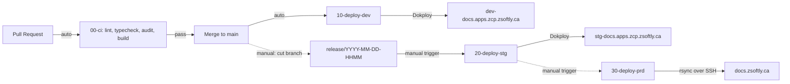

# CI/CD Pipeline

How a change moves from pull request to production.

---

## Flow



---

## Workflow files

| File                | Trigger                        | Runner          | Deploys to                     |
| ------------------- | ------------------------------ | --------------- | ------------------------------ |
| `00-ci.yml`         | PR (auto) plus `workflow_call` | `ubuntu-latest` | nowhere (quality gate only)    |
| `10-deploy-dev.yml` | push to `main` (auto)          | `zsoftly-iaas`  | `dev-docs.apps.zcp.zsoftly.ca` |
| `20-deploy-stg.yml` | `workflow_dispatch` (manual)   | `zsoftly-iaas`  | `stg-docs.apps.zcp.zsoftly.ca` |
| `30-deploy-prd.yml` | `workflow_dispatch` (manual)   | `zsoftly-iaas`  | `docs.zsoftly.ca`              |

CI runs on GitHub-hosted runners because the repo is public (no minutes limit). Every deploy runs on
the self-hosted `zsoftly-iaas` runner because it needs network access to the Dokploy API and the prd
SSH key.

---

## Stages

### 1. PR (automatic)

`00-ci.yml` runs four jobs. `lint`, `typecheck`, and `security-audit` run in parallel; `build` waits
for all three.

```
1. lint           pnpm fmt:check  +  pnpm lint (ESLint)
2. typecheck      pnpm typecheck (astro sync && tsc --noEmit)
3. security-audit pnpm audit --audit-level=high
4. build          pnpm build, then verify dist/ has >= 50 files
```

The build step also runs `starlight-links-validator`, so a broken internal link fails CI. A green
check means the PR is ready to merge.

### 2. Dev deploy (automatic on merge)

`10-deploy-dev.yml` runs on every push to `main`:

```
1. Re-run 00-ci.yml on main (reusable workflow)
2. Deploy to Dokploy dev app (.github/scripts/dokploy-deploy.sh, DOKPLOY_APP_ID_DEV)
3. Smoke test dev-docs.apps.zcp.zsoftly.ca (.github/scripts/smoke-test.sh)
```

### 3. Staging deploy (manual)

Cut a `release/YYYY-MM-DD-HHMM` branch from `main`, then run **"20: Deploy Staging"** from the
Actions tab with that branch as the input.

```
1. Validate the branch name starts with release/
2. Re-run 00-ci.yml on the release branch
3. Switch the Dokploy stg app to the release branch (saveGithubProvider, DOKPLOY_APP_ID_STG)
4. Deploy via the Dokploy API
5. Smoke test stg-docs.apps.zcp.zsoftly.ca
```

### 4. Production deploy (manual)

After stg is validated, run **"30: Deploy Production"** with the same release branch.

```
1. Validate the branch name starts with release/
2. Verify stg is on the same branch (reads the Dokploy stg app branch; blocks untested code)
3. Re-run 00-ci.yml on the release branch
4. Checkout the branch, pnpm build, verify dist/ has >= 50 files
5. rsync dist/ over SSH to the prd VM (StrictHostKeyChecking=yes, pinned known_hosts)
6. Smoke test the live site
```

prd is the only environment that does not use Dokploy. It rsyncs static files to a bare-metal VM.

---

## Smoke tests

`.github/scripts/smoke-test.sh <domain>` requests a fixed set of key pages and asserts HTTP 200,
retrying the full suite up to three times (20s apart) to let routing settle after a deploy. Edit the
`PATHS` array in that script when you add or rename a top-level page.

---

## Dokploy integration (dev and stg)

`.github/scripts/dokploy-deploy.sh` calls the Dokploy API and waits for the deploy to finish. For
stg, the app branch is switched first via `application.saveGithubProvider` because the deploy call
has no branch parameter. The Dokploy webhook auto-deploy is disabled; all deploys go through GitHub
Actions.

---

## Secrets

Repository-level GitHub secrets (not per-environment):

| Secret                   | Used by       | Description                                   |
| ------------------------ | ------------- | --------------------------------------------- |
| `DOKPLOY_API_URL`        | dev, stg      | Dokploy API base URL (internal DNS)           |
| `DOKPLOY_API_KEY`        | dev, stg, prd | Dokploy API auth token                        |
| `DOKPLOY_APP_ID_DEV`     | dev           | Dokploy application ID for the dev app        |
| `DOKPLOY_APP_ID_STG`     | stg, prd      | Dokploy application ID for the stg app        |
| `DOKPLOY_GITHUB_ID`      | stg           | Dokploy GitHub provider ID for branch switch  |
| `DEPLOY_KEY_PRD`         | prd           | SSH private key for the prd VM                |
| `DEPLOY_HOST_PRD`        | prd           | prd VM hostname                               |
| `DEPLOY_USER_PRD`        | prd           | rsync/SSH user                                |
| `DEPLOY_PATH_PRD`        | prd           | Target directory served by the prd web server |
| `DEPLOY_KNOWN_HOSTS_PRD` | prd           | Pinned host key (`ssh-keyscan <host>`)        |

prd reads `DOKPLOY_APP_ID_STG` only to confirm the release branch is already live on stg before it
ships.

---

## Node and pnpm on runners

The `.github/actions/setup-node` composite action installs pnpm (`pnpm/action-setup@v4`, version
pinned by the `packageManager` field in `package.json`), sets up Node (default 22, pnpm cache), and
runs `pnpm install --frozen-lockfile`. The `FORCE_JAVASCRIPT_ACTIONS_TO_NODE24` env in each workflow
runs the JS actions on Node 24 ahead of the June 2026 default.
