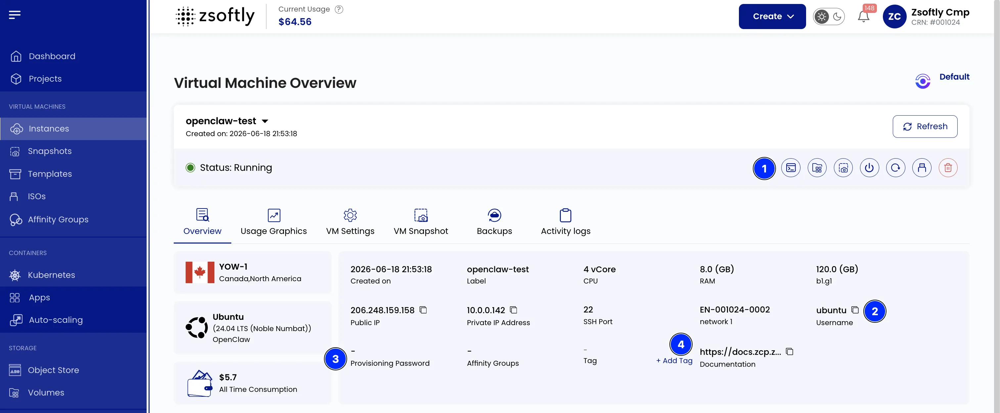
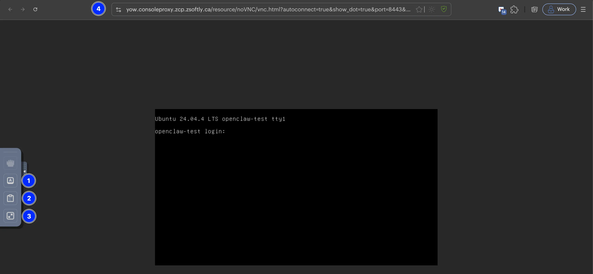

L'accès à la console ouvre une session **VNC** dans le navigateur vers votre instance. Utilisez-la
pour atteindre le système d'exploitation sans SSH ni RDP, observer l'écran de démarrage pendant un
dépannage, ou récupérer une instance dont vous avez perdu l'accès.

## Ouvrir la console

1. Allez dans **Compute → Instances** et ouvrez votre instance.
2. Sur la **vue d'ensemble de la machine virtuelle**, repérez la barre d'actions et cliquez sur
   l'icône **console** (repère **1** ci-dessous).

La console s'ouvre dans un nouvel onglet et se connecte automatiquement.

La même vue d'ensemble affiche ce dont vous avez besoin pour vous connecter :

- **Nom d'utilisateur** (repère **2**) : l'utilisateur par défaut de l'image, par exemple `ubuntu`
  sur Ubuntu ou `Administrator` sur Windows. Utilisez l'icône de copie.
- **Mot de passe de provisionnement** (repère **3**) : le mot de passe généré automatiquement au
  premier démarrage. Un tiret signifie que l'instance a été créée avec une clé SSH sans mot de
  passe. Réinitialisez le mot de passe depuis le portail, puis connectez-vous (le nouveau mot de
  passe s'applique au prochain redémarrage).

## Se connecter

Saisissez le nom d'utilisateur et le mot de passe à l'invite de connexion.

La barre d'adresse (repère **4**) pointe vers le proxy de console régional, par exemple
`yow.consoleproxy.zcp.zsoftly.ca`.

## Barre d'outils de la console

Une petite barre d'outils se trouve sur le bord gauche de la console :

- **Touches supplémentaires** (repère **1**) : envoie les touches interceptées par le navigateur
  (voir [Raccourcis clavier](#raccourcis-clavier)).
- **Presse-papiers** (repère **2**) : copie du texte entre votre machine et l'instance.
- **Plein écran** (repère **3**) : agrandit la console à tout l'écran.

### Raccourcis clavier

Le bouton **Touches supplémentaires** ouvre ces entrées :

- **Toggle Control (Ctrl)** : simule l'appui sur la touche Contrôle.
- **Toggle Alt** : simule l'appui sur la touche Alt.
- **Toggle Shift** : simule l'appui sur la touche Maj.
- **Toggle Windows Key** : simule la touche Windows.
- **Send Tab** : envoie une touche Tab.
- **Send Escape (Esc)** : envoie une touche Échap.
- **Send Ctrl+Alt+Delete** : envoie la combinaison Ctrl+Alt+Suppr.
- **Clipboard** : copie du texte entre la machine locale et la VM.
- **Full-Screen Mode** : agrandit la console de la VM en plein écran.

## Quand utiliser la console

- Atteindre une instance avant que SSH ou RDP soit configuré ou accessible.
- Corriger un réseau, un pare-feu ou un paramètre SSH défaillant qui bloque l'accès distant.
- Lire les messages du noyau ou de connexion pendant le démarrage de l'instance.
- Récupérer l'accès après la perte d'une clé ou d'un mot de passe (réinitialisez d'abord le mot de
  passe depuis le portail).

## Voir aussi

- [Se connecter avec SSH](/fr/public-cloud/compute/connect-ssh)
- [Se connecter avec RDP](/fr/public-cloud/compute/connect-rdp)
- [Images de système d'exploitation](/fr/public-cloud/operating-systems/)
