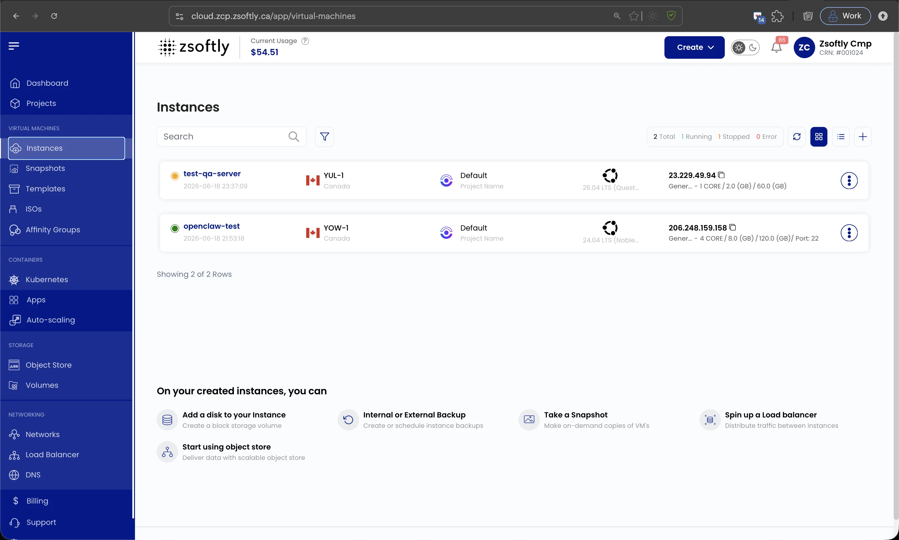

La page de vue d'ensemble d'une instance fournit un résumé détaillé de votre VM et des options de
gestion disponibles. Elle affiche l'état de l'instance, son emplacement, son système d'exploitation,
ses métriques de performance et les actions rapides.

Ouvrez **Virtual Machines → Instances** dans le portail pour voir toutes vos VM, chacune avec son
état, sa région, son projet, son système d'exploitation et son IP. Sélectionnez une instance pour
ouvrir sa vue d'ensemble.

## Boutons d'action

Ces actions sont disponibles depuis le menu à trois points ou la page de vue d'ensemble :

- **Refresh** : actualise l'état de l'instance et les renseignements de la page.
- **Accès à la console** : ouvre une console pour interagir directement avec la VM.
- **VM Instantanés de volume** : affiche les instantanés existants ou permet d'en créer un.
- **Power Off** : arrête la machine virtuelle.
- **Reboot** : redémarre l'instance.
- **Attach ISO for VM** : monte un fichier ISO sur la VM.
- **Delete** : supprime définitivement l'instance.

:::note

Captures d'écran à venir.

:::

## Informations sur l'instance

- **Nom de l'instance**
- **Créée le**
- **État** (running/stopped)

:::note

Captures d'écran à venir.

:::

## Détails de l'instance

- **Emplacement**
- **Système d'exploitation**
- **Coût** (total)

:::note

Captures d'écran à venir.

:::

## Spécifications des ressources

- **Label**
- **CPU** (vCPU)
- **RAM**
- **Taille du disque**
- **IP publique**
- **IP privée**
- **Réseau**
- **Nom d'utilisateur**
- **Mot de passe**
- **Groupe d'affinité**
- **Tag** (ajout avec Ajouter Tag → Key + Value → Soumettre)

:::note

Captures d'écran à venir.

:::

## Utilisation des ressources

- **Taille du disque** : utilisation de la capacité
- **Trafic réseau** : métriques sur une période donnée, par défaut les dernières 24 heures
- **Utilisation du CPU** : pourcentage d'utilisation
- **Utilisation de la RAM** : consommation de mémoire

:::note

Captures d'écran à venir.

:::

## Voir aussi

- [Créer une instance](/fr/public-cloud/compute/create-instance)
- [Accès à la console](/fr/public-cloud/compute/console-access)
- [Journaux d'activité](/fr/public-cloud/compute/activity-logs)
