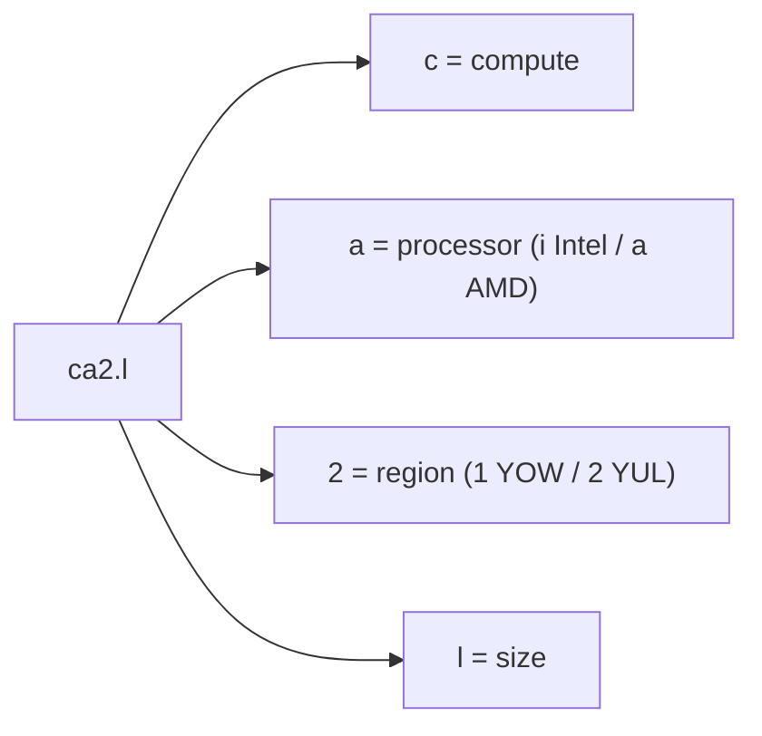
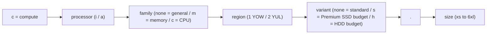

Chaque plan de calcul possède un ID court et structuré, comme `ca2.l` ou `cam2.2xl`. Une fois le
modèle compris, vous pouvez lire directement le processeur, la famille, la région, le niveau de
stockage et la taille à partir du nom du plan.

## Anatomie d'un ID de plan

Un ID de plan est composé d'une **série**, suivie d'un `.` et d'une **taille** :

Les plans optimisés pour la mémoire et le CPU ajoutent une lettre de famille. Les niveaux de
stockage économiques ajoutent un `s` final pour Premium SSD à YUL ou un `h` final pour HDD à YOW :

## Segments

| Position   | Valeurs                                 | Signification                                                         |
| ---------- | --------------------------------------- | --------------------------------------------------------------------- |
| Préfixe    | `c`                                     | Compute                                                               |
| Processeur | `i` / `a`                               | Intel / AMD                                                           |
| Famille    | _(aucune)_ / `m` / `c`                  | Usage général / optimisé pour la mémoire / optimisé pour le CPU       |
| Région     | `1` / `2`                               | YOW / YUL                                                             |
| Variante   | _(aucune)_ / `s` / `h`                  | Niveau standard / Premium SSD économique (YUL) / HDD économique (YOW) |
| Taille     | `xs` `s` `m` `l` `xl` `2xl` `4xl` `6xl` | Capacité relative, de la plus petite à la plus grande                 |

## Séries de plans

| Série   | Région | Processeur | Stockage    | Famille                               |
| ------- | ------ | ---------- | ----------- | ------------------------------------- |
| `ci1`   | YOW    | Intel      | NVMe        | Usage général                         |
| `ci1h`  | YOW    | Intel      | HDD         | Usage général (économique)            |
| `ca1`   | YOW    | AMD        | NVMe        | Usage général                         |
| `ca1h`  | YOW    | AMD        | HDD         | Usage général (économique)            |
| `ca2`   | YUL    | AMD        | Pro NVMe    | Usage général                         |
| `ca2s`  | YUL    | AMD        | Premium SSD | Usage général (économique)            |
| `cim1`  | YOW    | Intel      | NVMe        | Optimisé pour la mémoire              |
| `cim1h` | YOW    | Intel      | HDD         | Optimisé pour la mémoire (économique) |
| `cam1`  | YOW    | AMD        | NVMe        | Optimisé pour la mémoire              |
| `cam2`  | YUL    | AMD        | Pro NVMe    | Optimisé pour la mémoire              |
| `cam2s` | YUL    | AMD        | Premium SSD | Optimisé pour la mémoire (économique) |
| `cac1`  | YOW    | AMD        | NVMe        | Optimisé pour le CPU                  |
| `cac2`  | YUL    | AMD        | Pro NVMe    | Optimisé pour le CPU                  |
| `cac2s` | YUL    | AMD        | Premium SSD | Optimisé pour le CPU (économique)     |

## Ratios vCPU/RAM

La famille détermine l'évolution conjointe des vCPU et de la RAM :

| Famille                        | Ratio (RAM:vCPU) | Notes                                         |
| ------------------------------ | ---------------- | --------------------------------------------- |
| Usage général `xs` à `l`       | 2:1              |                                               |
| Usage général `xl` et plus     | 4:1              | Plafonné à 16 vCPU                            |
| Optimisé pour la mémoire (`m`) | 8:1              | Pour les charges de travail exigeantes en RAM |
| Optimisé pour le CPU (`c`)     | 1:1              | Calcul haute densité                          |

:::tip

Le catalogue complet des plans, avec vCPU, RAM, disque et tarification pour chaque taille, se trouve
sur la [page de tarification](https://zcp.zsoftly.ca/pricing).

:::
