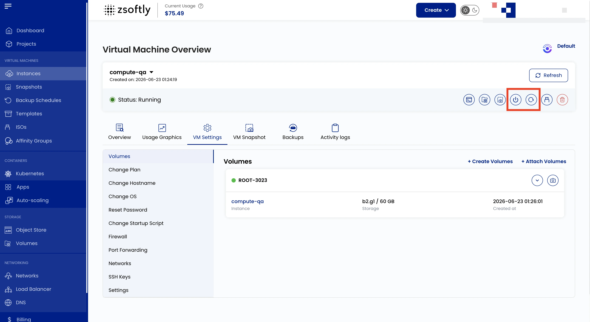

La gestion de l'alimentation vous permet de contrôler l'état d'exécution de votre VM.

## Actions manuelles

Disponibles depuis la vue d'ensemble de l'instance :

- **Power Off** : arrête proprement la VM.
- **Reboot** : redémarre la VM.
- **Power On** : démarre une VM arrêtée.

## Actions d'arrêt planifiées

Les actions d'arrêt planifiées ne sont pas encore disponibles. Utilisez les actions manuelles
ci-dessus pour arrêter une instance.

## Voir aussi

- [Vue d'ensemble des instances](/fr/public-cloud/compute/instance-overview)
- [Journaux d'activité](/fr/public-cloud/compute/activity-logs)
