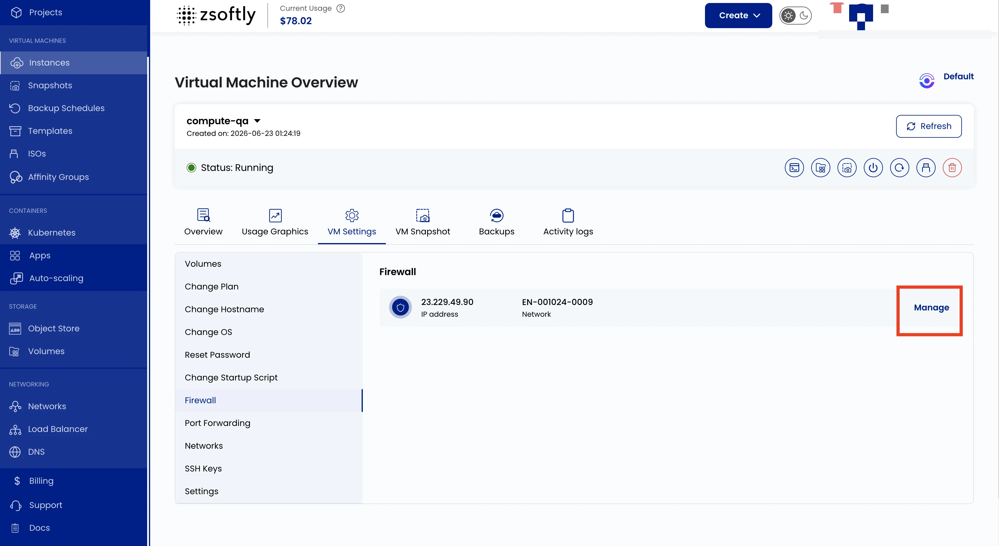

## Configuration du pare-feu

Le paramètre de pare-feu vous permet de définir des règles de sécurité pour le trafic réseau entrant
et sortant de votre VM. Autorisez ou refusez l'accès à des adresses IP, ports ou protocoles précis.

- Allez à **VM Settings** → **Pare-feu**.
- Cliquez sur **Gérer** pour modifier la configuration du pare-feu du réseau.

Exemple : bloquer tout le trafic sauf SSH (port 22) et le trafic Web (ports 80/443).

## Politique des ports entrants

L'attribution d'une IP publique n'ouvre pas tous les ports d'une VM. Appliquez le principe du
moindre privilège au trafic entrant :

- Les images de systèmes d'exploitation standard autorisent généralement SSH sur le TCP **22** au
  niveau du pare-feu du système invité. Gardez les ports d'application fermés tant qu'ils ne sont
  pas nécessaires.
- Les images de la Place de marché peuvent inclure des règles de pare-feu propres à l'image.
  Consultez sa documentation avant de modifier les règles par défaut.
- Ne créez pas de règle entrante qui autorise tout le trafic. Ouvrez uniquement le protocole et le
  port de destination requis, puis limitez l'adresse IP ou la plage CIDR source lorsque possible.

### Exemple : ouvrir le TCP 3000

Si une application écoute sur le port TCP **3000** et doit être accessible depuis Internet, ajoutez
une règle entrante d'autorisation avec les valeurs suivantes :

| Champ               | Valeur                                                   |
| ------------------- | -------------------------------------------------------- |
| IP ou CIDR source   | Une IP ou plage approuvée, par exemple `203.0.113.10/32` |
| Protocole           | TCP                                                      |
| Port source         | Tous                                                     |
| Port de destination | `3000`                                                   |
| Action              | Autoriser                                                |

Utilisez `0.0.0.0/0` comme source uniquement si l'application doit être publique. Les ports sources
des clients sont généralement dynamiques. Le port de l'application doit donc être indiqué dans le
champ du port de destination.

Effectuez aussi les étapes propres au réseau :

- Si le réseau utilise la redirection de ports, redirigez le port public **3000** vers le port
  **3000** de la VM. Consultez
  [Redirection de ports](/fr/public-cloud/compute/settings/port-forwarding).
- Pour un VPC, autorisez le TCP **3000** dans
  l'[ACL réseau](/fr/public-cloud/networking/vpc/network-acls) concernée.
- Vérifiez que le pare-feu du système invité autorise le TCP **3000** et que l'application écoute
  sur l'interface réseau de la VM, et pas uniquement sur `127.0.0.1`.

Pour les applications Web de production, exposez de préférence les ports **80** et **443** via un
proxy inverse. Gardez le port de l'application privé.

Voir aussi : [Réseaux](/fr/public-cloud/compute/settings/networks),
[Redirection de ports](/fr/public-cloud/compute/settings/port-forwarding)
