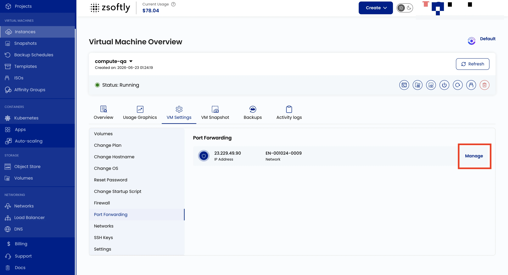

La redirection de ports achemine le trafic d'un port précis de votre adresse IP publique vers un
port de votre VM. Par exemple, vous pouvez rediriger le trafic externe du port 8080 vers le port 80
de votre VM pour l'accès à un serveur Web.

- Allez à **VM Settings** → **Redirection de ports**.
- Cliquez sur **Gérer** pour modifier la configuration des ports du réseau.

La redirection de ports associe le port de destination public à un port de la VM. Elle ne remplace
pas la règle de pare-feu entrante ni l'ACL réseau du VPC. Configurez chaque couche concernée et
limitez l'adresse IP ou la plage CIDR source dans le pare-feu lorsque le service n'a pas besoin
d'être public.

