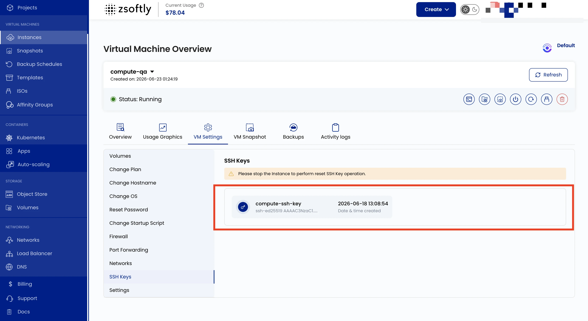

## Accès par clé SSH

Les clés SSH offrent une méthode sécurisée d'accès à votre VM sans mot de passe. Ce paramètre
affiche les clés SSH publiques autorisées à se connecter à la VM.

- Allez à **VM Settings** → **Clés SSH** pour voir les clés autorisées.

:::caution

Vous devez arrêter l'instance avant d'effectuer une opération de réinitialisation de clé SSH.

:::

Voir aussi : [Se connecter avec SSH](/fr/public-cloud/compute/connect-ssh)
