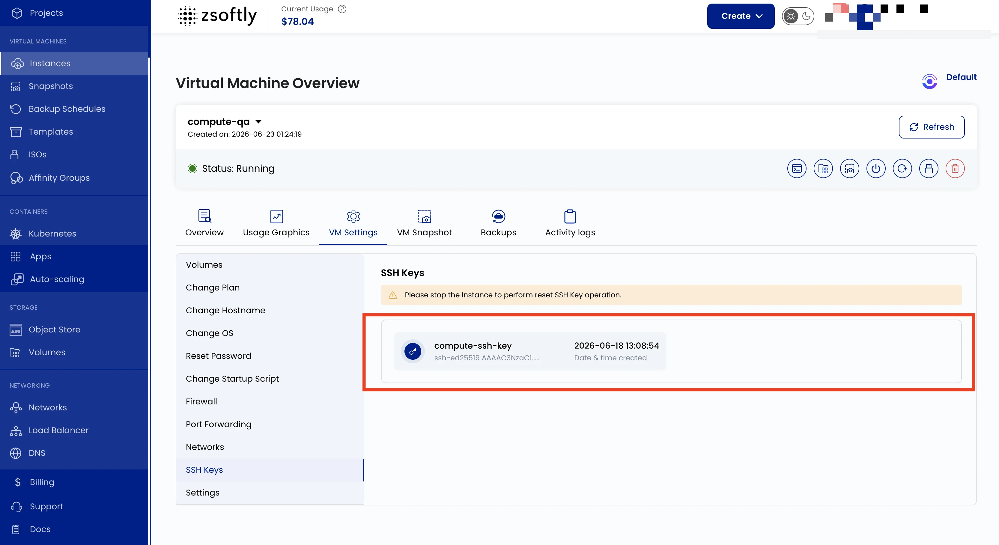

## Accès par clé SSH

Les clés SSH offrent une méthode sécurisée d'accès à votre VM sans mot de passe. Ce paramètre
affiche les clés SSH publiques autorisées à se connecter à la VM. Pour ajouter une clé lors de la
création d'une instance, ouvrez **Server Settings** et cliquez sur **Add now** à côté de **Add SSH
Key To Your Instance**. Dans la boîte de dialogue, entrez un nom et collez votre clé publique, ou
sélectionnez une clé existante. Consultez
[Créer une instance](/fr/public-cloud/compute/create-instance) pour le déroulement complet.

- Allez à **VM Settings** → **SSH Keys** pour voir les clés autorisées.

:::caution

Vous devez arrêter l'instance avant d'effectuer une opération de réinitialisation de clé SSH.

:::

Voir aussi : [Se connecter avec SSH](/fr/public-cloud/compute/connect-ssh)
