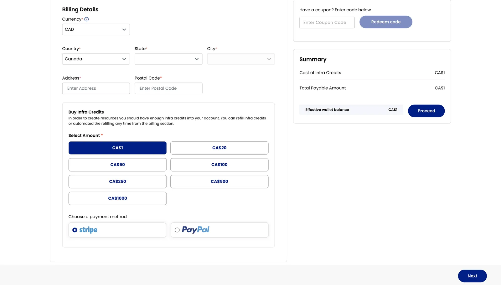

## Guide de création d'un compte ZSoftly Public Cloud

Ce guide vous accompagne étape par étape pour créer un compte ZSoftly Public Cloud, configurer la
facturation et vérifier votre compte.

### Structure des comptes et des projets

**Une adresse courriel, un compte.** Chaque adresse courriel correspond à un seul compte ZCP. Vous
ne pouvez pas créer un deuxième compte avec une adresse déjà utilisée.

**Utilisez les projets pour isoler les environnements.** La plupart des équipes n'ont besoin que d
un seul compte. Créez des **Projets** distincts pour `dev`, `stg` et `prd`. Chaque projet possède
ses propres ressources, quotas et membres. Les ressources de projets différents ne partagent pas les
réseaux ni le stockage. Consultez [Projets](../projects) pour en savoir plus.

**Utilisez des comptes distincts pour une isolation stricte.** Certaines organisations exigent une
séparation complète entre des environnements ou des unités d'affaires : facturation distincte, IAM
distinct et aucune ressource partagée. Créez un compte par périmètre. Comme chaque compte exige une
adresse courriel unique, utilisez l'adressage avec signe plus si votre fournisseur le prend en
charge :

| Compte   | Courriel                |
| -------- | ----------------------- |
| Compte 1 | `company+1@example.com` |
| Compte 2 | `company+2@example.com` |
| Compte 3 | `company+3@example.com` |

Les trois adresses livrent les messages dans la même boîte de réception. Chacune correspond à un
compte ZCP entièrement indépendant, avec sa propre facturation et son propre IAM.

### Créer le compte

- Allez à la page d'inscription :
  [cloud.zcp.zsoftly.ca/register](https://cloud.zcp.zsoftly.ca/register).
- Entrez votre nom, votre adresse courriel, votre numéro de téléphone et un mot de passe, puis
  acceptez les **Terms and Conditions**. Vous pouvez aussi vous inscrire avec **GitHub** ou
  **Google**.
- Cliquez sur **Create Account** pour passer à l'étape suivante.

### Vérifier votre courriel

- Consultez votre boîte de réception pour trouver le courriel de vérification de ZSoftly Public
  Cloud contenant un mot de passe à usage unique (OTP).
- Entrez l'**OTP** dans le champ prévu sur le site.
- Cliquez sur **Verify** pour confirmer et passer à la configuration de la facturation.

Une fois la vérification terminée, ZSoftly Public Cloud envoie un courriel de bienvenue confirmant
que votre compte est prêt.

### Configurer le mode de facturation

- Après la vérification du compte, vous serez invité à configurer vos renseignements de facturation.
- Choisissez un type de facturation :
  - **Individual** : pour un usage personnel; entrez des renseignements comme votre adresse.
  - **Company** : pour une organisation; fournissez des renseignements comme le nom de l'entreprise,
    le site Web et l'adresse.

- Si vous avez un coupon, appliquez-le au paiement pour recevoir un rabais ou une offre
  promotionnelle.

:::note

Pour créer votre compte, un paiement minimal de **1,00 $ CA** est requis. Il est traité de façon
sécurisée par Stripe et affiché comme **Infra Credits**. Ce paiement sert à vérifier et valider
votre compte. Le montant ajouté est crédité à votre compte sous forme de **crédits d'infrastructure
utilisables**; vous conservez donc sa pleine valeur.

:::

### Crédit de compte

Les nouveaux comptes reçoivent automatiquement **100 $ CA de crédit** à l'inscription, valide
pendant **30 jours**.

Après avoir dépensé **200 $ CA** sur la plateforme, vous pouvez demander **200 $ CA de crédit**
supplémentaire. Faites la demande depuis l'adresse courriel de votre compte au moyen de notre
[page de contact](https://zcp.zsoftly.ca/contact?source=docs&topic=billing), en indiquant votre
**numéro de compte** et la mention **"$200 Credit Request"**. Nous appliquerons directement le
crédit de **200 $ CA** à votre compte, valide pendant **60 jours**, pour un total pouvant atteindre
**300 $ CA**.

Le crédit s'applique aux plans Small à XLarge. L'offre est disponible jusqu'au **31 décembre 2026**.

### Modes de paiement

ZSoftly Public Cloud accepte :

- **Carte** : Visa, Mastercard et American Express, traitées de façon sécurisée par **Stripe**.
- **PayPal** : paiement depuis votre solde PayPal ou un compte lié.
- **Bank Transfer / Wire** : pour les paiements manuels, communiquez avec notre
  [équipe des ventes](https://zcp.zsoftly.ca/contact?source=docs&topic=billing). Elle organisera le
  transfert et appliquera les fonds à votre compte sous forme de crédits d'infrastructure.

Les paiements par carte et PayPal sont en libre-service dans le portail. Les virements bancaires
sont organisés avec l'équipe des ventes.

### Choisir un plan de paiement

#### Prépayé (recommandé)

- Les comptes prépayés exigent l'ajout de crédits à l'avance; ces crédits servent ensuite à créer
  des ressources sur la plateforme.
- Pour utiliser des ressources, achetez des crédits d'infrastructure en sélectionnant le montant
  désiré.
- Payez avec **Stripe** ou **PayPal**, puis cliquez sur **Proceed** pour terminer le paiement. Pour
  payer par virement bancaire, communiquez avec
  [l'équipe des ventes](https://zcp.zsoftly.ca/contact?source=docs&topic=billing).

#### Postpayé

- Les comptes postpayés vous permettent de payer après avoir consommé des ressources. Cette option
  exige une vérification supplémentaire, comme des renseignements de facturation détaillés ou des
  vérifications de crédit.
- Ajoutez **Stripe** ou **PayPal** comme mode de paiement, puis cliquez sur **Save Card** pour
  terminer la configuration. Pour organiser un paiement manuel par virement bancaire, communiquez
  avec [l'équipe des ventes](https://zcp.zsoftly.ca/contact?source=docs&topic=billing).

### Dernières étapes

- Passez attentivement en revue les **Terms & Conditions** de la plateforme.
- Acceptez les conditions pour terminer l'inscription.

- **Utilisateurs prépayés** : l'état de votre compte s'affichera comme actif, avec le type de compte
  prépayé.

- **Utilisateurs postpayés** : après la vérification, votre compte s'affichera comme actif, avec le
  type de compte postpayé.

### Se connecter au portail

Une fois votre compte actif, connectez-vous à
[cloud.zcp.zsoftly.ca/login](https://cloud.zcp.zsoftly.ca/login). Saisissez votre **courriel** et
votre **mot de passe** (ou utilisez **GitHub** ou **Google**), réussissez la vérification, puis
cliquez sur **Sign in**.

#### Réinitialiser votre mot de passe

Si vous oubliez votre mot de passe, cliquez sur **Forgot Password?** sur la page de connexion (ou
allez à [cloud.zcp.zsoftly.ca/forgot-password](https://cloud.zcp.zsoftly.ca/forgot-password)).
Saisissez le courriel de votre compte et cliquez sur **Send Reset Link**. Vous recevrez les
instructions de réinitialisation par courriel.

#### Se déconnecter

Pour mettre fin à votre session, utilisez le menu du compte et sélectionnez la déconnexion. Le
portail confirme que vous êtes déconnecté, et vous pouvez vous reconnecter à tout moment.

La configuration d'un compte ZSoftly Public Cloud est un processus simple : inscrivez-vous, vérifiez
votre courriel, configurez la facturation et choisissez le plan de paiement qui correspond à vos
besoins. Une fois ces étapes terminées, vous aurez accès au tableau de bord ZSoftly Public Cloud et
à ses fonctionnalités pour gérer vos ressources efficacement.
