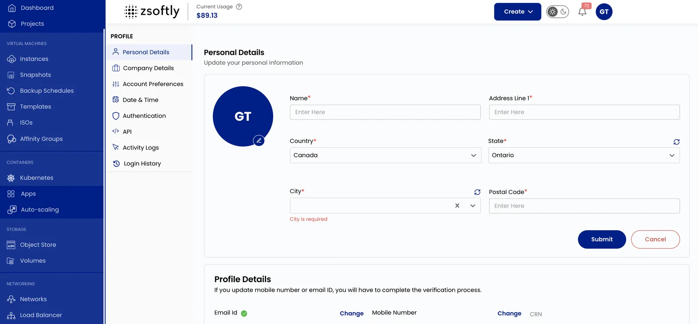
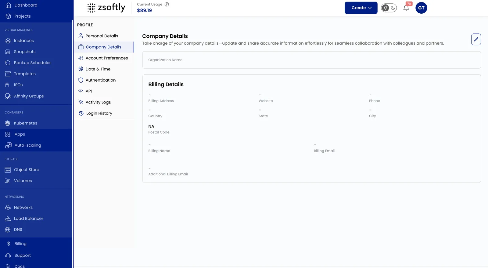
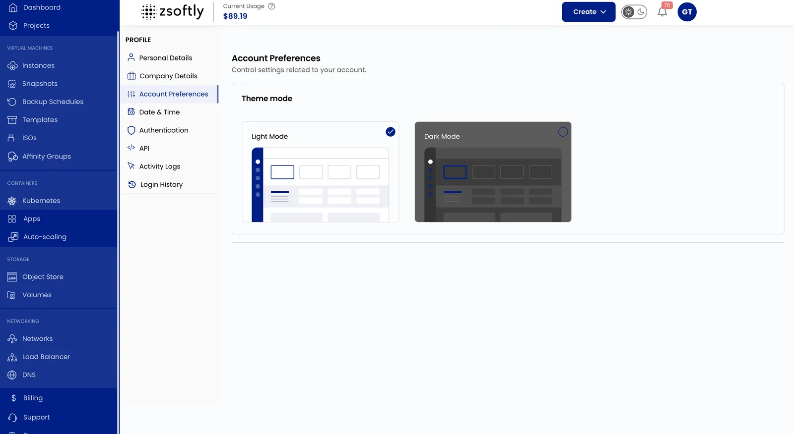
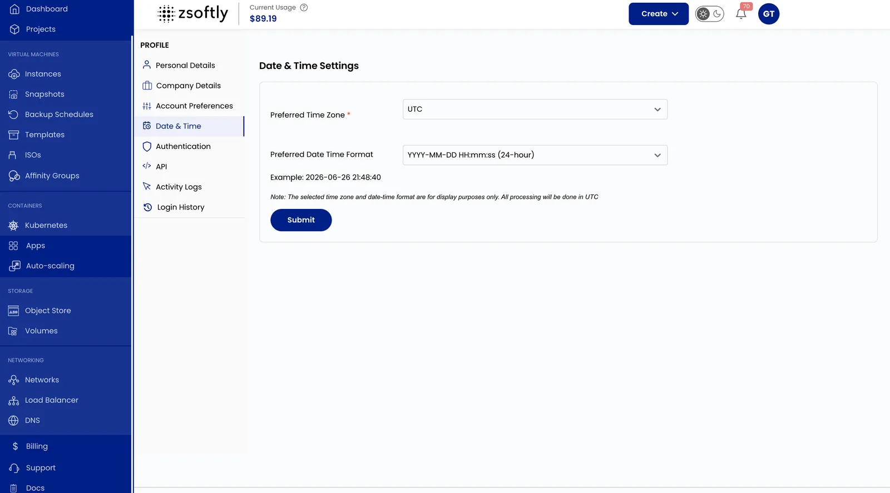
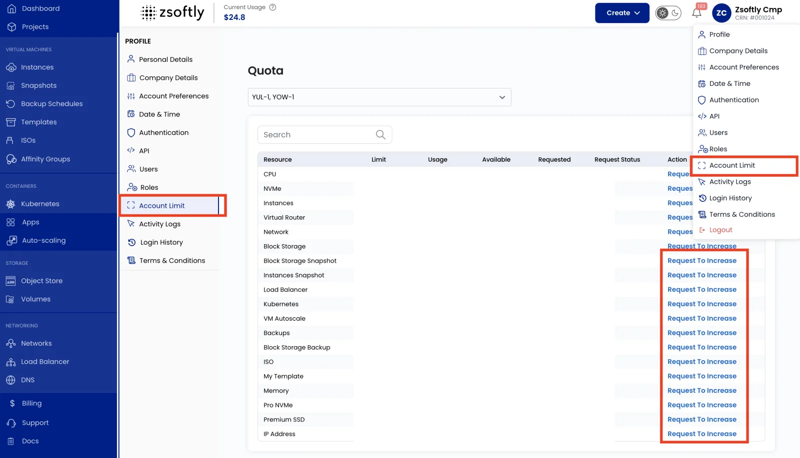
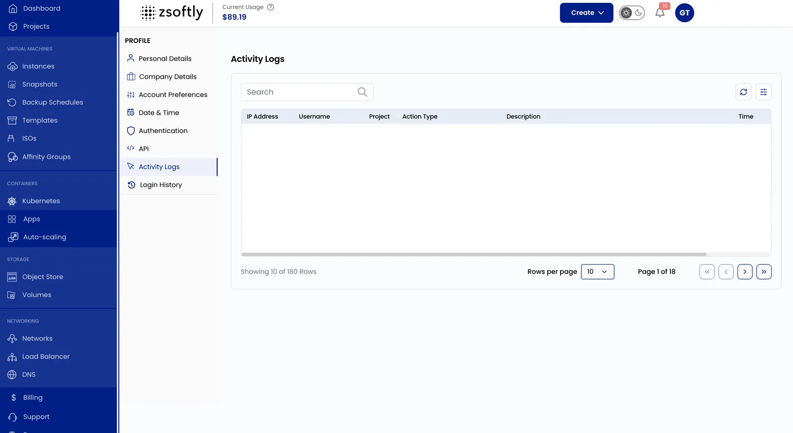
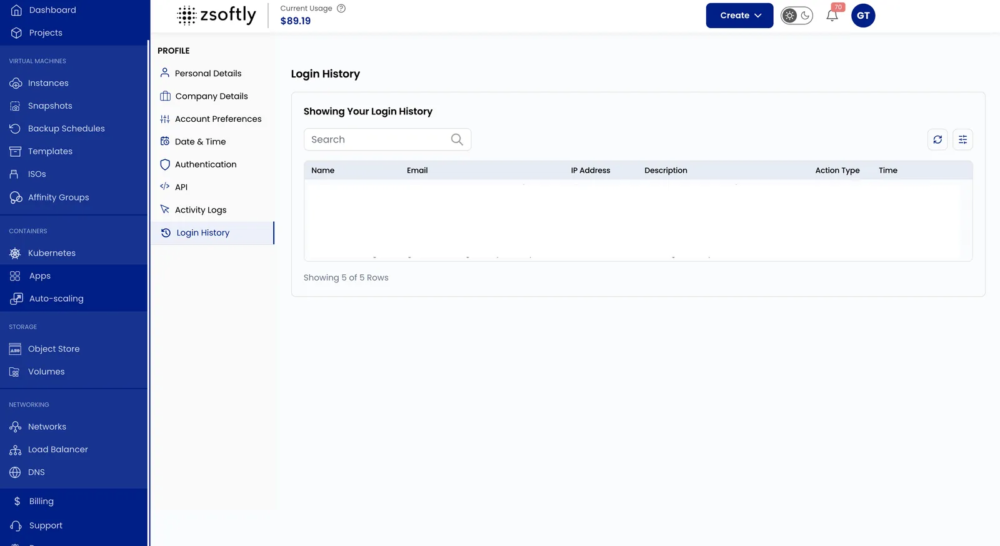

## Configurer votre profil utilisateur dans ZSoftly Public Cloud

La configuration du profil utilisateur de **ZSoftly Public Cloud** vous permet de gérer vos
renseignements personnels, de configurer les paramètres de paiement, de personnaliser vos
préférences et de suivre l'activité de votre compte.

:::tip

Vous voulez inviter des collègues, créer des rôles, activer l'authentification à deux facteurs ou
changer votre mot de passe? Ces fonctions se trouvent sous [IAM](/fr/public-cloud/iam/overview),
dans Utilisateurs, Rôles et permissions, et Sécurité du compte.

:::

### Mettre à jour vos renseignements personnels

Gardez vos renseignements personnels à jour afin que votre profil demeure exact.

- Cliquez sur votre **nom d'utilisateur** (en haut à droite) pour ouvrir le menu **Profil**.
- Sélectionnez **Personal Details** pour mettre à jour vos renseignements personnels.
- Cliquez sur **Soumettre** pour enregistrer les changements.

### Gérer les renseignements de facturation

- Cliquez sur votre **nom d'utilisateur** (en haut à droite) pour ouvrir le menu **Profil**.
- Sélectionnez **Personal Details**, puis ouvrez **Billing Details**.
- Ajoutez ou mettez à jour la **Billing Address** et le **Phone Number**.
- Cliquez sur **Soumettre** pour enregistrer les changements.

### Personnaliser les préférences du compte

- Cliquez sur votre **nom d'utilisateur** (en haut à droite) pour ouvrir le menu **Profil**.
- Sélectionnez **Account Preferences**.
- Choisissez **Light Mode** ou **Dark Mode**.

### Modifier les paramètres de date et d'heure

- Cliquez sur votre **nom d'utilisateur** (en haut à droite) pour ouvrir le menu **Profil**.
- Sélectionnez **Date and Time Settings**.
- Choisissez votre **Preferred Time Zone** et votre **Date Time Format**.
- Cliquez sur **Soumettre** pour appliquer les changements.

### Définir les limites du compte

- Cliquez sur votre **nom d'utilisateur** (en haut à droite) pour ouvrir le menu **Profil**.
- Sélectionnez **Account Limit** pour consulter le tableau d'allocation des ressources.
- Cliquez sur **Request To Increase** pour demander des ressources supplémentaires.

### Consulter les journaux d'activité

- Cliquez sur votre **nom d'utilisateur** (en haut à droite) pour ouvrir le menu **Profil**.
- Sélectionnez **Journaux d'activité** pour surveiller les actions et changements du système.
- Utilisez la barre de recherche pour filtrer les journaux par mots-clés.

### Consulter l'historique de connexion

- Cliquez sur votre **nom d'utilisateur** (en haut à droite) pour ouvrir le menu **Profil**.
- Sélectionnez **Login History** pour consulter les connexions enregistrées.

### Conclusion

Gérez votre profil ZSoftly Public Cloud pour renforcer les paramètres de sécurité et personnaliser
votre compte selon vos besoins.
