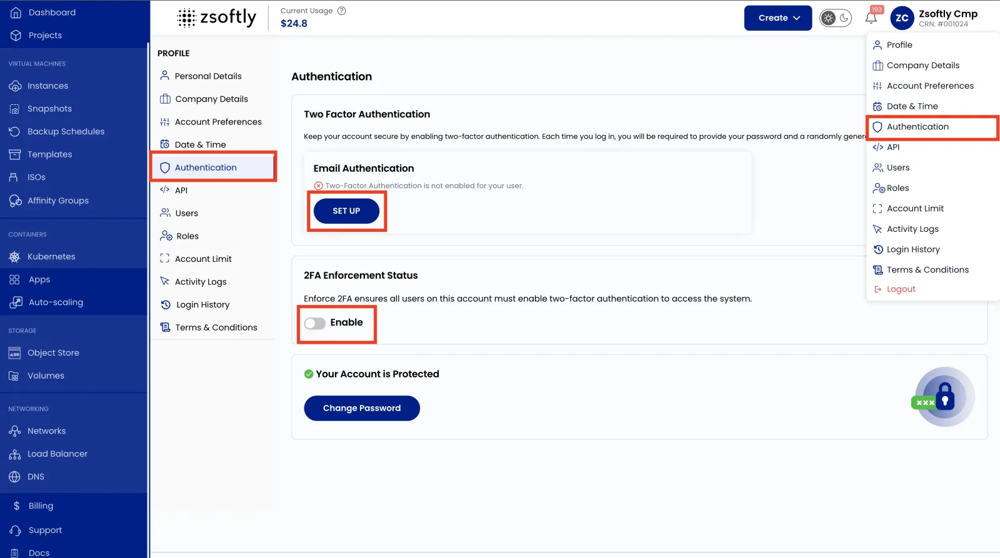
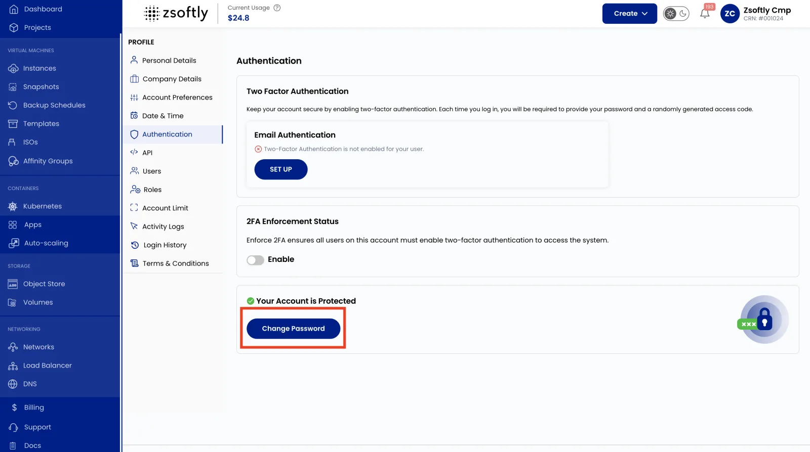

Protégez l'accès à votre organisation avec l'authentification à deux facteurs et de bonnes pratiques
de gestion des mots de passe. Ces paramètres se trouvent dans la section **Authentication** de votre
profil.

## Authentification à deux facteurs (2FA)

L'authentification à deux facteurs ajoute une deuxième étape de vérification lors de la connexion.
Un mot de passe seul ne suffit donc pas pour accéder au compte.

- Cliquez sur votre **nom d'utilisateur** (en haut à droite) pour ouvrir le menu **Profil**.
- Sélectionnez **Authentication**, puis repérez **Two-Factor Authentication (2FA)**.
- Cliquez sur **Set Up** sous **Email Authentication**.
- Entrez votre **Email ID**, puis cliquez sur **Send OTP**.
- Entrez l'OTP envoyé à votre courriel pour confirmer.
- Activez **Enable 2FA for All Users** si vous voulez l'imposer à toute l'organisation.

:::tip

Il est fortement recommandé d'imposer la 2FA à toute l'organisation. Elle protège chaque
utilisateur, pas seulement le propriétaire du compte.

:::

## Changer votre mot de passe

- Cliquez sur votre **nom d'utilisateur** (en haut à droite) pour ouvrir le menu **Profil**.
- Sélectionnez **Authentication**, puis cliquez sur **Change Password**.
- Entrez votre **Current Password**, puis entrez et confirmez votre **New Password**.
- Cliquez sur **Change Password** pour enregistrer.

## Voir aussi

- [Utilisateurs](/fr/public-cloud/iam/users) : gérez qui peut se connecter à votre organisation.
- [Vue d'ensemble IAM](/fr/public-cloud/iam/overview) : consultez le modèle d'accès complet.
