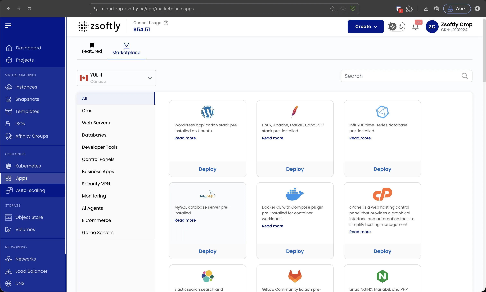
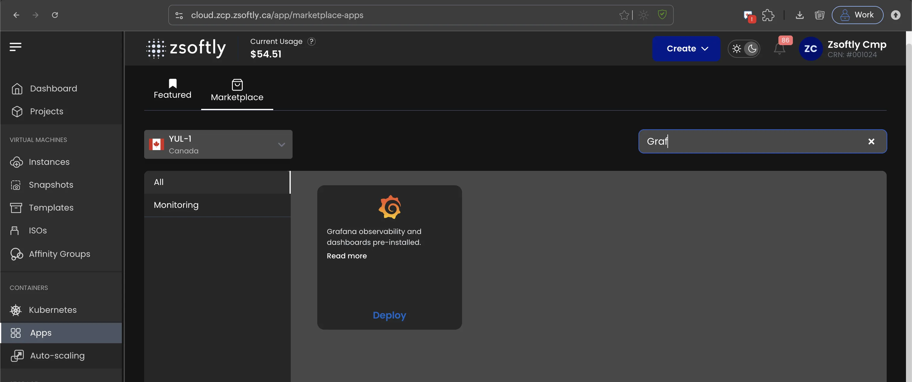

Coolify est une PaaS open source et auto-hébergée, alternative directe à Heroku, Netlify et Vercel.
Elle déploie des applications, des bases de données et des services sur votre propre serveur grâce à
des workflows basés sur Git et à un tableau de bord web, tout en gardant l'ensemble de vos données
sous votre contrôle.

:::note[Bientôt disponible]

Une image Coolify préconfigurée arrive bientôt. Pour l'instant, déployez une instance **Ubuntu 24.04
LTS** neuve depuis la marketplace et suivez les étapes ci-dessous pour installer Coolify vous-même.

:::

## Prérequis

| Ressource | Minimum | Recommandé |
| --------- | ------- | ---------- |
| vCPU      | 2       | 4          |
| RAM       | 2 Go    | 4 Go       |
| Stockage  | 30 Go   | 60 Go      |

## Déployer l'instance de base

1. Dans le portail ZSoftly Cloud, ouvrez **Apps** et passez à l'onglet **Marketplace**. Il s'ouvre
   sur **Featured** par défaut, sélectionnez donc **Marketplace** à côté. Choisissez votre région
   (YOW-1 ou YUL-1), recherchez **Ubuntu 24.04 LTS** et cliquez sur **Deploy**. Vous pouvez aussi
   créer l'instance depuis **Instances → Create**. Dans les deux cas, vous obtenez une VM Ubuntu
   24.04 propre.

   

   

2. Choisissez un plan qui répond aux prérequis ci-dessus.

3. Lorsque l'instance est **Running**, connectez-vous en SSH:

```bash
ssh ubuntu@<your-vm-ip>
```

4. Mettez le système à jour:

```bash
sudo apt update && sudo apt upgrade -y
```

## Installer Coolify

Coolify fournit un installeur officiel en une ligne qui met en place Docker, Docker Compose et la
pile Coolify complète pour vous. Exécutez-le en tant que root:

```bash
curl -fsSL https://cdn.coollabs.io/coolify/install.sh | sudo bash
```

L'installeur télécharge les images requises et démarre chaque service. Une fois terminé, il affiche
l'URL du tableau de bord. Rien d'autre n'a besoin d'être installé manuellement.

## Configurer Coolify

1. Ouvrez le tableau de bord dans votre navigateur à l'adresse `http://<your-vm-ip>:8000`.
2. Le premier compte que vous créez devient l'administrateur racine. Définissez immédiatement une
   adresse e-mail et un mot de passe robustes, car les inscriptions se ferment après le premier
   utilisateur.
3. Sous **Settings**, définissez le domaine de votre instance afin que Coolify puisse émettre des
   certificats TLS Let's Encrypt et servir le tableau de bord en HTTPS. Coolify inclut un reverse
   proxy Traefik intégré qui gère le routage et les certificats à la fois pour le tableau de bord et
   pour vos applications déployées, aucun proxy distinct n'est donc nécessaire.
4. Ajoutez la clé SSH publique de votre serveur et connectez une source Git (GitHub, GitLab ou un
   dépôt générique) pour commencer à déployer des applications.

## Ouvrir le pare-feu

Par défaut, l'instance n'autorise que le SSH (port 22) depuis l'extérieur. Ouvrez les ports dont
Coolify a besoin et ajoutez-les aux règles réseau/sécurité de l'instance dans le portail:

```bash
sudo ufw allow 8000/tcp
sudo ufw allow 80/tcp
sudo ufw allow 443/tcp
sudo ufw allow 6001/tcp
sudo ufw allow 6002/tcp
```

Les ports 80 et 443 servent vos applications déployées et le TLS. Les ports 6001 et 6002 sont
utilisés par les fonctionnalités temps réel et terminal de Coolify.

## Étapes suivantes

- [Documentation Coolify](https://coolify.io/docs)
- [Guide d'installation de Coolify](https://coolify.io/docs/get-started/installation)
