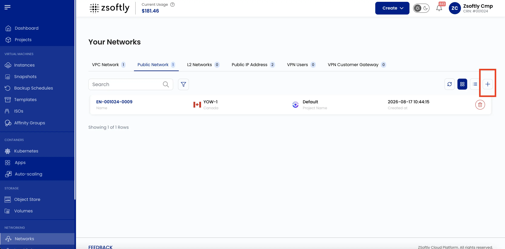
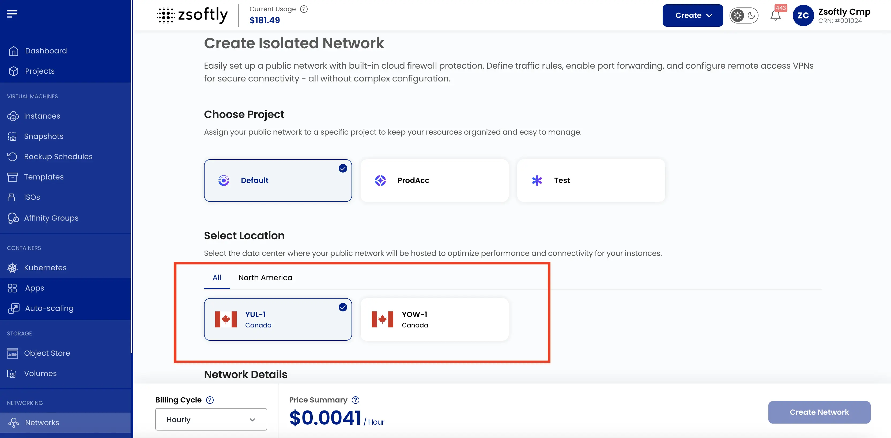
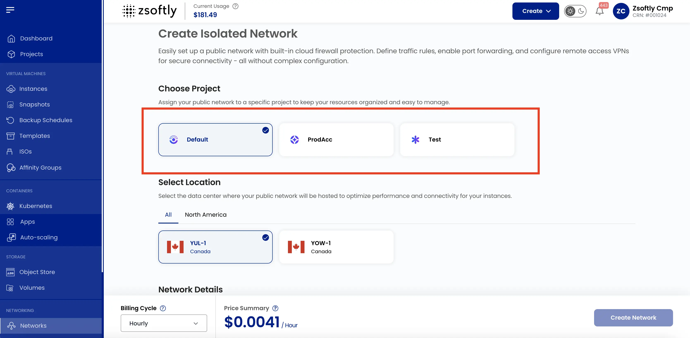
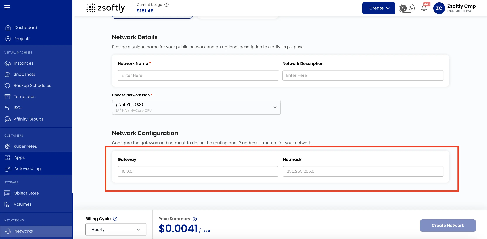
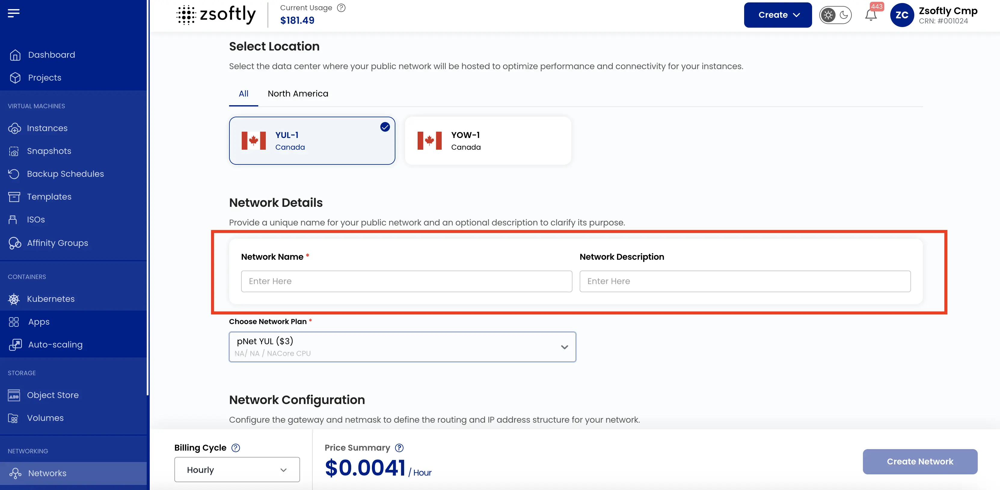
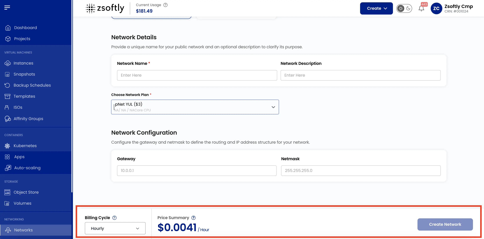

Un **réseau public** fournit un accès exposé à Internet aux ressources cloud. Il permet aux VM et
aux services de communiquer avec des systèmes externes sur Internet.

### Créer un réseau public

- Dans le menu de gauche, cliquez sur **Réseaux** → onglet **Réseau public**.
- Cliquez sur l'icône **+** pour ouvrir la page de création.

### Choisir un emplacement

Sélectionnez l'emplacement du centre de données où héberger le réseau.

### Assigner à un projet

Assignez le réseau à un projet pour organiser les ressources.

### Configurations réseau

Configurez la passerelle et le masque réseau pour définir le routage et la structure des adresses
IP.

### Nom

Fournissez un nom unique pour votre réseau public.

### Créer

- Choisissez le **cycle de facturation** : horaire, mensuel ou annuel.
- Passez en revue le sommaire du prix et cliquez sur **Créer**.

Voir aussi : [Vue d'ensemble du réseau](/fr/public-cloud/networking/public-network/overview),
[IP publiques](/fr/public-cloud/networking/public-network/public-ips)
