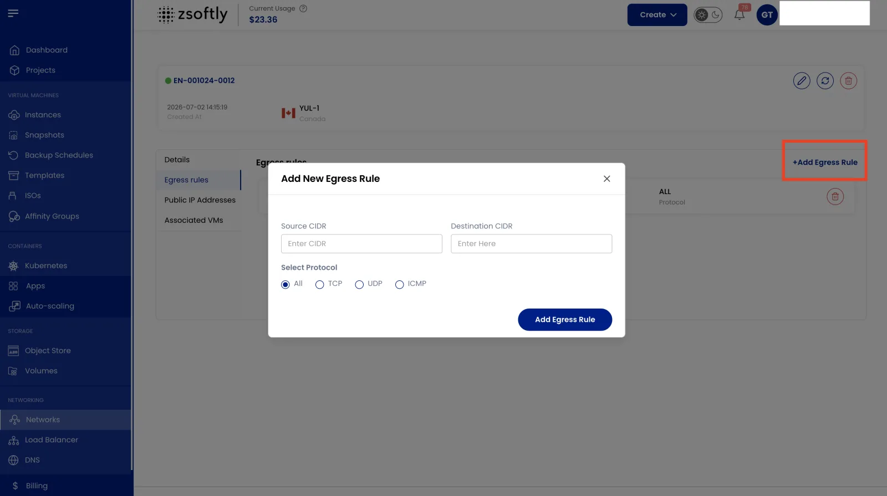

Une règle de sortie contrôle le trafic réseau sortant d'une source vers une destination précise,
selon les protocoles et plages IP définis.

- Dans l'onglet **Egress Rules**, consultez toutes les règles de sortie actuelles.
- Cliquez sur **Ajouter Egress Rule** pour ouvrir le formulaire de configuration.

### Ajouter une nouvelle règle de sortie

- Entrez **Source CIDR** et **Destination CIDR**.
- Choisissez le protocole : TCP, UDP, ICMP ou All.
- Cliquez sur **Ajouter Egress Rule**.
