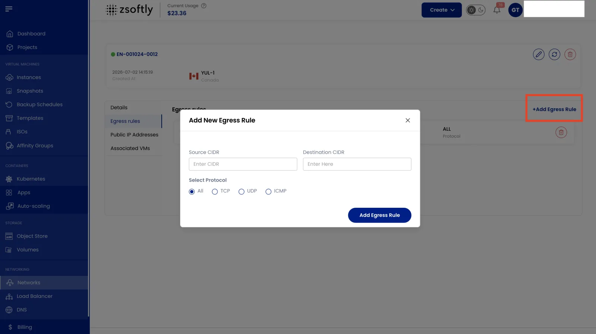

Une règle de sortie contrôle le trafic réseau sortant d'une source vers une destination précise,
selon les protocoles et plages IP définis.

:::caution

Le fait qu'un réseau dispose ou non d'un accès sortant fonctionnel dépend de la façon dont il a été
créé.

Lorsqu'une VM est déployée avec un plan réseau, via le portail, `zcp instance create --network-plan`
ou l'argument `network_plan` du fournisseur Terraform, la plateforme provisionne le réseau avec un
accès sortant déjà fonctionnel. Vous n'avez rien à ajouter.

Un réseau que vous créez comme ressource distincte, via `zcp network create` ou la ressource
Terraform `zcp_network`, démarre sans aucune règle de sortie et bloque tout le trafic sortant. Les
VM qui s'y trouvent ne peuvent joindre ni les dépôts de paquets, ni les registres de conteneurs, ni
aucun autre hôte Internet tant que vous n'ajoutez pas de règles. Le symptôme : toutes les commandes
sortantes expirent alors que la VM est par ailleurs saine et accessible en SSH.

Vérifiez dans quelle situation vous êtes :

```bash
zcp egress list --network <network-slug> --region <region-slug>
```

:::

- Dans l'onglet **Egress Rules**, consultez toutes les règles de sortie actuelles.
- Cliquez sur **Ajouter Egress Rule** pour ouvrir le formulaire de configuration.



### Ajouter une nouvelle règle de sortie

- Entrez **Source CIDR** et **Destination CIDR**.
- Choisissez le protocole : TCP, UDP, ICMP ou All.
- Cliquez sur **Ajouter Egress Rule**.
