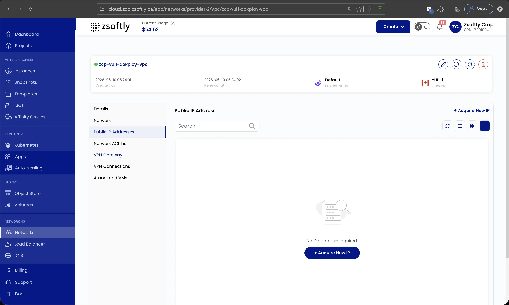

Les adresses IP publiques permettent aux ressources du VPC de communiquer avec Internet.

- Dans l'onglet **Adresses IP publiques**, consultez toutes les IP publiques assignées.
- Cliquez sur **Acquire New IP** pour demander une nouvelle IP publique.
- Choisissez le **cycle de facturation** et cliquez sur **Buy IP**.

Voir aussi : [Vue d'ensemble du VPC](/fr/public-cloud/networking/vpc/create-vpc),
[Passerelle VPN](/fr/public-cloud/networking/vpc/site-vpn)
