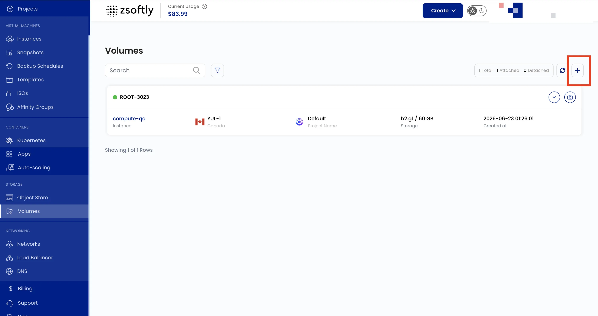
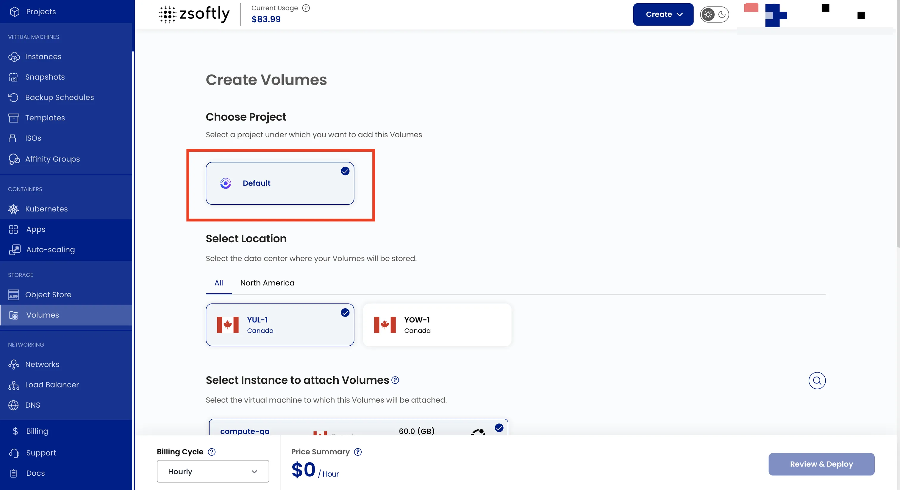
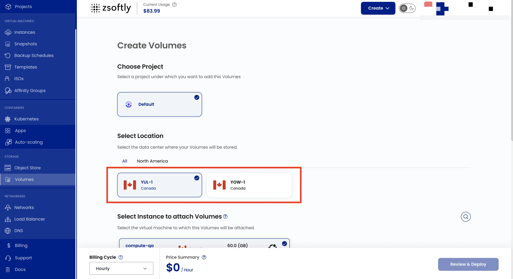
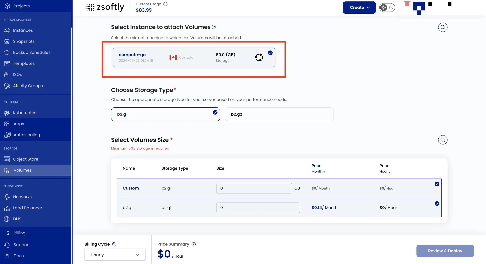
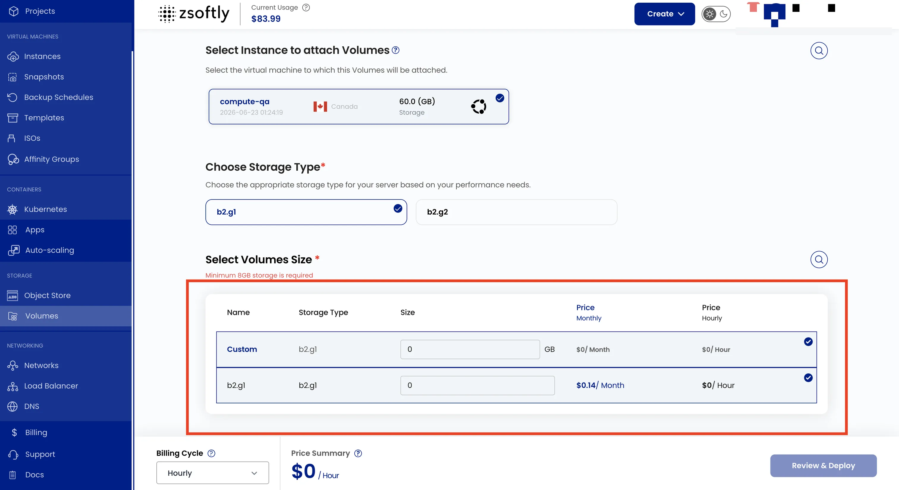
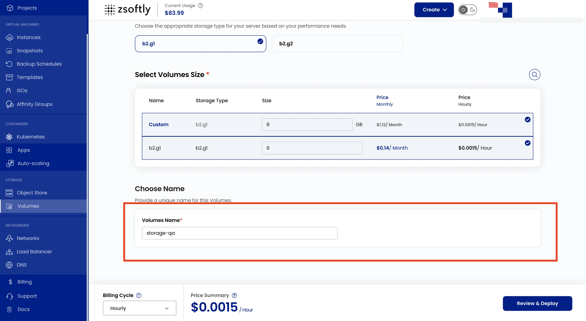
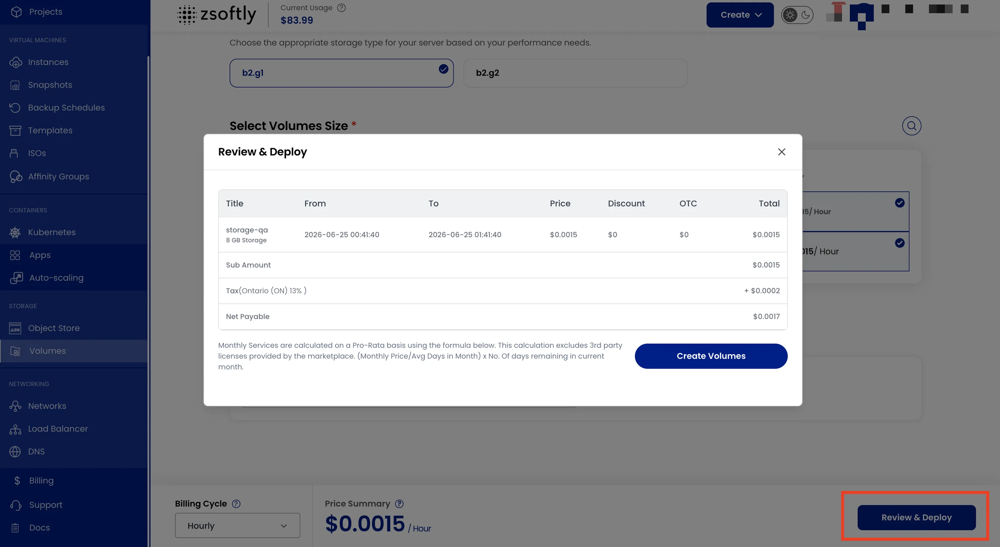

## Volumes de stockage bloc

Les volumes de stockage bloc fournissent des volumes SSD NVMe locaux, des volumes SSD SATA locaux ou
des volumes de stockage partagé répliqué pour les machines virtuelles, selon la région et le plan
choisis. Une fois le volume attaché, formatez-le et montez-le pour étendre le stockage de votre VM.

### Create Volumes

- Dans le menu de gauche, cliquez sur **Volumes**.
- Cliquez sur l'icône **+**.



### Choose Project

Sous **Choose Project**, attribuez le volume à un projet.



### Select Location

Sous **Select Location**, choisissez l'emplacement du centre de données.



### Select Instance to attach Volumes

Sous **Select Instance to attach Volumes**, choisissez l'instance virtuelle.



### Choose Storage Type and Select Volumes Size

Dans **Choose Storage Type**, sélectionnez un type de stockage. Dans **Select Volumes Size**,
sélectionnez la taille du volume. Des volumes personnalisés sont disponibles.

La capture d'écran publiée indique « Minimum 8GB storage is required ». Vérifiez la valeur minimale
affichée pour le plan de stockage sélectionné et utilisez cette valeur.



### Choose Name

Sélectionnez **Choose Name** et fournissez un **Volumes Name** unique.



### Créer

Connectez-vous à l'instance virtuelle cible avec SSH avant de créer le volume. N'exécutez jamais ces
commandes sur votre poste de travail local. Exécutez `hostname` et vérifiez qu'il correspond au
**Server Hostname** de l'instance dans le portail. Ensuite, exécutez la première commande `lsblk`
ci-dessous avant de créer le volume et enregistrez sa sortie.

```bash
# Confirm that this is the target VM before recording its disks.
hostname

# Before creating and attaching the volume, record the current devices.
lsblk -p -o NAME,SIZE,TYPE,FSTYPE,MOUNTPOINTS
```

- **Billing Cycle** : **Hourly**, **Monthly** ou **Yearly**.
- Cliquez sur **Review & Deploy**, examinez le résumé, puis cliquez sur **Create Volumes**.



Après l'attachement, exécutez de nouveau la commande complète `lsblk` et comparez sa sortie avec la
sortie enregistrée avant la création du volume. Attribuez à `NEW_DISK` le chemin du seul disque
entier apparu après l'attachement. Arrêtez-vous si aucun disque n'est apparu, si plusieurs disques
sont apparus ou si vous ne pouvez pas l'identifier.

Exécutez ce bloc autonome après l'attachement, connecté à l'instance virtuelle cible avec SSH,
jamais sur votre poste de travail local. Exécutez `hostname` et vérifiez qu'il correspond au
**Server Hostname** de l'instance dans le portail avant de continuer. Il s'arrête avant le
formatage, sauf si le périphérique spécifié est le nouveau disque vide. Le formatage efface les
données existantes.

```bash
(
  set -eu

  if [ -z "${SSH_CONNECTION:-}" ]; then
    echo "Connect to the target VM over SSH before formatting a disk." >&2
    exit 1
  fi

  # Confirm that this is the target VM before formatting a disk.
  hostname

  # Compare this inventory with the baseline. Stop unless one new whole disk appeared after attachment.
  lsblk -p -o NAME,SIZE,TYPE,FSTYPE,MOUNTPOINTS

  # Replace this sentinel with the absolute path of the one verified new disk.
  NEW_DISK=/dev/REPLACE_WITH_NEW_DISK

  if [ "$NEW_DISK" = /dev/REPLACE_WITH_NEW_DISK ] || [ ! -b "$NEW_DISK" ]; then
    echo "Set NEW_DISK to the verified block device path." >&2
    exit 1
  fi

  # Recheck the device immediately before formatting.
  lsblk -p -o NAME,SIZE,TYPE,FSTYPE,MOUNTPOINTS "$NEW_DISK"
  DISK_TYPE=$(lsblk -dn -o TYPE "$NEW_DISK") || { echo "Could not inspect the disk type. Stop and verify it." >&2; exit 1; }
  DEVICE_ROWS=$(lsblk -nr -o NAME "$NEW_DISK") || { echo "Could not inspect disk devices. Stop and verify them." >&2; exit 1; }
  DEVICE_COUNT=$(awk 'NF { count++ } END { print count + 0 }' <<<"$DEVICE_ROWS") || { echo "Could not count disk devices. Stop and verify them." >&2; exit 1; }
  FSTYPE=$(lsblk -dn -o FSTYPE "$NEW_DISK") || { echo "Could not inspect the disk filesystem. Stop and verify it." >&2; exit 1; }
  MOUNTPOINTS=$(lsblk -dn -o MOUNTPOINTS "$NEW_DISK") || { echo "Could not inspect disk mount points. Stop and verify them." >&2; exit 1; }
  SIGNATURES=$(sudo wipefs -n -i -O TYPE "$NEW_DISK") || { echo "Could not inspect disk signatures. Stop and verify them." >&2; exit 1; }
  if [ "$DISK_TYPE" != disk ] ||
    [ "$DEVICE_COUNT" -ne 1 ] ||
    [ -n "$FSTYPE" ] ||
    [ -n "$MOUNTPOINTS" ] ||
    [ -n "$SIGNATURES" ]; then
    echo "NEW_DISK is not an empty whole disk. Stop and verify it." >&2
    exit 1
  fi
  MOUNT_TARGETS=$(findmnt -rn -o TARGET) || { echo "Could not inspect mount targets. Stop and review them." >&2; exit 1; }
  if grep -Fx /data <<<"$MOUNT_TARGETS" >/dev/null; then
    echo "/data is already mounted. Stop and review it." >&2
    exit 1
  else
    MOUNT_TARGET_STATUS=$?
    if [ "$MOUNT_TARGET_STATUS" -ne 1 ]; then
      echo "Could not search mount targets. Stop and review them." >&2
      exit 1
    fi
  fi
  FSTAB_SNAPSHOT=$(mktemp) || {
    echo "Could not create a temporary fstab snapshot. Stop and review it." >&2
    exit 1
  }
  trap 'rm -f -- "$FSTAB_SNAPSHOT"' EXIT
  if ! sudo cat /etc/fstab >"$FSTAB_SNAPSHOT"; then
    echo "Could not read /etc/fstab. Stop and review it." >&2
    exit 1
  fi
  if ! findmnt --verify --tab-file "$FSTAB_SNAPSHOT" >/dev/null; then
    echo "Could not validate /etc/fstab. Stop and review it." >&2
    exit 1
  fi
  if awk '/^[[:space:]]*($|#)/ { next } { target = $2; sub(/\/+$/, "", target); if (target == "/data") found = 1 } END { exit(found ? 0 : 1) }' "$FSTAB_SNAPSHOT"; then
    echo "/data already has an fstab entry. Stop and review it." >&2
    exit 1
  else
    FSTAB_TARGET_STATUS=$?
    if [ "$FSTAB_TARGET_STATUS" -ne 1 ]; then
      echo "Could not inspect fstab targets. Stop and review them." >&2
      exit 1
    fi
  fi
  if ! rm -f -- "$FSTAB_SNAPSHOT"; then
    echo "Could not remove the temporary fstab snapshot. Stop and review it." >&2
    exit 1
  fi
  trap - EXIT
  if [ -L /data ]; then
    echo "/data is a symbolic link. Stop and review it." >&2
    exit 1
  fi
  if [ -e /data ] && [ ! -d /data ]; then
    echo "/data is not a directory. Stop and review it." >&2
    exit 1
  fi
  if [ -d /data ]; then
    DATA_ENTRY=$(sudo find /data -mindepth 1 -maxdepth 1 -print -quit) || {
      echo "Could not inspect /data. Stop and review it." >&2
      exit 1
    }
    if [ -n "$DATA_ENTRY" ]; then
      echo "/data is not empty. Stop and review it." >&2
      exit 1
    fi
  fi

  sudo mkfs.ext4 "$NEW_DISK"
  sudo mkdir -p /data
  sudo mount "$NEW_DISK" /data
  UUID=$(sudo blkid -s UUID -o value "$NEW_DISK")
  if [ -z "$UUID" ]; then
    echo "No filesystem UUID was created. Stop and verify the disk." >&2
    exit 1
  fi
  printf '%s\n' "UUID=$UUID /data ext4 defaults,nofail 0 2" | sudo tee -a /etc/fstab >/dev/null
  sudo findmnt --verify
  sudo mount -a
  findmnt /data
)
```

Voir aussi :
[Types de stockage et résilience](/fr/public-cloud/storage/block-storage/storage-types),
[Instantanés de volume](/fr/public-cloud/storage/block-storage/snapshots),
[Instantanés de VM](/fr/public-cloud/backups-snapshots/vm-snapshots)
