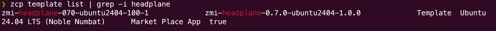
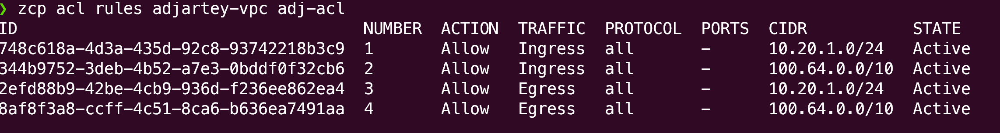
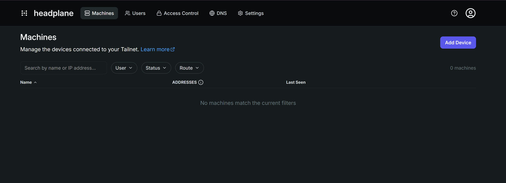
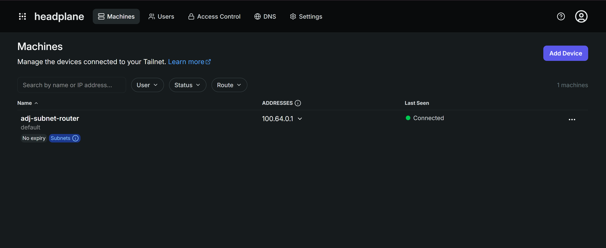
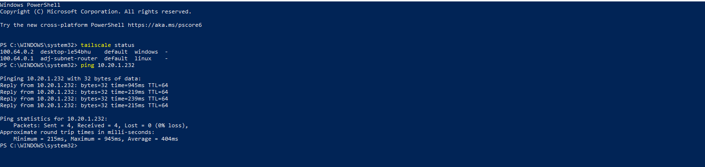
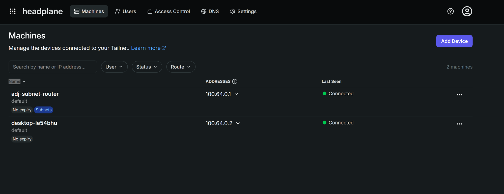

Ce tutoriel crée un réseau privé sur ZCP : un VPC avec un niveau réseau qui n'est pas exposé
publiquement par défaut, ainsi qu'un serveur [Headscale](https://headscale.net) auto-hébergé qui
vous donne un accès par réseau maillé WireGuard. Il sert de fondation au reste de cette série : le
stockage privé et les postes de travail privés des employés résident dans le niveau créé ici et ne
sont accessibles que par le réseau maillé, jamais par une adresse IP publique.

À la fin, vous disposerez de :

- Un VPC et un niveau réseau privés
- Une ACL réseau personnalisée qui limite ce niveau au trafic dont il a besoin
- Un serveur Headscale auto-hébergé, déployé depuis le Marketplace
- Un routeur de sous-réseau qui relie Internet au niveau privé
- Votre appareil connecté au réseau maillé et capable d'atteindre le niveau privé

Prévoyez environ 30 minutes.

:::note

Les slugs de ce tutoriel (région `yul-1`, projet `default-9`, plans, entre autres) sont des
**exemples d'un compte**. Les vôtres diffèrent. Chaque étape affiche la commande `list` qui indique
la bonne valeur pour votre compte et votre région. Utilisez toujours ces valeurs et ne copiez pas
les exemples tels quels.

:::

## Avant de commencer

- Un compte ZSoftly Public Cloud. [Créez-en un](/public-cloud/getting-started/account-signup) si
  vous n'en avez pas.
- Un terminal avec un client SSH.
- `jq` installé. Les scripts de création et de suppression de ce tutoriel l'exigent
  (`apt install jq` ou `brew install jq`).
- Le [client Tailscale](https://tailscale.com/download) installé sur votre appareil pour vérifier la
  connectivité à la fin.

:::note

Aucun domaine ni certificat TLS n'est requis. Le modèle Headplane utilise HTTP en clair par défaut,
ce qui correspond à la configuration de base de ce tutoriel. Le tunnel SSH chiffre l'accès à
l'interface d'administration. Consultez « Ce que le script crée » ci-dessous.

:::

## Étape 1 : Installer le CLI

```bash
# macOS and Linux
curl -fsSL https://raw.githubusercontent.com/zsoftly/zcp-cli/main/scripts/install.sh | bash
```

```powershell
# Windows (PowerShell)
irm https://raw.githubusercontent.com/zsoftly/zcp-cli/main/scripts/install.ps1 | iex
```

Confirmez son fonctionnement avec `zcp version`.

## Étape 2 : S'authentifier

1. Dans le portail, ouvrez **Profil → Jetons d'API** et créez un jeton. Copiez-le.
2. Créez un profil CLI et répondez aux invites :

```bash
zcp profile add default
```

Le CLI demande le **jeton Bearer** copié, puis une **région par défaut** et un **projet par défaut**
(consultez la note ci-dessous pour les trouver si vous ne les connaissez pas). Il ne demande pas
l'URL de l'API. Elle utilise une valeur par défaut fixe, sauf remplacement avec
`--api-url-override`. Vérifiez ensuite :

```bash
zcp auth validate
```

:::note

Chaque commande qui traite une ressource propre à une région exige une **région** et un **projet**.
Le profil créé contient déjà les valeurs par défaut définies par les invites précédentes.
Recherchez-les d'abord si vous ne les connaissez pas encore :

```bash
zcp region list                # find your region, e.g. yul-1
zcp project list                # find your project slug, e.g. default-9
```

Remplacez les valeurs par défaut du profil pour une seule commande avec les options
`--region`/`--project`, ou pour le reste de votre session shell avec
`export ZCP_REGION=...`/`export ZCP_PROJECT=...`.

:::

## Étape 3 : Trouver vos ressources

Trouvez le modèle Headplane (il regroupe le serveur de contrôle Headscale et une interface web) :

```bash
zcp template list | grep -i headplane
```



Notez le **SLUG** (par exemple `zmi-headplane-070-ubuntu2404-100-1`). Les slugs de modèles varient
selon la région et la version.

Vous avez aussi besoin d'un **plan de calcul**, d'un **plan réseau**, d'un **plan de routeur VPC**
et d'une **catégorie de stockage** :

```bash
zcp plan vm                 # compute plans, e.g. ca2sm
zcp plan network            # network plans, e.g. pnet-yul
zcp plan router             # VPC router plan, e.g. virtual-private-cloud-vpc-1
zcp storage-category list   # e.g. pro-nvme, ssd-storage, premium-ssd
```

## Étape 4 : Ajouter votre clé SSH

```bash
ssh-keygen -t ed25519 -C "you@example.com"   # skip if you already have one

zcp ssh-key import --name my-key --key-file ~/.ssh/id_ed25519.pub

zcp ssh-key list
```

:::note

Le nom de la clé doit contenir 20 caractères ou moins, et la clé publique doit être unique dans
votre compte.

:::

## Exécuter le script

Un seul script crée le VPC, le niveau privé, l'ACL, Headplane et le routeur de sous-réseau :
`zcp/build-private-network.sh` du dépôt [zsoftly/tools](https://github.com/zsoftly/tools). Il passe
en ordre par les mêmes phases expliquées dans la section suivante et affiche chaque ressource lors
de sa création.

:::note

Ce script et le script de suppression plus bas exigent un shell bash. Il est natif sur macOS et
Linux. Sous Windows, exécutez-les depuis WSL ou Git Bash.

:::

```bash
bash <(curl -fsSL https://raw.githubusercontent.com/zsoftly/tools/main/zcp/build-private-network.sh) \
  --ssh-key my-key --name my-workspace
```

Ce tutoriel utilise `my-workspace` comme préfixe `--name` dans tous ses exemples de commandes. Les
captures d'écran ci-dessous viennent d'un essai antérieur avec un préfixe différent. Les noms de
ressources qui y figurent ne correspondent donc pas exactement aux exemples de commandes. Vos noms
de ressources différeront des deux, selon la valeur choisie pour `--name`.

Le script récupère `ZCP_REGION` et `ZCP_PROJECT` depuis votre shell si vous les avez exportées à
l'étape 2. Sinon, transmettez `--region`/`--project`.

| Option       | Rôle                                       | Valeur par défaut / exigence        |
| ------------ | ------------------------------------------ | ----------------------------------- |
| `--ssh-key`  | Nom de clé de l'étape 4, pour les deux VM  | Obligatoire                         |
| `--name`     | Préfixe de chaque ressource créée          | `workspace`                         |
| `--region`   | Slug de région ZCP                         | Obligatoire (option ou var. d'env.) |
| `--project`  | Slug de projet ZCP                         | Obligatoire (option ou var. d'env.) |
| `-y`/`--yes` | Ignore l'invite de confirmation ci-dessous | Désactivé                           |

Le modèle Headplane, les deux plans de calcul, le plan réseau, le plan du routeur VPC et les deux
catégories de stockage sont détectés automatiquement dans votre compte. Le script affiche ses choix
au début de sa sortie afin que vous puissiez les examiner avant toute création.

Le modèle du routeur de sous-réseau n'est pas recherché. Il utilise par défaut un slug fixe
(`ubuntu-2404-lts-1`). Transmettez `--router-template` si votre compte ne possède pas ce modèle.
Votre adresse IP publique (`--my-ip`), la base du réseau VPC (`--network-address`) et le cycle de
facturation (`--billing-cycle`) ne sont pas non plus recherchés dans le compte. Ils utilisent une
valeur détectée automatiquement ou fixe que vous pouvez remplacer.

Transmettez explicitement une option pour fixer une valeur précise. Exécutez le script avec `--help`
pour obtenir la liste complète.

```text
==> Preflight checks
[OK] zcp CLI authenticated, region=yul-1 project=default-9
[INFO] Detecting your public IP...
[INFO] Admin-port access scoped to: <your-ip>/32
[INFO] Resolved resources:
    Headplane template   : zmi-headplane-070-ubuntu2404-100-1
    Headplane plan       : ci2ls
    Router template      : ubuntu-2404-lts-1
    Router plan          : ci2ls
    Network plan         : pnet-yul
    VPC router plan      : virtual-private-cloud-vpc-1
    VPC storage category : pro-nvme
    VM storage category  : pro-nvme

This creates a VPC, two VMs (plans above), and networking on your account now.
Billing starts as soon as each resource is created.
Type 'yes' to continue:
```

À moins d’avoir passé `-y`/`--yes`, le script s’arrête ici et attend que vous saisissiez `yes`. Tout
ce qui précède est une recherche en lecture seule. Aucune ressource n’a encore été créée.

Le script prend ensuite plusieurs minutes. Il attend le démarrage des deux VM, la fin du
provisionnement de premier démarrage de Headplane et la disponibilité de SSH avant toute
configuration par ce canal.

## Ce que le script crée

### VPC et niveau privé

**Le niveau privé n'a lui-même aucune adresse IP publique. Seul Headplane reçoit un port
d'application exposé sur Internet.**

Le script crée un VPC (`my-workspace`) et un niveau réseau (`my-workspace-tier`) à l’intérieur, sans
IP publique sur le niveau lui-même. Les deux VM déployées reçoivent chacune une IP publique, dont le
script a besoin pour les configurer par SSH. Ensuite, chaque VM l’utilise pour une raison
différente. Headplane en a besoin car il est le serveur Headscale : le routeur et votre appareil
l’atteignent à cette adresse. Le routeur en a besoin seulement pendant sa configuration, pour
joindre Headplane avant son inscription au maillage. Headplane est le seul des deux avec un port
d’application exposé à Internet, ouvert délibérément par des règles de pare-feu et de redirection de
port.

:::note

ZCP attribue automatiquement au VPC une IP source-NAT pour le trafic sortant lors de sa création. Le
script n’en alloue pas lui-même et vous ne devez pas non plus le faire avec `zcp ip allocate`. Cela
créerait une IP supplémentaire redondante et facturable. Si cela arrive, `zcp ip release <slug>` la
supprime.

:::

### L'ACL réseau personnalisée

**C'est l'ACL qui rend le niveau privé, pas le VPC à lui seul.**

L'ACL par défaut du niveau autorise tout. Le script la remplace par une ACL qui n'autorise que ce
dont le niveau a besoin, puis l'applique au niveau. Un VPC seul ne garantit pas l'isolation. L'ACL
la garantit.

:::note

Le second CIDR autorisé par le script, `100.64.0.0/10`, est la plage d'adresses du réseau maillé de
Headscale. Elle n'est pas recherchée après la création de Headplane. C'est la plage IP par défaut,
documentée par Tailscale et Headscale, pour chaque appareil du réseau maillé
([RFC 6598](https://www.rfc-editor.org/rfc/rfc6598), le bloc « Shared Address Space » (« espace
d'adresses partagé »)). Chaque installation par défaut l'utilise, sauf reconfiguration volontaire.
Le script peut ajouter ces règles avant le déploiement de Headplane, car cette plage ne dépend
d'aucune autre ressource créée.

:::

:::caution

Autoriser uniquement le CIDR du niveau (`10.20.1.0/24`) ne suffit pas. L'accès à l'adresse IP du
niveau du routeur de sous-réseau par le réseau maillé fonctionne avec cette seule règle, car ce
trafic se termine directement au point de terminaison du tunnel WireGuard du routeur, avant
l'évaluation de l'ACL du niveau.

Le trafic vers toute _autre_ VM du niveau passe d'abord par le routeur. Une capture de paquets a
confirmé que le NAT source par défaut de Tailscale réécrit ce trafic transféré avec l'adresse du
niveau du routeur, et non celle du client maillé d'origine. La règle de CIDR du réseau maillé
(entrée et sortie) reste donc dans cette ACL, car un essai antérieur a montré que l'accès aux autres
VM du niveau échoue sans elle. Les règles de sortie sont aussi requises, car les ACL réseau de cette
plateforme sont sans état : une règle d'entrée seule ne couvre pas le trafic de retour.

:::

Vérifiez que les règles ont été appliquées (consultez `zcp acl rules` dans « Inspecter les
ressources créées » ci-dessous) :



### Headplane

**Headplane ouvre délibérément un seul port d'application sur Internet : le point de contrôle du
réseau maillé. L'interface d'administration ne touche jamais Internet.**

Le script déploie le modèle Marketplace Headplane (il regroupe le serveur de contrôle Headscale et
une interface web) sur son propre réseau public.

Par défaut, le script de premier démarrage du modèle fait pointer la configuration Headscale vers
l'adresse IP **privée** de la VM. Les appareils externes ont plutôt besoin de l'adresse IP publique.
Le script se connecte donc par SSH, réécrit cette configuration et redémarre la pile.

Le script ouvre le port **8080** (le point de contrôle du réseau maillé de Headscale) dans le
pare-feu et crée la règle de redirection de port correspondante. Une règle de pare-feu seule
autorise le trafic au niveau réseau. Dans ce type de réseau, elle ne rend pas le service accessible
à elle seule. Une règle de redirection associe le port de l'adresse IP publique à l'adresse IP
privée de la VM. Les deux sont requises. Le port 8080 doit rester largement ouvert (`0.0.0.0/0`) :
tout appareil distant qui rejoint le réseau maillé doit pouvoir l'atteindre depuis son emplacement.

:::caution

Le port **3000**, qui sert à l'interface d'administration, n'est jamais ouvert dans le pare-feu, pas
même en le limitant à votre adresse IP. La clé d'API qu'il protège contrôle l'ensemble du réseau
maillé : elle permet de créer des clés de préauthentification, d'approuver des routes et de voir
tous les appareils connectés. Envoyer cette clé en HTTP en clair sur un port public crée un risque
réel de vol d'identifiants. Le script ne l'expose donc jamais ainsi. Accédez-y uniquement par un
tunnel SSH au moyen de la règle du port 22 déjà en place :

```bash
ssh -L 3000:localhost:3000 ubuntu@<headplane-public-ip>
```

Laissez ce tunnel ouvert, puis ouvrez `http://localhost:3000/admin/login` dans votre navigateur. Le
récapitulatif final du script affiche cette commande exacte avec votre adresse IP réelle.

:::

:::caution

Les modèles Marketplace App comme celui-ci reçoivent au déploiement une règle de pare-feu SSH par
défaut ouverte à **toute adresse** (`0.0.0.0/0`, ports 22 TCP et UDP), visible dans
`zcp firewall list --ip <ip-slug>` (trouvez le slug avec `zcp ip list`). Vous ne l’avez pas créée et
elle ne se limite pas à vous. Le script ajoute une règle de remplacement limitée à votre IP et
confirme son existence avant de supprimer la règle ouverte. Une défaillance en cours d’exécution ne
laisse ainsi jamais la VM inaccessible par SSH.

Le script exécute cette même procédure sur les deux VM qu’il crée, pas seulement Headplane : il
ajoute et confirme une règle limitée à votre IP, puis retire toute règle ouverte `0.0.0.0/0`
trouvée. Le routeur de sous-réseau, déployé depuis une image de système d’exploitation ordinaire,
peut ne pas avoir la règle ouverte par défaut des modèles Marketplace App. Il reçoit tout de même la
règle limitée. C’est la véritable passerelle vers votre niveau privé. Il doit donc être verrouillé,
quel que soit son état initial.

:::

Le premier démarrage de la VM Headplane génère un secret de cookie unique, démarre la pile, crée un
utilisateur Headscale par défaut et génère une clé API, écrite dans `/etc/headplane/credentials.txt`
sur la VM. Le script la lit par SSH et l'affiche dans son résumé final. Cette lecture unique relève
d'une convention, pas d'une limite technique : si vous avez de nouveau besoin de la clé,
connectez-vous par SSH et lisez directement `/etc/headplane/credentials.txt`.

:::note

Si l'interface Headplane rejette cette clé (« API key was not found in the Headscale database »),
générez-en une nouvelle directement sur la VM et utilisez-la :

```bash
sudo docker exec headscale headscale apikeys create --expiration 90d
```

:::

Lorsque le tunnel est ouvert, connectez-vous à `http://localhost:3000/admin/login` avec la clé API.



### Le routeur de sous-réseau

**Le routeur de sous-réseau est le seul chemin entre Internet et le niveau privé.**

Le script déploie une petite VM avec deux interfaces réseau : son propre réseau public pour joindre
Headscale lors de l'inscription, et le niveau privé attaché après sa création.

La plateforme ajoute la seconde interface à chaud, mais le système d'exploitation ne l'active pas
automatiquement. Le script écrit et applique un fichier netplan pour cette nouvelle interface, puis
lit l'adresse attribuée par DHCP dans le niveau.

Il installe le client Tailscale sur le routeur, le même client qu'utilise Headscale mais pointé vers
un serveur de contrôle personnalisé, puis active le transfert IP **avant** l'inscription.
`tailscale up` affiche un avertissement à ce sujet (« IP forwarding is disabled, subnet routing/exit
nodes will not work »). Il ne bloque pas l'opération. Sans cette étape, la route est approuvée mais
ne transfère jamais de trafic.

Le script génère une clé preauth sur le serveur Headplane et l'utilise pour inscrire le routeur en
annonçant le CIDR du niveau comme route.

:::note

L'inscription exige l'ID numérique de l'utilisateur Headscale, et non son nom. `--user default`
échoue avec une erreur d'analyse. Vous pourriez aussi voir un avertissement indiquant que « UDP GRO
forwarding » est configuré de manière non optimale. C'est une suggestion de réglage des
performances, pas une erreur, et elle ne bloque pas l'inscription.

:::

L'approbation d'une route annoncée côté Headscale n'est pas automatique. Le script s'en charge : il
recherche l'ID de nœud du routeur et approuve le CIDR du niveau pour celui-ci. Sans approbation,
`list-routes` indique **Available**, mais jamais **Approved** ni **Serving**. Après l'approbation,
**Serving (Primary)** peut prendre quelques secondes à apparaître. C'est normal.

Vous pouvez aussi le vérifier dans l'interface Headplane : le routeur affiche **Connected** avec le
badge **Subnets** dès qu'il annonce la route.



Cette VM est la porte d'accès au niveau privé. Les bureaux et le stockage des tutoriels suivants se
trouvent derrière elle, sans nécessiter leurs propres IP publiques.

## Inspecter les ressources créées

Tout ce que le script crée est une ressource ZCP ordinaire. Listez-les comme n'importe quelle autre
ressource :

```bash
zcp vpc list
zcp network list
zcp instance list
zcp acl rules my-workspace my-workspace-acl
```

```text
ID            NAME                        STATE    PRIVATE IP  PUBLIC IP      REGION
a1b2c3d4-...  my-workspace-headscale      Running  10.0.0.214  198.51.100.10  YUL-1
e5f6a7b8-...  my-workspace-subnet-router  Running  10.0.0.76   198.51.100.11  YUL-1
```

`acl rules` prend le slug du VPC, pas son nom. Ils sont identiques dans un compte propre, mais un
nom peut recevoir automatiquement un suffixe (`my-workspace-1`) s'il a déjà été utilisé. Si la
commande ci-dessus ne se résout pas, récupérez d'abord le vrai slug avec `zcp vpc list`.

## Vous connecter depuis votre appareil

Le résumé final du script de construction génère déjà une clé preauth neuve pour votre appareil. Il
affiche une commande prête à l'emploi qui installe Tailscale s'il n'est pas déjà présent et
l'inscrit auprès de votre serveur Headscale en une étape. C'est le même script `vpn/install.sh`
utilisé pour intégrer tout autre point de terminaison. Copiez cette ligne depuis votre terminal.
Elle ressemble à ceci (la clé est générique, la vôtre est réelle) :

```bash
HEADSCALE_URL="http://198.51.100.10:8080" \
  bash <(curl -fsSL https://raw.githubusercontent.com/zsoftly/tools/main/vpn/install.sh) "your-name" --key "hskey-auth-EXAMPLE..."
```

Collez-la dans un terminal sur votre machine et exécutez-la. Sous macOS, vous devrez peut-être
approuver une extension réseau dans **Réglages Système → Confidentialité et sécurité** avant la fin
de la connexion. Sous Windows sans WSL ni Git Bash, utilisez plutôt `vpn/install.ps1` du même dépôt
`zsoftly/tools`. Son README donne la méthode d'appel PowerShell.

Vérifiez :

```bash
tailscale status
ping <router-tier-ip>
```





Les connexions directes dans la même région répondent généralement en quelques millisecondes. Une
connexion relayée par un serveur DERP, fréquente entre réseaux éloignés, peut prendre plusieurs
centaines de millisecondes, surtout pour le premier paquet durant la négociation du chemin. Les deux
cas sont normaux. Le chemin réseau a bien plus d'effet sur la latence que la taille de la VM.

:::caution

Si un nœud apparaît **offline** dans `tailscale status`, avec un message de santé indiquant qu'il ne
peut joindre le serveur de coordination, redémarrez `tailscaled` sur le nœud concerné. Cela peut se
produire même si la configuration réseau est correcte :

```bash
sudo systemctl restart tailscaled
```

Ce comportement a été observé sur le routeur de sous-réseau comme sur les clients ordinaires.

:::

## Vérifier l'isolation

Atteindre l'IP de niveau du routeur de sous-réseau dans la section précédente prouve que le routeur
lui-même n'est pas exposé publiquement. Cela ne prouve pas que le niveau entier est isolé. Ce trafic
se termine directement au point de terminaison WireGuard du routeur. Atteindre une _autre_ VM du
niveau passe au contraire par le transfert du routeur, un chemin différent.

Pour une preuve réelle, déployez une seconde VM comme le script déploie le routeur de sous-réseau :
sa propre IP publique pour la configuration, puis son attachement au niveau. Cette IP publique sert
uniquement à la configurer et ne fait pas partie de ce qui est testé :

```bash
zcp instance create --name isolation-check \
  --template ubuntu-2404-lts-1 --plan ci2ls --billing-cycle hourly \
  --network-plan pnet-yul --storage-category pro-nvme --ssh-key my-key --wait

zcp instance add-network isolation-check --network my-workspace-tier
```

`add-network` prend aussi le slug du niveau, pas son nom, avec la même réserve que ci-dessus.
Récupérez-le avec `zcp network list` si le nom seul ne se résout pas.

Connectez-vous avec SSH par sa propre IP publique et activez l'interface réseau de niveau ajoutée à
chaud comme le script le fait pour le routeur. Consultez « Le routeur de sous-réseau » ci-dessus
pour savoir pourquoi cette étape manuelle est nécessaire :

```bash
ip -br link show   # find the new interface, typically ens8

sudo tee /etc/netplan/60-tier-nic.yaml <<'EOF'
network:
  version: 2
  ethernets:
    ens8:
      dhcp4: true
EOF
sudo netplan apply

ip -4 -br addr show ens8   # note the address it gets, e.g. 10.20.1.201
```

Depuis votre appareil déjà connecté :

```bash
ping <isolation-check-tier-ip>
```

Cette commande réussit à travers le maillage et le transfert du routeur, pas seulement vers
l'adresse du routeur. Essayez maintenant d'atteindre cette même IP de niveau depuis un endroit qui
n'a jamais rejoint le maillage : votre réseau domestique, une autre machine ou Internet. Elle échoue
à chaque fois. Cette adresse est privée, sans IP publique ni règle de redirection dans cette
architecture. Elle n'a jamais été joignable depuis Internet, maillage ou non. C'est la preuve réelle
de l'isolation.

Comme chaque déploiement avec `--network-plan` de ce tutoriel, `isolation-check` a aussi créé son
propre réseau autonome et une IP source-NAT épinglée. `instance delete` ne les supprime pas et le
script de suppression ne gère que les ressources associées à `--name my-workspace`. Il ne touchera
donc pas celles-ci. Relevez l'ID de ce réseau **avant** de supprimer la VM, car l'association
disparaît lorsque la VM est supprimée :

```bash
zcp ip list -o json | jq -r '.[] | select(.vm=="isolation-check") | .network_id // empty' | head -1
```

Supprimez ensuite la VM (`zcp instance delete isolation-check`). Elle ne fait pas partie de la
configuration de travail, elle sert seulement à le constater vous-même. Trouvez le réseau associé à
cet ID et supprimez-le du portail web CMP, comme l'indique l'avertissement Nettoyer ci-dessous.

## Nettoyer les ressources

La facturation horaire continue tant que les ressources existent. Le script de suppression retire le
routeur de sous-réseau, la VM Headplane, le niveau privé et le VPC correspondant à un préfixe
`--name` donné.

```bash
bash <(curl -fsSL https://raw.githubusercontent.com/zsoftly/tools/main/zcp/destroy-private-network.sh) \
  --name my-workspace
```

Il récupère `ZCP_REGION`/`ZCP_PROJECT` dans votre shell comme le script de construction. Passez
plutôt `--region`/`--project` si vous ne les avez pas exportés.

:::caution

Cette opération ne supprime pas toujours tout automatiquement. Le déploiement de chaque VM crée
implicitement son propre réseau autonome, distinct du VPC et du niveau. Supprimer la VM ne supprime
jamais ce réseau ni l'IP source-NAT qui y est épinglée. Le script le détecte et vous avertit avec
l'ID du réseau, mais ne peut pas le supprimer automatiquement. Aucune commande `zcp` ne résout cet
ID en une ressource supprimable. Le script ne demande pas non plus de confirmation : chaque
suppression qu'il effectue est immédiate.

Un reste confirmé produit toujours une sortie non nulle. Vérifiez donc `$?` après l'exécution. Un
avertissement « can't verify » ne produit ce résultat que s'il a réellement supprimé quelque chose
durant cette exécution. S'il n'a rien supprimé parce que tout avait déjà disparu, cet avertissement
signifie « nothing here to check », et non qu'il existe un reste, et le script se termine avec 0.
Dans tous les cas, recherchez dans sa sortie un avertissement leftover-network ou cannot-verify
avant de considérer le nettoyage terminé. S'il apparaît, confirmez ce qui reste avec `zcp ip list`.
Cette commande fournit l'ID réseau requis, alors que `zcp network list` n'en expose pas pour établir
la correspondance. C'est aussi pourquoi le script ne peut pas supprimer ce réseau automatiquement.
Un reste est un réseau et son IP épinglée, pas une instance ni un VPC.
`zcp instance list`/`zcp vpc list` ne l'affichent donc pas. Supprimez le réseau signalé depuis le
portail web CMP en recherchant l'ID réseau imprimé par le script.

:::

## Récapitulatif

1. Installez le CLI, authentifiez-vous, trouvez les slugs des ressources de votre compte et importez
   une clé SSH (étapes 1 à 4).
2. Exécutez `build-private-network.sh --ssh-key <name> --name my-workspace`. Le script crée le VPC,
   le niveau privé, l'ACL limitée, Headplane et le routeur de sous-réseau, puis affiche une commande
   de connexion pour votre appareil.
3. Copiez cette commande depuis la sortie du script, exécutez-la sur votre machine, puis vérifiez
   avec `tailscale status` et un ping vers le niveau.
4. Exécutez `destroy-private-network.sh --name <prefix>` lorsque vous avez terminé afin de tout
   supprimer et d'arrêter la facturation.

## Prochaines étapes

- [Déployer un stockage partagé privé](/tutorials/deploy-private-shared-storage) : un partage NFS
  dans le niveau que vous venez de créer, accessible depuis le niveau et le maillage
- [Déployer des postes Ubuntu pour les employés](/tutorials/deploy-ubuntu-employee-desktops) : un
  bureau complet pour un employé dans le même niveau, accessible uniquement via le maillage
- [Référence CLI](/public-cloud/cli/reference) : chaque commande et indicateur
- [Vue d'ensemble des tutoriels](/tutorials) : la liste complète des tutoriels
