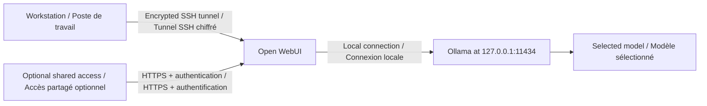

Ce tutoriel ajoute Open WebUI à une VM où Ollama est déjà installé. Open WebUI et Ollama s’exécutent
sur la même VM. Le conteneur fournit l’interface navigateur, tandis qu’Ollama charge et exécute le
modèle.

Ce guide s’adresse aux développeurs et aux opérateurs DIY. Il explique l’ajout de l’interface
navigateur, son exposition contrôlée et le nettoyage du déploiement.



Commencez par
[Exécuter Ollama pour le chat et l’inférence sur ZCP](/fr/tutorials/ollama-chat-and-inference).

Version anglaise : [Run Open WebUI With Ollama on ZCP](/tutorials/open-webui-with-ollama).

:::caution

Ollama ne possède pas d’authentification intégrée. Si l’interface navigateur suffit, n’exposez pas
le port 11434 à Internet. Exposez uniquement le port Open WebUI et limitez son CIDR source.

:::

## 1. Installer Docker

Exécutez ces commandes dans la VM Ollama :

```bash
sudo apt-get update
sudo apt-get install -y docker.io openssl
sudo systemctl enable --now docker
sudo systemctl is-active docker
```

## 2. Démarrer Open WebUI

Le mode réseau de l’hôte rend Ollama accessible à l’adresse 127.0.0.1:11434 dans le conteneur. Open
WebUI écoute sur le port 8080 de l’hôte.

L’exemple fixe Open WebUI à la version `v0.11.0`. Le tag `main` est une cible de développement
glissante et ne convient pas à un déploiement reproductible. Consultez les notes de version avant
une mise à niveau.

```bash
sudo install -d -m 0750 /etc/open-webui
if [ ! -s /etc/open-webui/secret ]; then
  openssl rand -hex 32 | sudo tee /etc/open-webui/secret >/dev/null
  sudo chmod 600 /etc/open-webui/secret
fi
WEBUI_SECRET_KEY="$(sudo cat /etc/open-webui/secret)"
sudo docker run -d \
  --network=host \
  -v open-webui:/app/backend/data \
  -e OLLAMA_BASE_URL=http://127.0.0.1:11434 \
  -e WEBUI_SECRET_KEY="$WEBUI_SECRET_KEY" \
  --name open-webui \
  --restart always \
  ghcr.io/open-webui/open-webui:v0.11.0
```

Vérifiez le conteneur et l’interface locale :

```bash
sudo docker ps --filter name=open-webui
sudo docker inspect --format '{{.State.Health.Status}}' open-webui || true
curl -sS -I http://127.0.0.1:8080/
```

La première visite dans le navigateur crée le compte administrateur Open WebUI. Le volume Docker
nommé conserve le compte et les données de l’application lors des redémarrages du conteneur.

Open WebUI s’exécute sur la même VM qu’Ollama. Il n’ajoute donc pas une deuxième facturation de VM
ZCP. Le déploiement YUL-1 de référence coûte environ 0,8082 $ CA par heure, ou 582 $ CA par mois,
avant taxes. Cela couvre la VM `ci2.4xl`, un réseau isolé et une adresse IPv4 publique. Les volumes
optionnels, sauvegardes, instantanés et remises sont séparés. Consultez
[Exécuter Ollama pour le chat et l’inférence sur ZCP](/fr/tutorials/ollama-chat-and-inference) pour
le détail des coûts et les commandes du catalogue.

## 3. Préparer un accès sécurisé

Le tunnel SSH de l’étape suivante n’a pas besoin d’une règle de pare-feu invité pour le port 8080 ni
d’une deuxième redirection ZCP. Gardez Open WebUI privé sur la VM et réutilisez l’accès SSH
restreint du tutoriel Ollama.

Ne partagez pas une URL de connexion publique en HTTP non chiffré. Pour un accès public partagé,
terminez TLS avec un reverse proxy HTTPS sur le port 443, exigez une authentification et proxyfiez
vers `127.0.0.1:8080`. Publiez uniquement la règle et la redirection HTTPS. Ne publiez pas le port
8080, ni un port navigateur remappé comme le 3000, en HTTP non chiffré.

## 4. Ouvrir Open WebUI avec un tunnel SSH chiffré

Exécutez cette commande sur votre poste. Remplacez `<public-ip>` par l’adresse de la VM :

```bash
ssh -i ~/.ssh/id_ed25519 \
  -N \
  -L 3000:127.0.0.1:8080 \
  ubuntu@<public-ip>
```

Laissez la session SSH active et ouvrez cette adresse locale dans le navigateur :

```text
http://127.0.0.1:3000/
```

La connexion du navigateur est locale et SSH chiffre le trafic entre votre poste et la VM. Après la
connexion, choisissez `llama3.1:8b` pour un chat interactif. Choisissez `llama3.3:70b` uniquement
pour des tests de qualité plus lents sur CPU. Open WebUI ne change pas le chemin de calcul du
modèle.

## 5. Garder Ollama privé

Open WebUI n’a pas besoin d’un accès public aux ports 11434 ou 8080. Le tunnel SSH garde les deux
services privés.

Si une autre application a besoin de l’API, exécutez-la sur la même VM à `http://127.0.0.1:11434` ou
placez un reverse proxy authentifié sur un réseau privé. N’ajoutez pas de redirection publique non
authentifiée.

## 6. Nettoyer le déploiement

Supprimez Open WebUI avant la VM :

```bash
sudo docker rm -f open-webui
sudo docker volume rm open-webui
```

Listez toutes les règles liées à l’IP de test. Exécutez une commande de suppression par identifiant
retourné, y compris la règle et la redirection SSH créées par le tutoriel Ollama. Omettez les
identifiants HTTPS si vous n’avez pas créé de reverse proxy TLS. Ajoutez une commande pour chaque
identifiant supplémentaire retourné :

```bash
zcp firewall list --ip <ip-slug> --region yul-1 --project default-9
zcp portforward list --ip <ip-slug> --region yul-1 --project default-9
zcp firewall delete <ssh-firewall-rule-id> --ip <ip-slug> --yes --region yul-1 --project default-9
zcp firewall delete <https-firewall-rule-id> --ip <ip-slug> --yes --region yul-1 --project default-9
zcp portforward delete <ssh-portforward-id> --ip <ip-slug> --yes --region yul-1 --project default-9
zcp portforward delete <https-portforward-id> --ip <ip-slug> --yes --region yul-1 --project default-9
```

Supprimez la VM :

```bash
zcp instance delete yul-ollama-test \
  --yes \
  --delete-public-ip \
  --region yul-1 \
  --project default-9

zcp instance get yul-ollama-test --region yul-1 --project default-9
```

Vérifiez la liste des IP :

```bash
zcp ip list --region yul-1 --project default-9
```

ZCP peut laisser une IP source NAT après le détachement de la VM. Si l’IP n’a plus de VM mais
appartient encore au réseau isolé créé pour le test, supprimez ce réseau après la suppression de la
VM :

```bash
zcp network delete <auto-created-network> \
  --yes \
  --region yul-1 \
  --project default-9
```

La suppression du réseau créé automatiquement libère son IP source NAT. N’exécutez pas de commande
`zcp ip release` séparée pour cette IP. Ne supprimez pas un réseau partagé. Supprimez la clé SSH de
déploiement si vous l’avez créée uniquement pour ce test :

```bash
zcp ssh-key delete my-yul-key --yes
```

## Références

- [Référence Ollama de la Place de marché](/fr/public-cloud/marketplace/ollama)
- [Documentation Open WebUI](https://docs.openwebui.com/)
- [Pare-feu ZCP](/fr/public-cloud/compute/settings/firewall)
- [Redirection de ports ZCP](/fr/public-cloud/compute/settings/port-forwarding)
