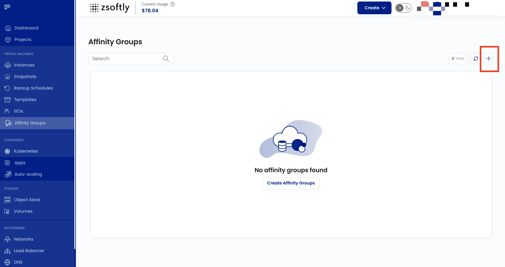

Affinity Groups control the placement of VMs on hypervisor hosts within the cloud infrastructure.
Use them to co-locate VMs for low-latency communication or spread them across hosts for fault
tolerance.

### Create an Affinity Group

- From the left-hand menu, click **Affinity Groups**.
- Click **Create Affinity Groups** or the **+** icon.
- Choose the **Project** and **Availability Zone**.
- Enter a **Name** and **Description**.
- Select the affinity group type:

| Type                                | Behavior                                                                            |
| ----------------------------------- | ----------------------------------------------------------------------------------- |
| **Host Affinity (Strict)**          | VMs must always run on the same hypervisor host. If not possible, deployment fails. |
| **Host Anti-Affinity (Strict)**     | VMs must always run on different hosts. If not possible, deployment fails.          |
| **Host Anti-Affinity (Non-Strict)** | Prefers different hosts, but allows same host if capacity requires it.              |
| **Host Affinity (Non-Strict)**      | Prefers same host, but allows different hosts if needed.                            |

- Click **Submit**.
