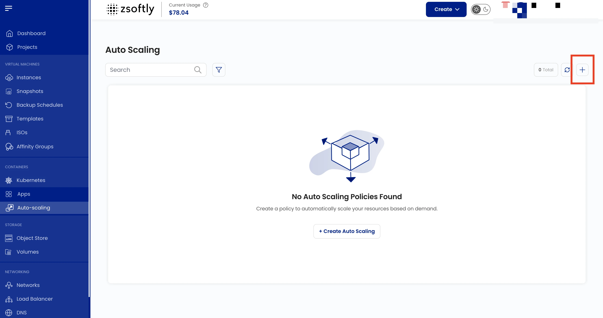

Auto-scaling automatically adjusts the number of VM instances in response to real-time demand,
ensuring availability while minimizing costs.

### Create an Auto-Scaling Group

- From the left-hand menu, click **Auto-Scaling**.
- Click **Create New**.

### Steps

1. **Project**: assign to a project.
2. **Location**: select the data center.
3. **Network**: select or create a network.
4. **Load Balancer**: select the load balancer to distribute traffic.
5. **Forwarding Rules**: set public and private port ranges.
6. **Image**: select OS/template.
7. **Plan**: choose CPU, memory, storage.
8. **Server Settings**: set password for instances.
9. **Capacity Planner**: set min/max instance count and grace period (seconds).
10. **Policies**:
    - **Scale Up Policy**: triggered when usage exceeds a threshold; adds instances.
    - **Scale Down Policy**: triggered when demand drops; removes instances.
    - **Expressions**: set Counter, Operator, Threshold for each policy.
    - **Scheduled Policies**: scale at specific times instead of reacting to metrics.
11. **Name**: provide a unique name.
12. **Create**: billing cycles: Monthly, Quarterly, Semiannually, Yearly, Bi-annually, Tri-annually.
    Click **Create**.
