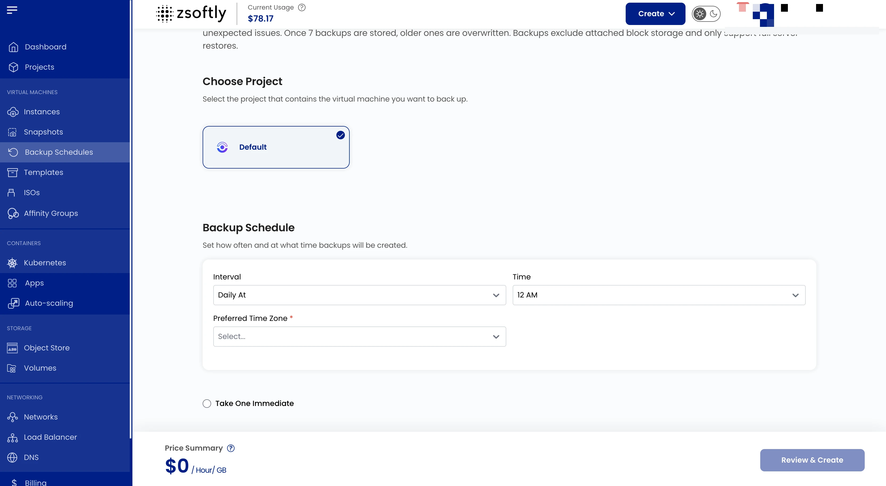

## Instance Backups

Backups create copies of your instance's data on a scheduled basis to protect against accidental
deletions, software failures, or security threats. ZSoftly Public Cloud provides automated daily,
weekly, or custom schedule backups.

:::note

Automatic backups cost 20% of the virtual machine's price.

:::

### Create a Backup Schedule

- From the left-hand menu, click **Backups**.
- Click **Create Backups** or the **+** icon.

### Steps

1. **Location**: select the data center.
2. **Project**: assign to a project.
3. **Instance**: select the VM to back up.
4. **Schedule**: set backup frequency (intervals and time). Optionally click **Take One Immediate**
   to also take an immediate backup.
5. **Create**: Billing: Hourly only, Fixed Prorata rule. Click **Create Backup**.

See also: [VM Snapshots](/public-cloud/backups-snapshots/vm-snapshots),
[Volume Snapshots](/public-cloud/storage/block-storage/snapshots)
