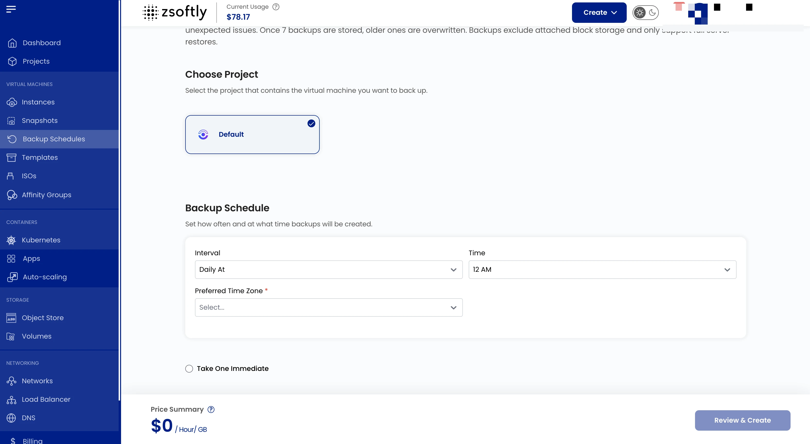

## Instance Backups

Backups create copies of your instance's data on a scheduled basis to protect against accidental
deletions, software failures, or security threats. ZSoftly Public Cloud provides automated daily,
weekly, or custom schedule backups.

### Backup Billing

The platform bills each backup based on the storage it occupies. Each backup has its own
subscription. The subscription ends when you delete the backup or retention cleanup removes it.

- Pausing a schedule stops new backups. Existing backups continue to incur storage charges until you
  delete them.
- Backup cost depends on the stored size and the retention period.
- Activity logs record schedule changes, runs, failures, and retention cleanup. They do not affect
  billing.

The Q3 2026 Platform Update says existing backup billing is still being migrated. Review **Billing →
Subscriptions** and contact support to confirm whether the migration of your backup billing is
complete.

For details about this change, see the
[Q3 2026 Platform Update](/changelog/q3-2026-platform-update).

### Create a Backup Schedule

- From the left-hand menu, click **Backups**.
- Click **Create Backups** or the **+** icon.

### Steps

1. **Location**: select the data center.
2. **Project**: assign to a project.
3. **Instance**: select the VM to back up.
4. **Schedule**: set backup frequency (intervals and time). Optionally click **Take One Immediate**
   to also take an immediate backup.
5. **Create**: Billing: Hourly only, Fixed Prorata rule. Click **Create Backup**.

See also: [VM Snapshots](/public-cloud/backups-snapshots/vm-snapshots),
[Volume Snapshots](/public-cloud/storage/block-storage/snapshots)
