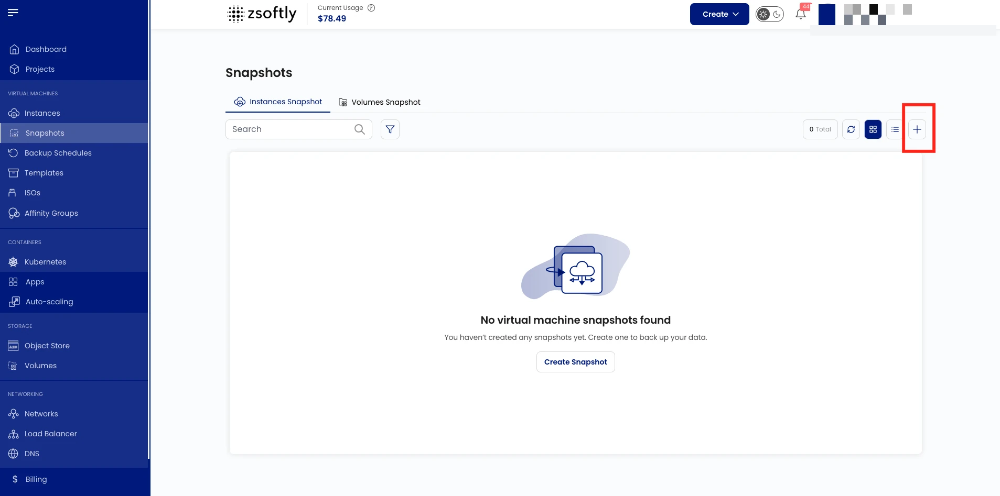
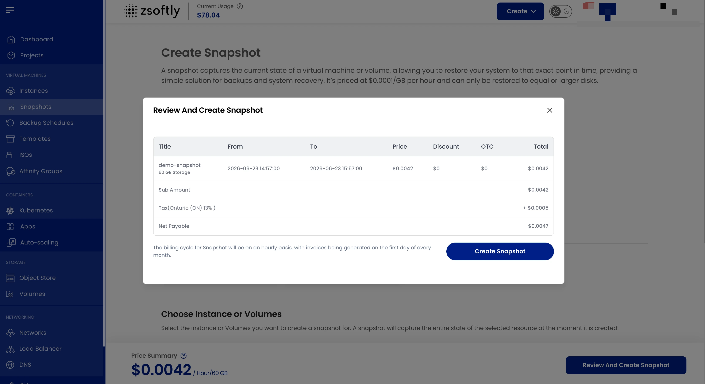

Instance snapshots capture the current state of a VM, including configuration and data, at a
specific point in time. Use them for backup, disaster recovery, and testing.

### Create a VM Snapshot

- From the left-hand menu, click **Snapshots** → **Instances Snapshot** tab.
- Click **Take Snapshot** or the **+** icon.

### Steps

1. **Location**: select the data center.
2. **Project**: assign to a project.
3. **Instance**: select the VM to snapshot.
4. **Snapshot Name**: provide a unique name.
5. **Create**: Billing: Hourly only, Fixed Prorata rule. Click **Take Snapshot**.

See also: [Volume Snapshots](/public-cloud/storage/block-storage/snapshots),
[Backups](/public-cloud/backups-snapshots/backups)
