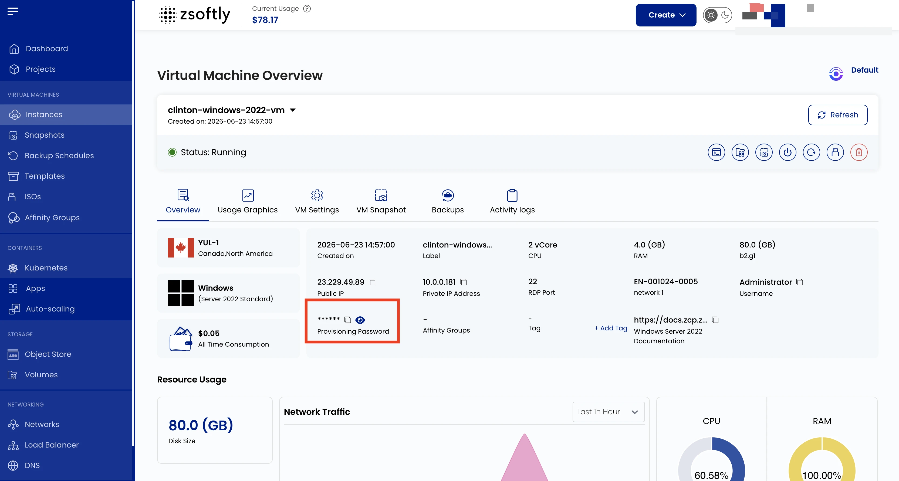
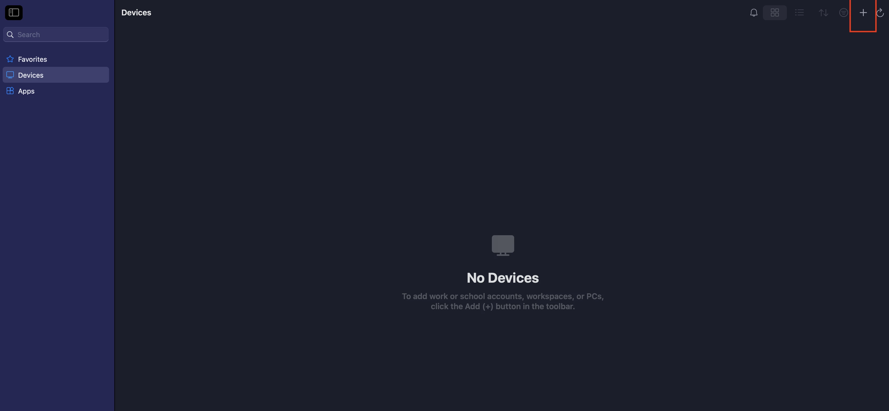
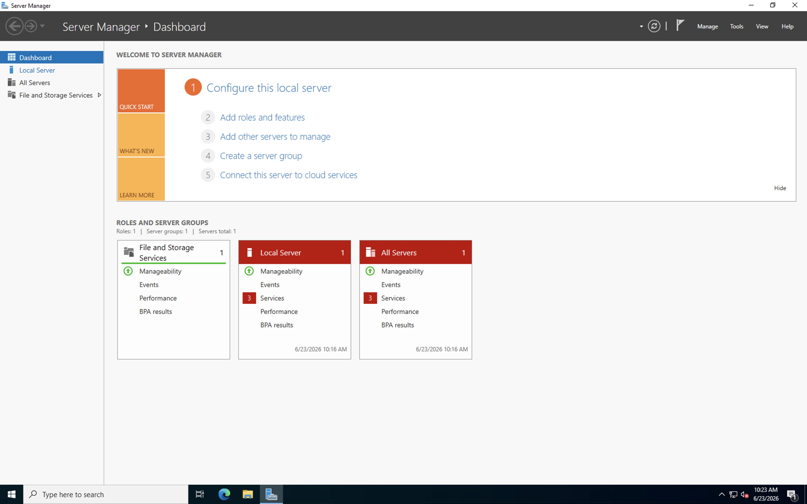

Remote Desktop Protocol (RDP) enables you to securely connect to and manage Windows VMs remotely.

## Access the Instance Overview

- Go to **Instances** and select the Windows VM.
- In the **VM Overview** tab, find and copy the **Username** and **Password** fields.

## Launch the RDP Client

- **Windows**: Press Win+R, type `mstsc`, press Enter. Or search "Remote Desktop Connection" in the
  Start menu.
- **macOS**: Download **Microsoft Remote Desktop** from the Mac App Store.
- **Linux**: Install **Remmina** (`sudo apt install remmina` on Ubuntu/Debian). Open Remmina and
  select RDP.

## Connect

1. Find the **Public IP Address** of your VM in the Overview tab.
2. Enter the Public IP in the RDP client.
3. Enter the **Username** and **Password** copied from the portal.
4. If a security warning appears, check "Don't ask me again for connections to this computer" and
   click **Yes**.
5. Click **OK** or **Connect**.

## See also

- [Connect With SSH](/public-cloud/compute/connect-ssh)
- [Console Access](/public-cloud/compute/console-access)
