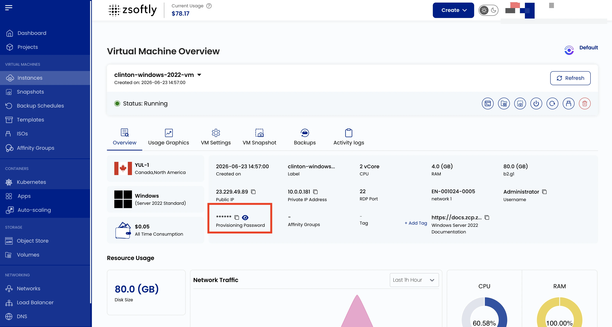
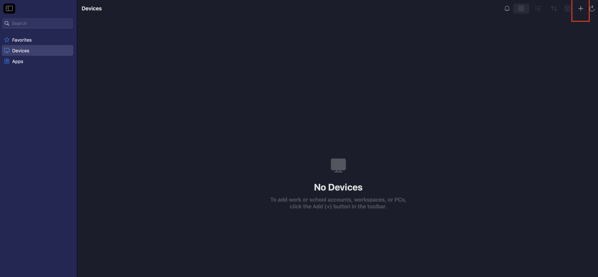
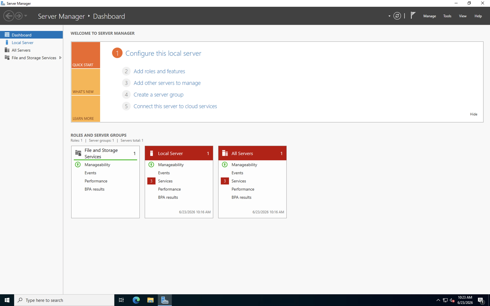
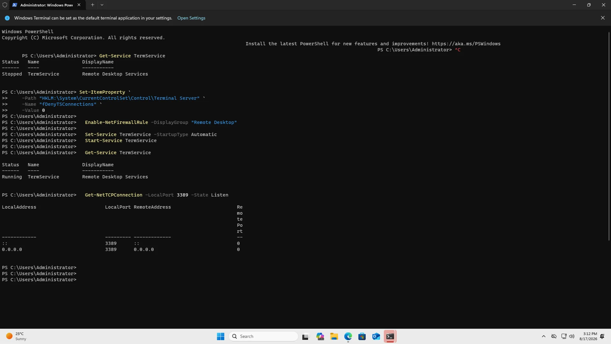

Remote Desktop Protocol (RDP) enables you to securely connect to and manage Windows VMs remotely.

## Access the Instance Overview

- Go to **Instances** and select the Windows VM.
- In the **VM Overview** tab, find and copy the **Username** and **Password** fields.



## Launch the RDP Client

- **Windows**: Press Win+R, type `mstsc`, press Enter. Or search "Remote Desktop Connection" in the
  Start menu.
- **macOS**: Download **Microsoft Remote Desktop** from the Mac App Store.
- **Linux**: Install **Remmina** (`sudo apt install remmina` on Ubuntu/Debian). Open Remmina and
  select RDP.



## Connect

1. Find the **Public IP Address** of your VM in the Overview tab.
2. Enter the Public IP in the RDP client.
3. Enter the **Username** and **Password** copied from the portal.
4. If a security warning appears, check "Don't ask me again for connections to this computer" and
   click **Yes**.
5. Click **OK** or **Connect**.



## If RDP Does Not Connect

RDP uses TCP port **3389**. Add an inbound [firewall rule](/public-cloud/compute/settings/firewall/)
for TCP 3389 and restrict the source to your public IP address. Use
[Port Forwarding](/public-cloud/compute/settings/port-forwarding/) only when the VM does not have a
public IP assigned directly.

If the firewall rule is correct but the connection still fails, use
[Console Access](./console-access) to check the Windows guest. Open an Administrator PowerShell
window and run:

```powershell
Set-ItemProperty `
  -Path "HKLM:\System\CurrentControlSet\Control\Terminal Server" `
  -Name "fDenyTSConnections" `
  -Value 0

Enable-NetFirewallRule -DisplayGroup "Remote Desktop"

Set-Service TermService -StartupType Automatic
Start-Service TermService

Get-Service TermService
Get-NetTCPConnection -LocalPort 3389 -State Listen
```

Confirm that `TermService` shows `Running` and that a listener appears on port `3389`. Then retry
the RDP connection.



## See also

- [Connect With SSH](/public-cloud/compute/connect-ssh)
- [Console Access](/public-cloud/compute/console-access)
