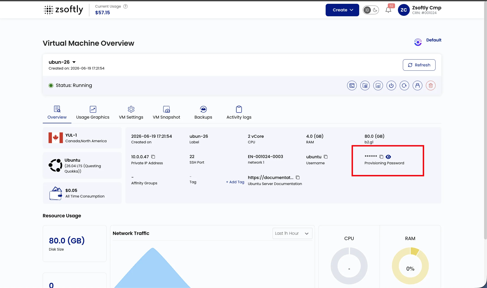
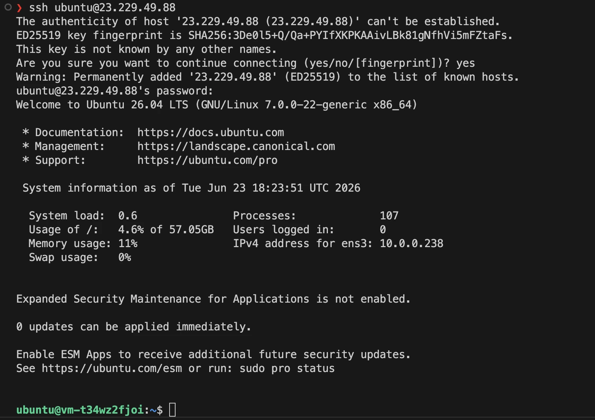

Manage your instance using a terminal and SSH for secure remote access.

## Prerequisites

Before connecting, ensure you have:

- **IP Address**: Available on the instance card or Instance Overview.
- **Default Username**: Depends on the OS image; see the table below.
- **Authentication Method**: SSH Key (recommended) or the **Provisioning Password** shown on the
  instance's Overview tab (see below).

### Default username by OS

| OS image     | Default username |
| ------------ | ---------------- |
| Ubuntu       | `ubuntu`         |
| Debian       | `debian`         |
| Rocky Linux  | `rocky`          |
| AlmaLinux    | `almalinux`      |
| CentOS       | `centos`         |
| Oracle Linux | `cloud-user`     |
| Fedora       | `fedora`         |

If an image has no distribution-specific user, it may use `root`. The exact username is shown in
**Instance Overview**. Windows instances use [RDP](/public-cloud/compute/connect-rdp), not SSH.

### Where to find the password

If you deployed without an SSH key, open the instance's **Overview** tab and reveal the
**Provisioning Password**: click the eye icon to show it, or the copy icon to copy it. Use it with
the default username above.



## Connecting

Open a terminal (Command Prompt/PowerShell on Windows, built-in terminal on macOS/Linux).

**With SSH Key:**

```bash
ssh -i /path/to/your/private/key username@ip_address
```

**With password:**

```bash
ssh username@ip_address
```

Example:

```bash
ssh root@192.168.1.1
```



## See also

- [Connect With RDP](/public-cloud/compute/connect-rdp)
- [Console Access](/public-cloud/compute/console-access)
- [SSH Keys](/public-cloud/compute/settings/ssh-keys)
