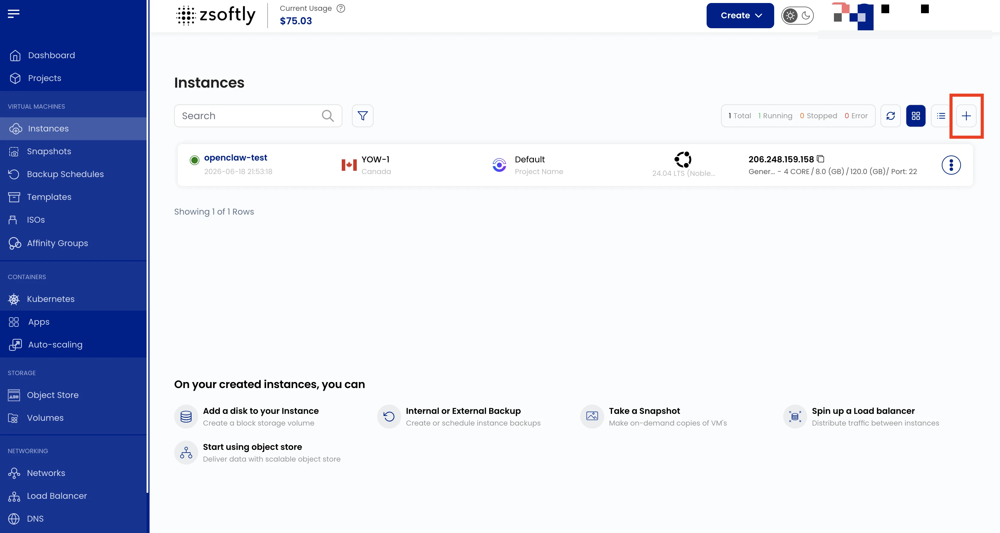
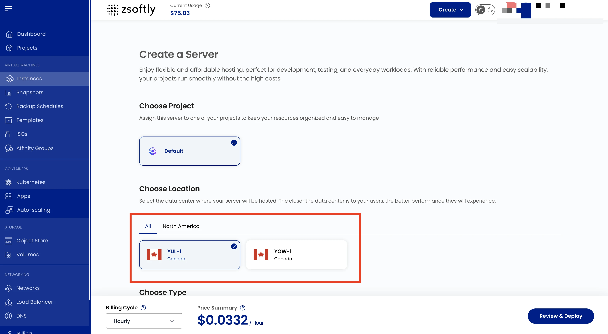
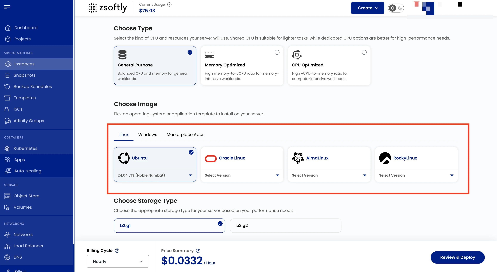
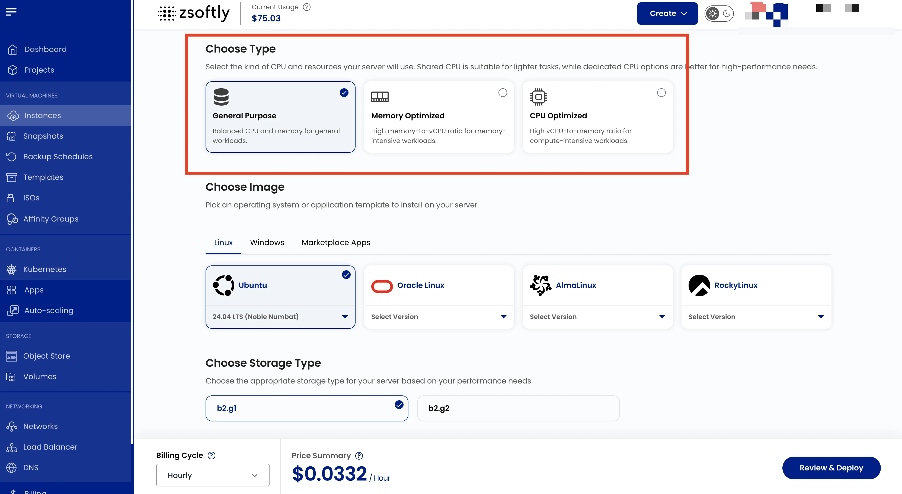
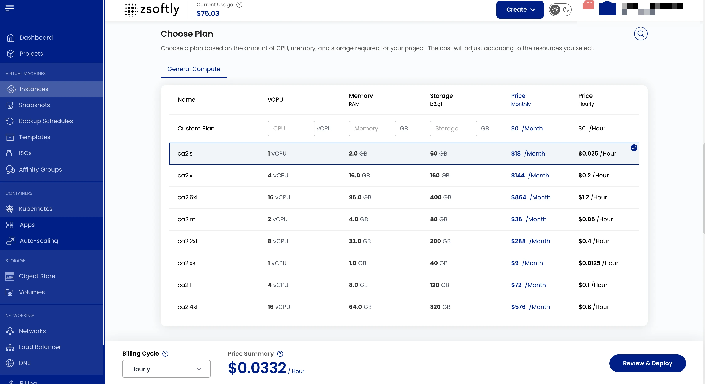
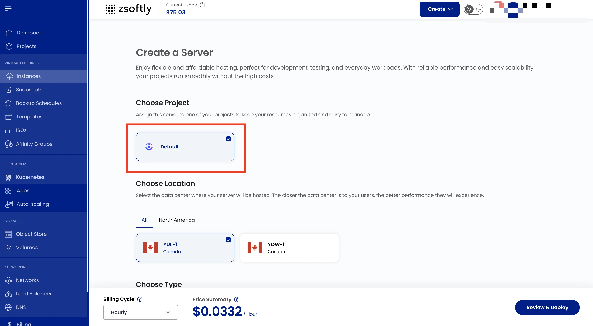
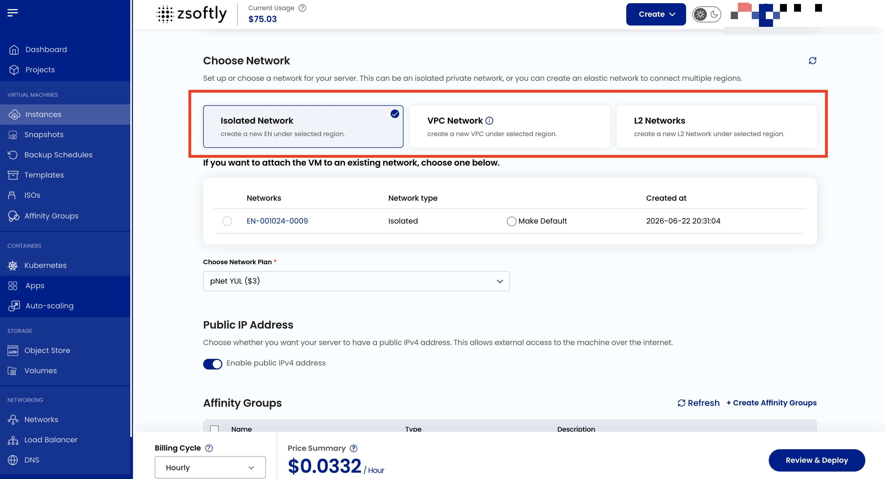
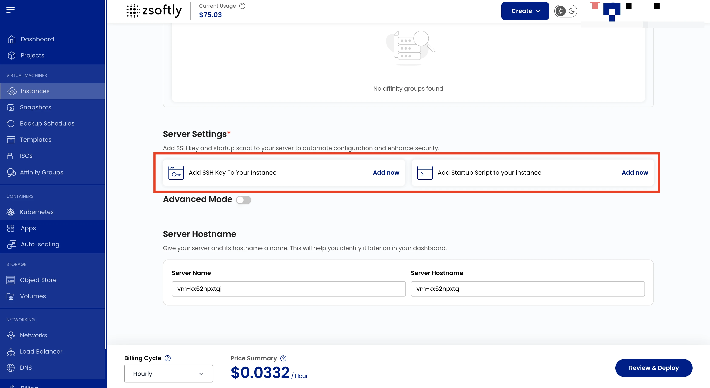
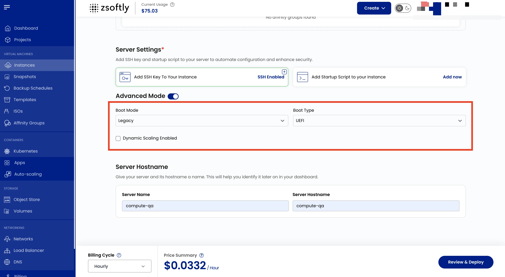
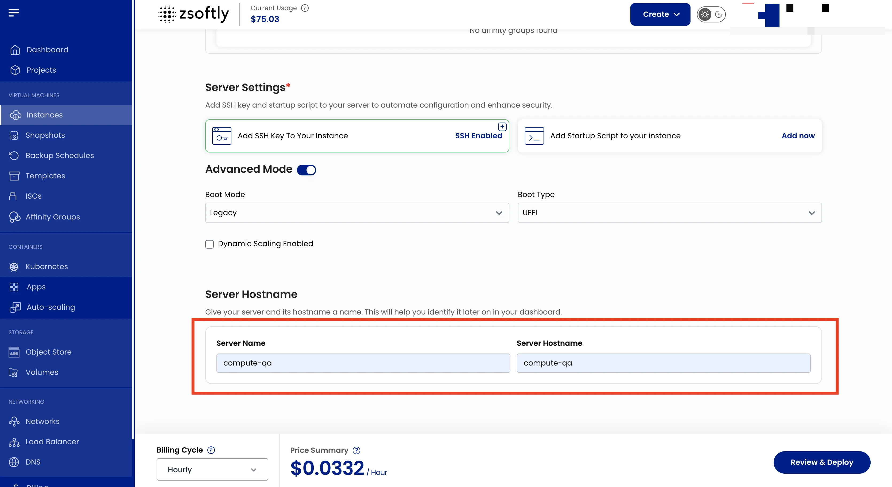

A **Compute Instance** is a virtual server in the cloud that functions similarly to a physical
computer. It has its own CPU, memory, and storage, allowing you to install software, run
applications, or host websites. Compute Instances are a fundamental component of ZSoftly Public
Cloud, enabling you to launch and scale servers as needed.

## Creating a Compute Instance

- From the left-hand menu, click on the **Instances** tab.
- To create an instance, click the **plus (+)** icon located on the right side of the page.

## Choose a Location

Select the data center location where your server will be physically hosted.

## Choose an Image

Select an OS or application template. Import a custom ISO if needed.

**Supported Windows images:**

| Image               | Status    |
| ------------------- | --------- |
| Windows Server 2025 | Available |
| Windows Server 2022 | Available |
| Windows 11 Pro      | Available |

Browse the full catalogs: [OS Images](https://zcp.zsoftly.ca/marketplace/os-images) and
[One-Click Apps](https://zcp.zsoftly.ca/marketplace/apps).

## Choose the Type of CPU Allocation

- **Shared CPU**: Affordable, with resources shared among users. Ideal for development, testing, and
  low-performance workloads like small websites.
- **Dedicated CPU**: Provides exclusive resources for consistent performance. Perfect for production
  environments, high-traffic applications, and databases.
- **High-Frequency Compute**: Offers high clock speeds for compute-intensive tasks like simulations,
  financial modeling, and low-latency applications.
- **Cloud GPU**: Delivers GPU acceleration for demanding tasks like machine learning, AI, video
  rendering, and scientific simulations.

## Choose a Plan

- **General Compute (GC)**: Balanced workloads with a mix of CPU, memory, storage, and bandwidth.
  Ideal for general-purpose applications, web servers, and testing environments.
- **Compute Optimized (CO)**: Prioritizes CPU performance for compute-intensive tasks like batch
  processing, analytics, and high-speed processing workloads.
- **Memory Optimized (RO)**: Tailored for applications requiring high memory capacity, such as
  in-memory databases, big data processing, and real-time caching systems.

See [Instance Types](/public-cloud/compute/instance-types) for families and storage tiers, and the
[pricing page](https://zcp.zsoftly.ca/pricing) for per-size specs and pricing.

## Assign to a Project

Assign the server to one of your projects to organize resources.

## Choose a Network

- **Public Network**: A simple, pre-configured network for external connectivity. Includes cloud
  firewall protection, port forwarding, and remote access VPN.
- **VPC Network**: A Virtual Private Cloud (VPC) offering complete control over traffic routing and
  enhanced security. Supports VPN gateway, site-to-site VPN connections, and traffic segregation.

> **Note:** By default, a VPC is created with a random CIDR block and one network tier.

Choose whether to enable public IPv4.

## Configure Server Settings

- Add SSH Key for secure access. Click **Add Now**. For some OS images (e.g., Arch Linux) an SSH key
  is required.
- Add a startup script to automate actions during initialization.

## Advanced Settings (Optional)

- **Boot Mode**: Select Legacy or Secure boot.
- **Boot Type**: Choose between UEFI or BIOS.
- **Enable Dynamic Scaling**: Allows automatic resource scaling.

## Server Hostname

Provide a unique Server Name and valid Server Hostname.

## Review and Deploy

- Choose the desired **Billing Cycle**: Hourly, Monthly, Quarterly, Semiannually, Yearly,
  Bi-annually, Tri-annually.
- Supported billing rules: Date to Date, Fixed Calendar Month, Unfixed Calendar Month, Fixed
  Prorata, Unfixed Prorata.
- Verify all configuration details and click **Review & Deploy**.

## Connect to your instance

Once the instance is running, open **Instance Overview** to get its **IP address**, the **default
username** (depends on the OS image — `ubuntu` for Ubuntu, `rocky` for Rocky Linux, and so on; see
[Connect With SSH](/public-cloud/compute/connect-ssh)), and — if you did not add an SSH key — the
**Provisioning Password**.

To reach it over SSH (port 22) from the internet, the instance needs a public IP **and** a rule that
allows the traffic. This is not opened automatically:

**Public Network**

- Make sure the instance has a public IPv4 address — see
  [Public IPs](/public-cloud/networking/public-network/public-ips).
- Allow SSH: add a [firewall](/public-cloud/compute/settings/firewall) rule for TCP **22**, then a
  [port-forwarding](/public-cloud/compute/settings/port-forwarding) rule mapping port 22 on the
  public IP to port 22 on the instance.

**VPC Network**

- Assign a [public IP](/public-cloud/networking/vpc/public-ips) and add a
  [port-forwarding](/public-cloud/compute/settings/port-forwarding) rule for port 22.
- Allow the traffic inbound in your [Network ACL](/public-cloud/networking/vpc/network-acls) (TCP
  22).

Then connect:

- **SSH key** — use the key you added under _Configure Server Settings_.
- **Password** — if you did not add a key, use the **Provisioning Password** from the instance's
  Overview tab (see
  [Connect With SSH](/public-cloud/compute/connect-ssh#where-to-find-the-password)); change it after
  your first login.

See [Connect With SSH](/public-cloud/compute/connect-ssh) for the exact commands. No network rules
are needed for [Console Access](/public-cloud/compute/console-access) (browser-based), and Windows
instances use [Connect With RDP](/public-cloud/compute/connect-rdp).

## See also

- [Instance Overview](/public-cloud/compute/instance-overview)
- [Activity Logs](/public-cloud/compute/activity-logs)
