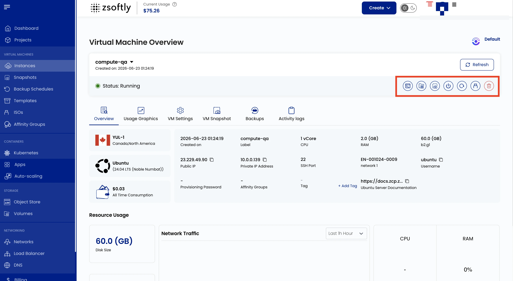
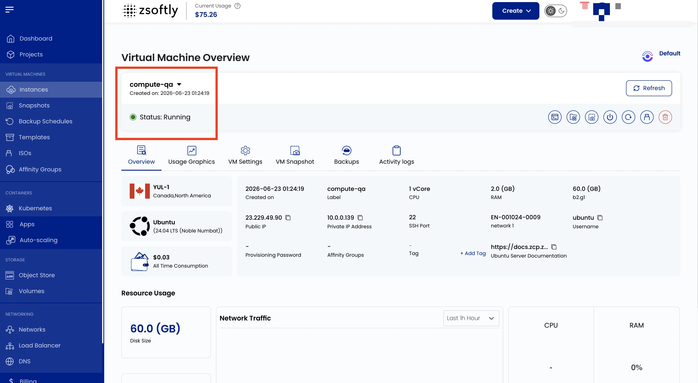
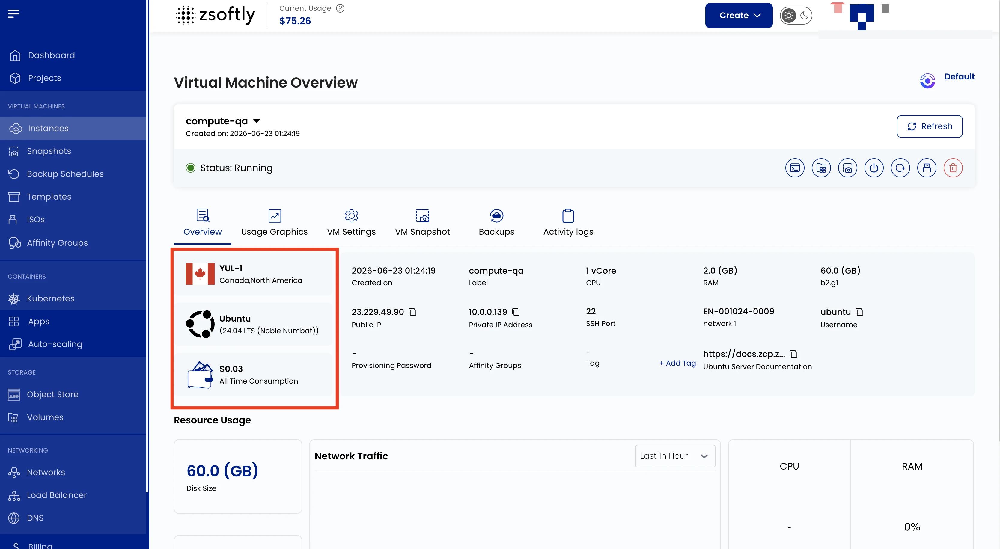
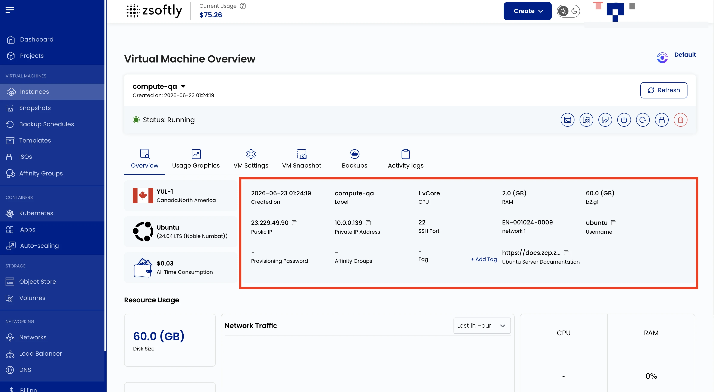
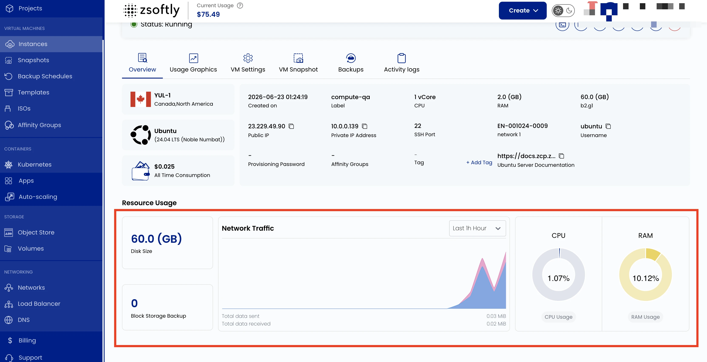

The Instance Overview page provides a detailed summary and management options for your VM. It
includes instance status, location, operating system, performance metrics, and quick actions.

Open **Virtual Machines → Instances** in the portal to see all your VMs, each with its status,
region, project, operating system, and IP. Select an instance to open its overview.

## Action Buttons

Available from the three-dot menu or overview page:

- **Refresh**: Refreshes the instance status and page information.
- **Console Access**: Opens a console interface to interact with the VM directly.
- **VM Volume Snapshots**: Lists existing snapshots or lets you take a new one.
- **Power Off**: Shuts down the virtual machine.
- **Reboot**: Restarts the instance.
- **Attach ISO for VM**: Mounts an ISO file to the VM.
- **Delete**: Deletes the instance permanently.

## Instance Information

- **Instance Name**
- **Created on**
- **Status** (running/stopped)

## Instance Details

- **Location**
- **Operating System**
- **Cost** (all-time)

## Resource Specifications

- **Label**
- **CPU** (vCPUs)
- **RAM**
- **Disk Size**
- **Public IP**
- **Private IP**
- **Network**
- **Username**
- **Password**
- **Affinity Group**
- **Tag** (add via Add Tag → Key + Value → Submit)

## Resource Usage

- **Disk Size**: capacity usage
- **Network Traffic**: metrics over a specified period (default: Last 24 Hours)
- **CPU Usage**: percentage
- **RAM Usage**: memory consumption

## See also

- [Create Instance](/public-cloud/compute/create-instance)
- [Console Access](/public-cloud/compute/console-access)
- [Activity Logs](/public-cloud/compute/activity-logs)
