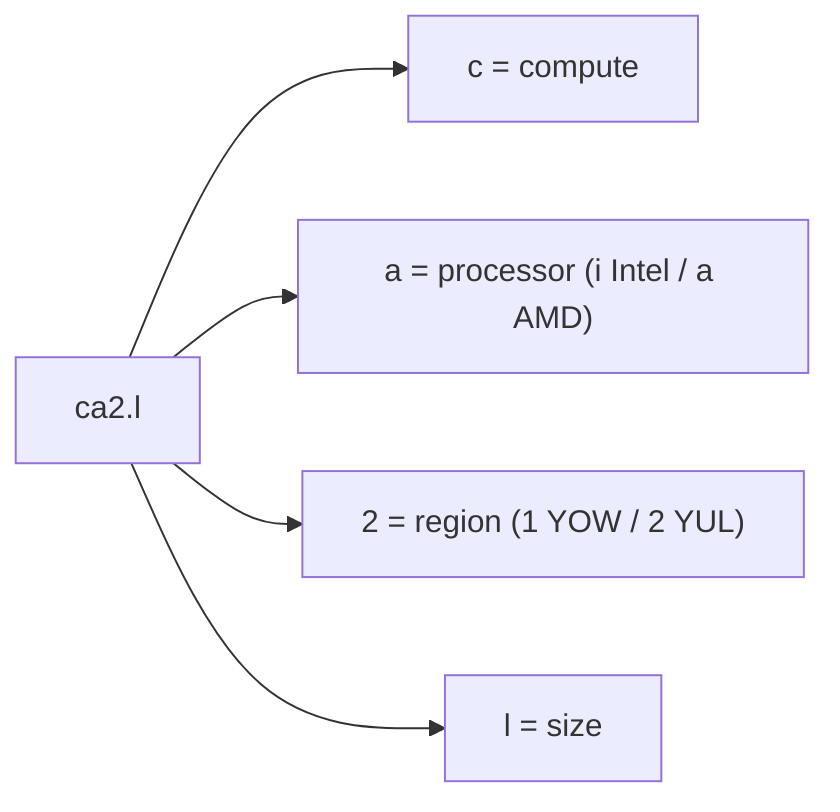
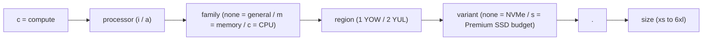

Every compute plan has a short, structured ID such as `ca2.l` or `cam2.2xl`. Once you know the
pattern you can read a plan's processor, family, region, storage tier, and size straight from its
name — no lookup table required.

## Anatomy of a plan ID

A plan ID is a **series** followed by a `.` and a **size**:

Memory- and CPU-optimized plans add a family letter, and the budget storage tier adds a trailing
`s`:

## Segments

| Position  | Values                                  | Meaning                                            |
| --------- | --------------------------------------- | -------------------------------------------------- |
| Prefix    | `c`                                     | Compute                                            |
| Processor | `i` / `a`                               | Intel / AMD                                        |
| Family    | _(none)_ / `m` / `c`                    | General purpose / Memory-optimized / CPU-optimized |
| Region    | `1` / `2`                               | YOW / YUL                                          |
| Variant   | _(none)_ / `s`                          | Standard NVMe / Premium SSD budget tier            |
| Size      | `xs` `s` `m` `l` `xl` `2xl` `4xl` `6xl` | Relative capacity, smallest to largest             |

## Plan series

| Series | Region | Processor | Storage     | Family                   |
| ------ | ------ | --------- | ----------- | ------------------------ |
| `ci1`  | YOW    | Intel     | NVMe        | General purpose          |
| `ca1`  | YOW    | AMD       | NVMe        | General purpose          |
| `ca2`  | YUL    | AMD       | Pro NVMe    | General purpose          |
| `ca2s` | YUL    | AMD       | Premium SSD | General purpose (budget) |
| `cim1` | YOW    | Intel     | NVMe        | Memory-optimized         |
| `cam1` | YOW    | AMD       | NVMe        | Memory-optimized         |
| `cam2` | YUL    | AMD       | Pro NVMe    | Memory-optimized         |
| `cac1` | YOW    | AMD       | NVMe        | CPU-optimized            |
| `cac2` | YUL    | AMD       | Pro NVMe    | CPU-optimized            |

## vCPU-to-RAM ratios

The family determines how vCPU and RAM scale together:

| Family                      | Ratio (RAM:vCPU) | Notes                   |
| --------------------------- | ---------------- | ----------------------- |
| General purpose `xs`–`l`    | 2:1              |                         |
| General purpose `xl` and up | 4:1              | Capped at 16 vCPU       |
| Memory-optimized (`m`)      | 8:1              | For RAM-heavy workloads |
| CPU-optimized (`c`)         | 1:1              | High-density compute    |

:::tip

The full plan catalog, with vCPU, RAM, disk, and pricing for every size, is on the
[pricing page](https://zcp.zsoftly.ca/pricing).

:::
