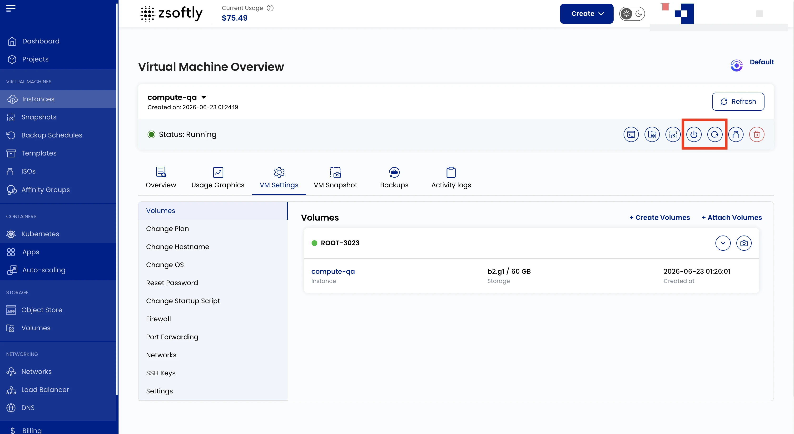

Power Management allows you to control the running state of your VM instance and configure scheduled
power actions.

## Manual Power Actions

Available from the Instance Overview:

- **Power Off**: gracefully shuts down the VM
- **Reboot**: restarts the VM
- **Power On**: starts a stopped VM

## Scheduled Power Actions

- From the instance page, navigate to the **Power Management** tab.
- Configure scheduled start and stop times with timezone support.
- Enable **Notify me when machine is turned on/off** to receive email alerts.

:::note

Screenshots coming.

:::

## See also

- [Instance Overview](/public-cloud/compute/instance-overview)
- [Activity Logs](/public-cloud/compute/activity-logs)
