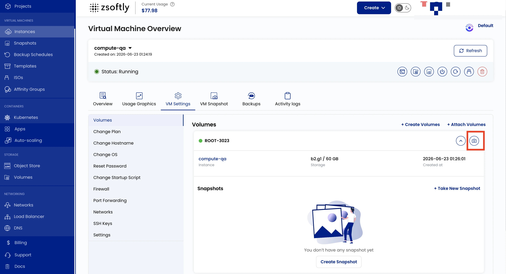

Block Storage allows you to attach additional storage volumes to your VM. These volumes are
independent disks that store application data, backups, or other files.

- Go to **VM Settings** → **Volume** to view the instance volume and its size.
- Click the right arrow icon to expand the list and see existing snapshots for the volume.
- Click the camera icon to create a new snapshot of the current volume state.

See also: [Create Volume](/public-cloud/storage/block-storage/create-volume),
[Volume Snapshots](/public-cloud/storage/block-storage/snapshots)
