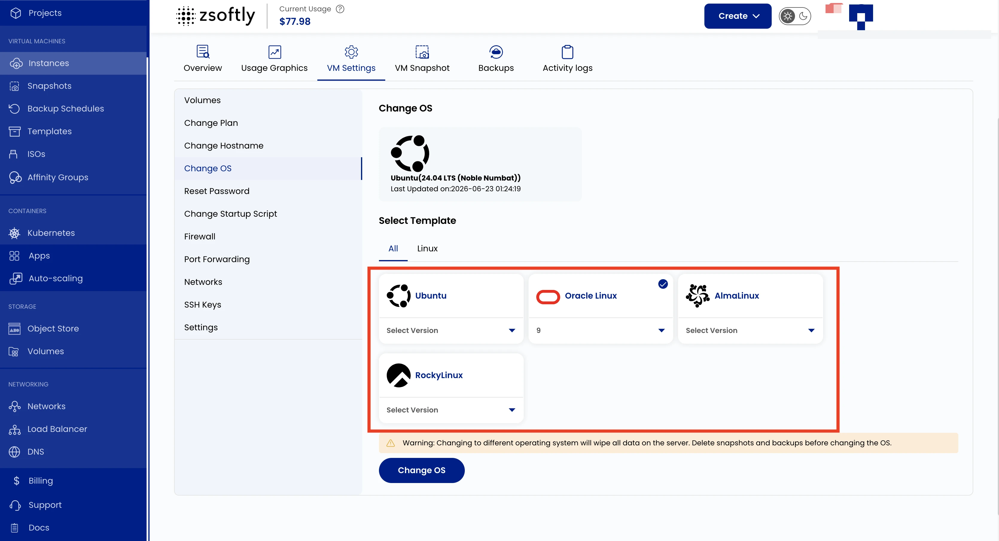

## Change Operating System

This setting reinstalls or switches the operating system running on your VM. Choose from Linux
distributions or Windows images. Windows Server (2025 and 2022) and Windows 11 Pro are all
available.

:::caution

Changing the OS will erase all existing data and configurations on the VM. Back up critical data
before proceeding. Delete snapshots and backups before changing the OS.

:::

- Go to **VM Settings** → **Change OS**.
- From **Templates**, select the OS and version.
- Click **Change OS**.

See also: [Create Instance](/public-cloud/compute/create-instance)
