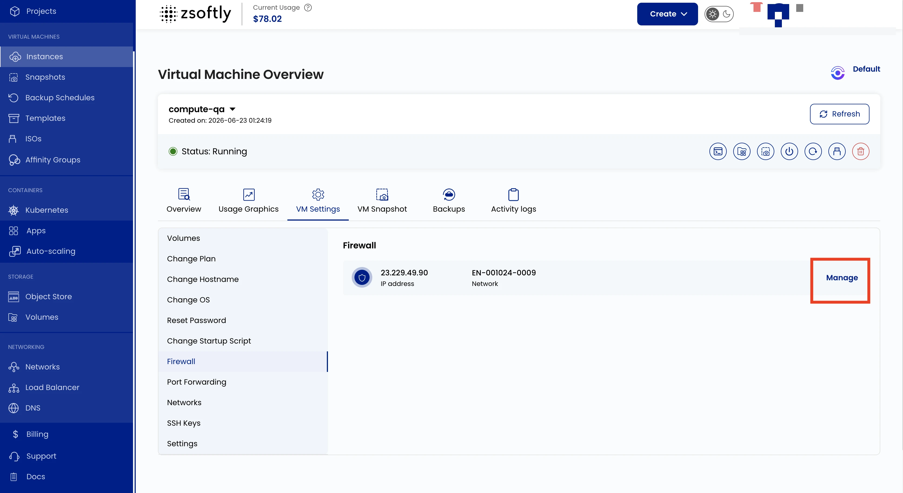

## Firewall Configuration

The Firewall setting lets you define security rules for incoming and outgoing network traffic to
your VM. Allow or deny access to specific IP addresses, ports, or protocols.

- Go to **VM Settings** → **Firewall**.
- Click **Manage** to change firewall configurations for the network.

Example use case: block all traffic except SSH (port 22) and web traffic (ports 80/443).

See also: [Networks](/public-cloud/compute/settings/networks),
[Port Forwarding](/public-cloud/compute/settings/port-forwarding)
