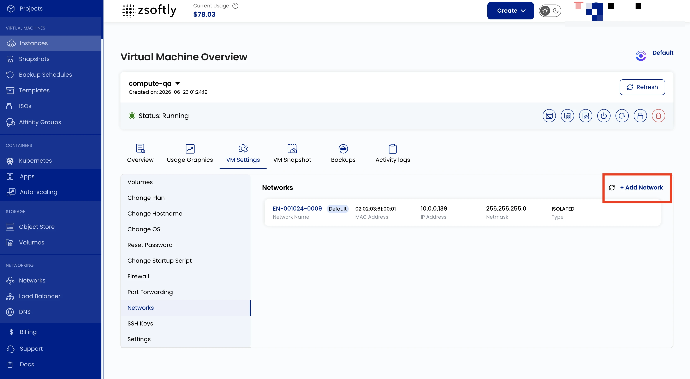

## Network Configuration

Manage the VM's network interfaces, including private and public network options. Private networks
enable VM-to-VM communication without internet exposure. Public networks provide external IP
addresses for internet access.

- Go to **VM Settings** → **Networks**.
- Click **Add Network** to add a new network interface.
- Click on a network to change its configuration (bandwidth limits, IP assignment).

See also: [Create VPC Networks](/public-cloud/networking/vpc/create-vpc),
[Create Public Networks](/public-cloud/networking/public-network/create)
