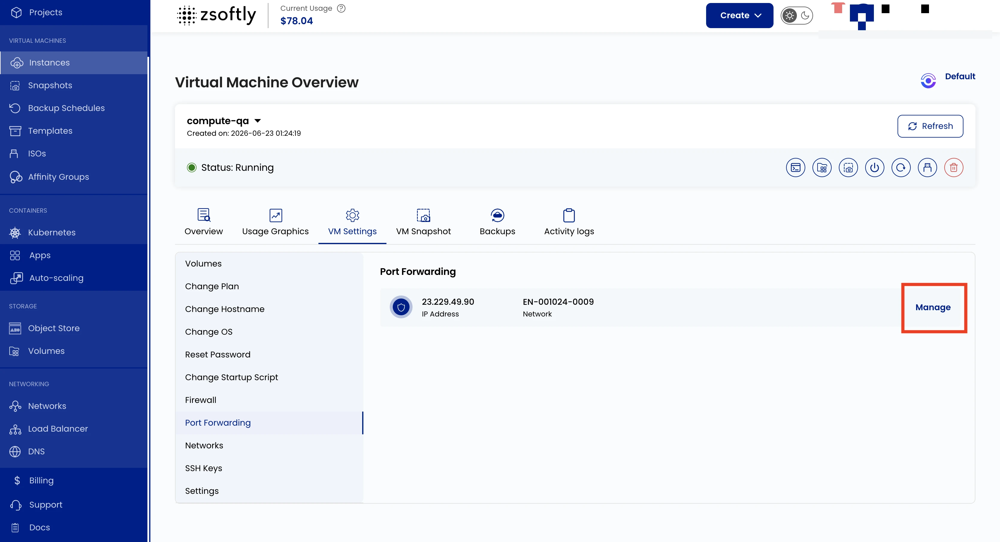

Port Forwarding redirects traffic from a specific port on your public IP to a port on your VM. For
example, forward external traffic on port 8080 to port 80 on your VM for web server access.

- Go to **VM Settings** → **Port Forwarding**.
- Click **Manage** to change port configurations for the network.

