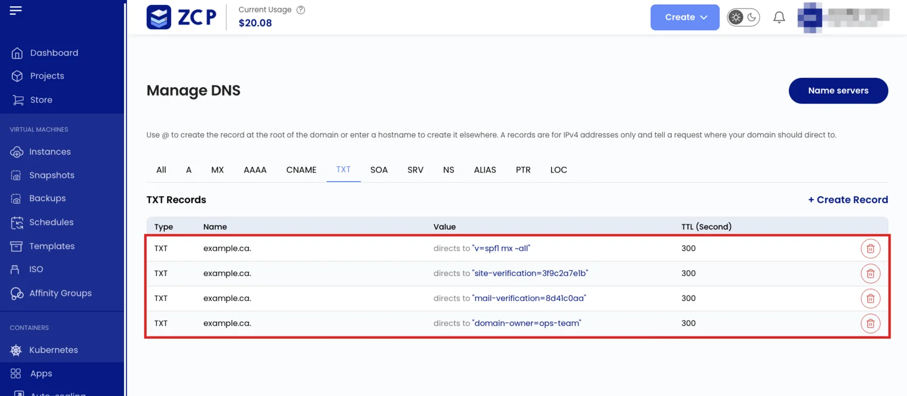

DNS records connect your domain to services. Each record has a **name**, a **type**, a **value**,
and a **TTL**. This page covers the shared rules. Each type has its own page with fields, examples,
and constraints.

## Record Types

| Type         | Purpose                                     | Page                                           |
| ------------ | ------------------------------------------- | ---------------------------------------------- |
| `A` / `AAAA` | Point a name at an IPv4 or IPv6 address     | [A and AAAA](/public-cloud/dns/records/a-aaaa) |
| `CNAME`      | Alias one name to another                   | [CNAME](/public-cloud/dns/records/cname)       |
| `MX`         | Route email to a mail server                | [MX](/public-cloud/dns/records/mx)             |
| `TXT`        | Store text (SPF, DKIM, verification)        | [TXT](/public-cloud/dns/records/txt)           |
| `CAA`        | Restrict certificate issuance to chosen CAs | [CAA](/public-cloud/dns/records/caa)           |
| `NS`         | Delegate a subdomain to other name servers  | [NS](/public-cloud/dns/records/ns)             |

:::note

Create `SRV` and `LOC` records in the console or through the API. The `zcp` CLI does not create them
yet.

:::

## Names Are Relative

The record **name** is relative to your zone. Enter `www` for `www.example.com`, not the full name.
Use `@` for the zone root (the apex). In the CLI and API, ZCP appends the zone for you, so a full
name like `www.example.com` becomes `www.example.com.example.com`.

## Values With a Trailing Dot

Hostname values, such as a `CNAME` target, an `MX` mail server, or an `NS` name server, should end
with a trailing dot. For example, use `mail.example.com.`. The dot marks the name as fully qualified
so ZCP does not treat it as relative to your zone.

## TTL

The **TTL** (time to live) is how long, in seconds, resolvers cache the record. The default is
`14400` (4 hours). Lower it to `300` a day or two before you plan to change a record, so the change
propagates quickly. Raise it again once the record is stable.

## Several Values per Name and Type

A name and type hold several values. Creating a record at a name and type with existing values adds
the new value to the set. The existing values stay. For example, add a second `A` record, a second
`MX` record, or a third `TXT` record at the same name. You do not need a support ticket for this.

Creating an exact copy of an existing value does not create a second copy, and it does not remove
the other values.

Deleting a value in the console removes only that value. The other values stay.

Enter a `TXT` value with or without double quotes. The platform stores it quoted and returns it
quoted.

## Known Limitations

The CNAME limitation applies to the console, the CLI, and the API. The CLI deletion limitation is
specific to the CLI.

### CNAME Cannot Share a Name

A name holding a `CNAME` holds nothing else, so it cannot also carry an `A`, `MX`, or `TXT` record.
Creating a `CNAME` at a name with other records fails with an error like
`RRset www IN CNAME: Conflicts with pre-existing RRset`. Use a `CNAME` only on a name with no other
records, and never at the zone apex.

### No In-Place Update

There is no update action. To change a value, delete it and create it again with the new value.

### CLI Delete Removes the Whole Set

`zcp dns record-delete` deletes the record set at a name and type, which removes every value in it.
To remove one value with the CLI, delete the set and create the values you want to keep again. The
console removes a single value.

### CAA Is Unavailable in the Console

The ZCP DNS console does not list `CAA` as a record type. Contact support if you need to publish a
CAA record.

## How to Manage Records

Use the documented surface for your workflow:

- **Console**: the DNS section of the portal, then **Create Record**. The console removes one
  selected value.
- **CLI**: [Manage DNS with the CLI](/public-cloud/dns/cli). `zcp dns record-delete` removes the
  whole record set.
- **API**: [Manage DNS with the API](/public-cloud/dns/api/).

There is no update action. To change a record, delete it and create it again with the new value.

See also: [DNS Overview](/public-cloud/dns/overview), [Worked examples](/public-cloud/dns/examples),
[Troubleshooting](/public-cloud/dns/troubleshooting)
