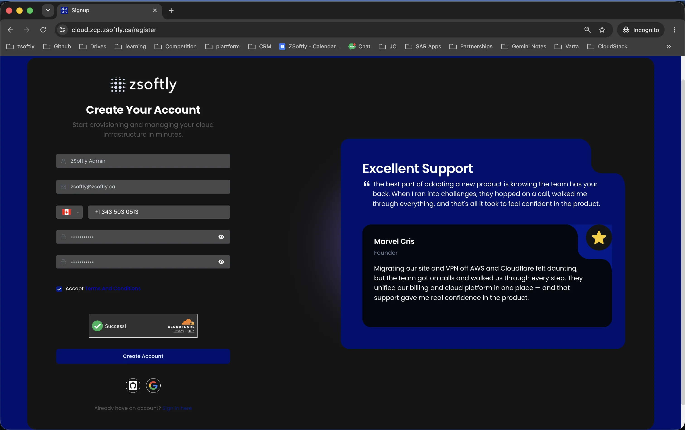
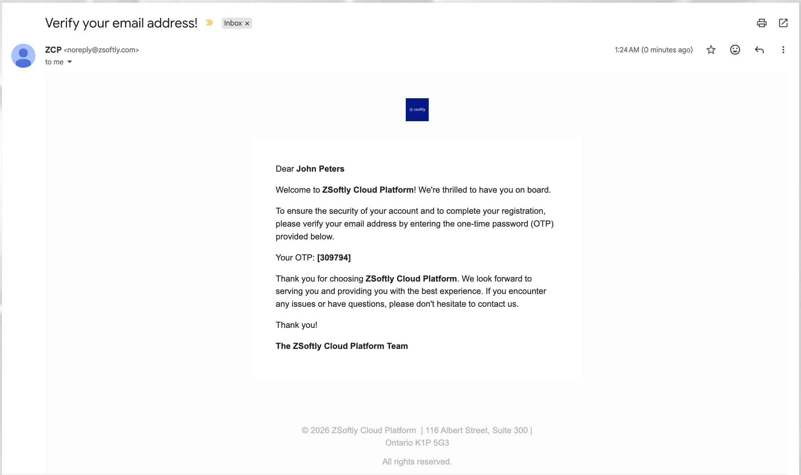
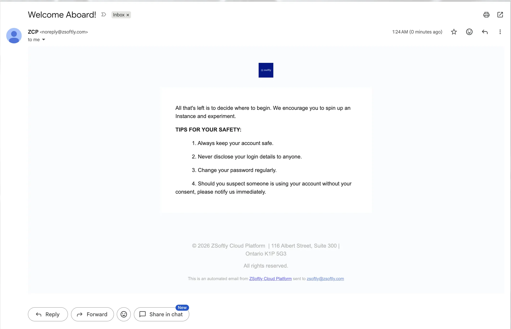
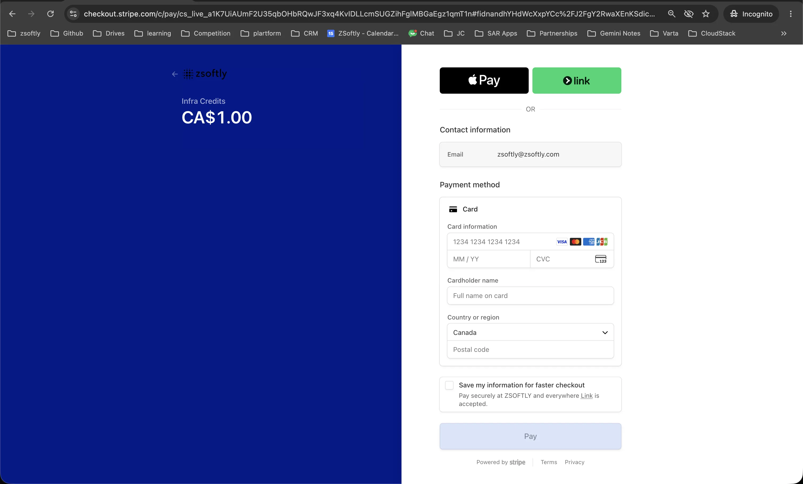
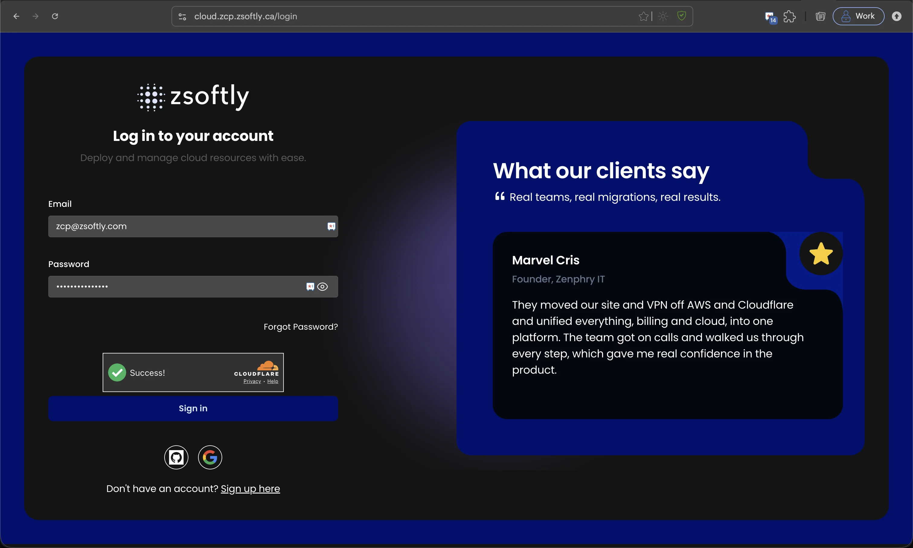
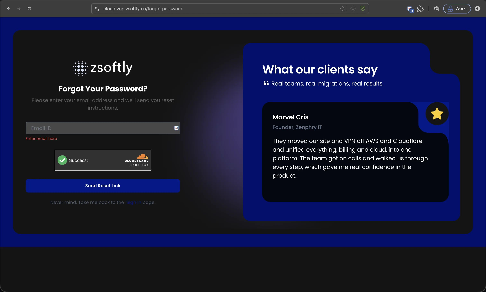
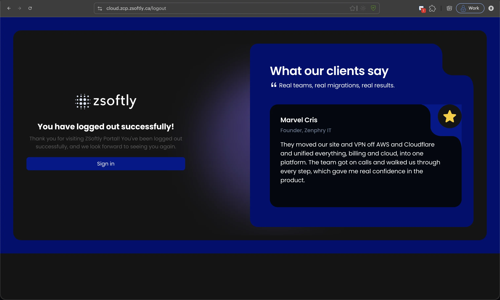

## ZSoftly Public Cloud Account Setup Guide

This guide provides a step-by-step tutorial to help you create a ZSoftly Public Cloud account, set
up billing, and verify your account.

### Account and Project Structure

**One email address, one account.** Each email address maps to exactly one ZCP account. You cannot
register a second account with an address already in use.

**Use Projects for environment isolation.** Most teams need one account. Create separate
**Projects** inside it for `dev`, `stg`, and `prd`. Each Project gets its own resources, quotas, and
team membership. Resources in different Projects do not share networks or storage. See
[Projects](../projects) for details.

**Use separate accounts for hard isolation.** Some organizations need a complete boundary between
environments or business units: separate billing, separate IAM, and no shared resources. Create one
account per boundary. Because each account requires a unique email address, use plus-addressing if
your mail provider supports it:

| Account   | Email                   |
| --------- | ----------------------- |
| Account 1 | `company+1@example.com` |
| Account 2 | `company+2@example.com` |
| Account 3 | `company+3@example.com` |

All three addresses deliver to the same inbox. Each maps to a fully independent ZCP account with its
own billing and IAM.

### Register Account

- Go to the registration page at
  [cloud.zcp.zsoftly.ca/register](https://cloud.zcp.zsoftly.ca/register).
- Enter your name, email address, phone number, and a password, then accept the **Terms and
  Conditions**. You can also sign up with **GitHub** or **Google**.
- Click **Create Account** to proceed to the next step.

### Verify Your Email

- Check your email inbox for a verification email from ZSoftly Public Cloud containing a One-Time
  Password (OTP).
- Enter the **OTP** in the provided field on the website.
- Click **Verify** to confirm and proceed to the billing setup.

Once verified, ZSoftly Public Cloud sends a welcome email confirming your account is ready.

### Set Up Billing Method

- After verifying your account, you'll be prompted to set up your billing information.
- Choose a billing type:
  - **Individual**: For personal use. Enter details like your address.
  - **Company**: For organizational use. Provide details such as your company name, website, and
    address.

- If you have a coupon, redeem it at checkout to receive a discount or promotional offer.

:::note

To create your account, a minimum payment of **CA$1.00** is required (processed securely through
Stripe, shown as **Infra Credits**). This is used to verify and validate your account. The amount
you add is credited to your account as **infra credit you can spend**, so you keep the full value.

:::

### Account Credit

New accounts receive **CAD $100 in credit** automatically at sign-up, valid for **30 days**.

After you spend **CAD $200** on the platform, you can claim an extra **CAD $200 in credit**: request
it from your account email address through our
[contact page](https://zcp.zsoftly.ca/contact?source=docs&topic=billing), including your **account
number** and referencing **"$200 Credit Request"**. We'll apply the **CAD $200** credit to your
account directly, valid for **60 days**, for up to **CAD $300 total**.

The credit applies to Small through XLarge plans. The offer is available until **December 31,
2026**.

### Payment Methods

ZSoftly Public Cloud accepts:

- **Card**: Visa, Mastercard, and American Express, processed securely through **Stripe**.
- **PayPal**: pay from your PayPal balance or a linked account.
- **Bank Transfer / Wire**: for manual payments, contact our
  [Sales team](https://zcp.zsoftly.ca/contact?source=docs&topic=billing) and they will arrange the
  transfer and apply the funds to your account as infra credit.

Card and PayPal are self-serve in the portal. Bank transfer and wire are arranged with Sales.

### Choose a Payment Plan

#### Prepaid (Recommended):

- Prepaid accounts require you to load credits in advance, which you'll use to create resources
  within the platform.
- To use resources, purchase infrastructure credits by selecting the desired amount.
- Pay with **Stripe** or **PayPal** and click **Proceed** to complete the payment, or contact
  [Sales](https://zcp.zsoftly.ca/contact?source=docs&topic=billing) to pay by bank transfer or wire.

#### Postpaid:

- Postpaid accounts allow you to pay after consuming resources. This option requires additional
  verification, such as detailed billing information or credit checks.
- Add **Stripe** or **PayPal** as your payment method and click **Save Card** to complete setup, or
  contact [Sales](https://zcp.zsoftly.ca/contact?source=docs&topic=billing) to arrange manual
  payment by bank transfer or wire.

:::note

Screenshots coming.

:::

### Final Steps

- Review the **Terms & Conditions** of the platform carefully.
- Accept the terms to complete the registration process.

- **Prepaid Users**: Your account status will display as active, with the account type set to
  prepaid.

- **Postpaid Users**: After verification, your account will display as active with the account type
  set to postpaid.

### Sign in to the portal

Once your account is active, sign in at
[cloud.zcp.zsoftly.ca/login](https://cloud.zcp.zsoftly.ca/login). Enter your **email** and
**password** (or use **GitHub** or **Google**), pass the verification challenge, and click **Sign
in**.

#### Reset your password

If you forget your password, click **Forgot Password?** on the sign-in page (or go to
[cloud.zcp.zsoftly.ca/forgot-password](https://cloud.zcp.zsoftly.ca/forgot-password)). Enter your
account email and click **Send Reset Link**. You'll receive reset instructions by email.

#### Sign out

To end your session, use the account menu and select sign out. The portal confirms you have logged
out, and you can sign back in anytime.

Setting up your ZSoftly Public Cloud account is a straightforward process. Register, verify your
email, configure billing, and choose a payment plan that best suits your needs. Once completed,
you'll have full access to the ZSoftly Public Cloud dashboard and its features, enabling you to
manage your resources efficiently.
