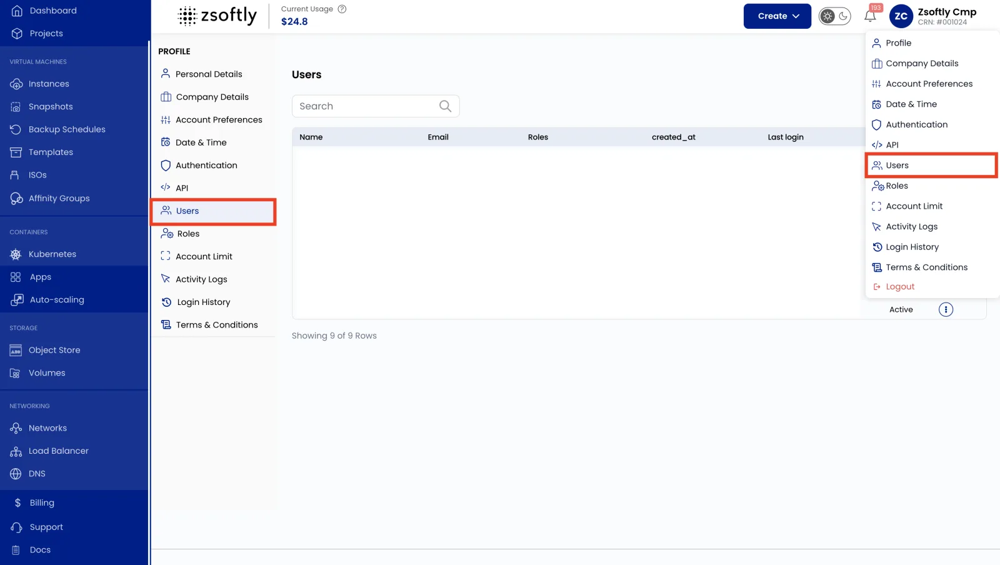
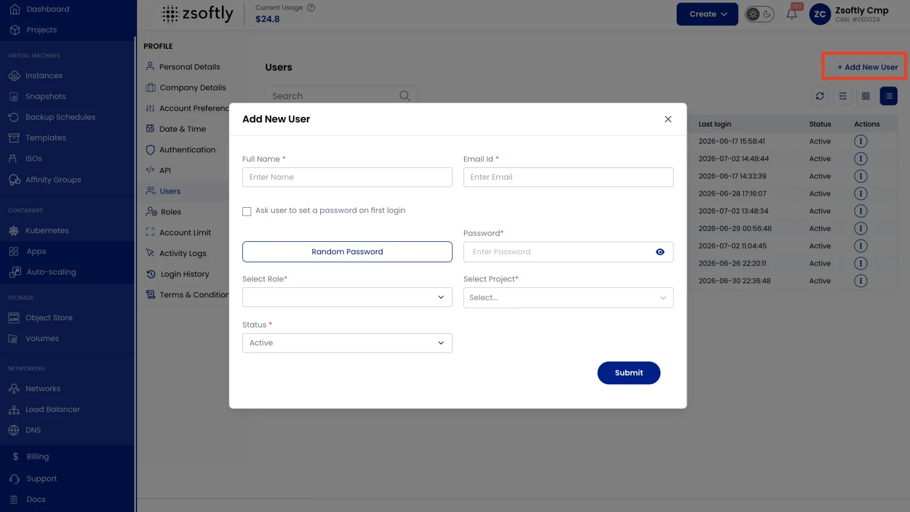

The **Users** section is where you add people to your organization and control their access. Each
user signs in with their own credentials and is assigned a [role](/public-cloud/iam/roles) that
determines what they can do.

## View users

- Click your **username** (top-right) to open the **Profile** menu.
- Select **Users** to see the complete list of active and inactive users in your organization.

From the list, use the action buttons to **edit** a user's details or role, or **re-invite** a user
whose invitation is still pending.

:::caution

The portal has no **delete user** button yet. Portal-based deletion is planned for a future release.

To remove someone's access from the portal, **block** (deactivate) the user with the action buttons
on the Users list. The account stays in your organization but loses access to the platform.

To delete an account, use the [ZCP CLI](#manage-sub-users-from-the-cli) (`zcp sub-user delete`) or
the API.

:::



## Add a new user

- Click your **username** (top-right) to open the **Profile** menu.
- Select **Users** and click **Add User**.
- Enter the user's details and select their **Role** (see
  [Roles & Permissions](/public-cloud/iam/roles) to create one first if the role you need doesn't
  exist yet).
- Click **Submit** to create the user.

The user receives an invitation and, once accepted, can sign in with the permissions granted by
their role.



## Restrict a user to specific Projects

You can limit a user to specific [Projects](/public-cloud/projects) so they only see and manage the
resources in the Projects they're authorized for. This combines with their role: the role controls
_what actions_ they can take, while the Project scope controls _which resources_ those actions apply
to.

:::tip

Pair a least-privilege role with a tight Project scope for sub-users. For example, a _Developer_
role scoped to only the `dev` Project.

:::

## Manage sub-users from the CLI

The same actions are available in the [ZCP CLI](/public-cloud/cli/installation). Sub-user commands
are account-level (no `--region`/`--project`), and a sub-user can be referenced by either its **ID**
or its **email**.

```bash
# List sub-users (optionally filter by role or blocked state)
zcp sub-user list
zcp sub-user list --role service-administrator
zcp sub-user list --blocked

# Create a sub-user. --email must be a company address; --password needs 8+ chars
# with mixed case, a number, and a symbol; --role is a role slug (see `zcp role list`);
# --project is repeatable. New sub-users start blocked until you unblock them.
zcp sub-user create --name "Jane Doe" --email jane@yourco.com \
  --password 'S3cret!pass' --role service-viewer --project default-9

# Change a sub-user's role or projects (referenced by email or ID)
zcp sub-user update jane@yourco.com --role service-administrator

# Revoke or restore access without deleting the account
zcp sub-user block jane@yourco.com
zcp sub-user unblock jane@yourco.com

# Remove a sub-user entirely
zcp sub-user delete jane@yourco.com
```

## Related

- [Roles & Permissions](/public-cloud/iam/roles): define what a user is allowed to do.
- [IAM Overview](/public-cloud/iam/overview): how the RBAC model fits together.
