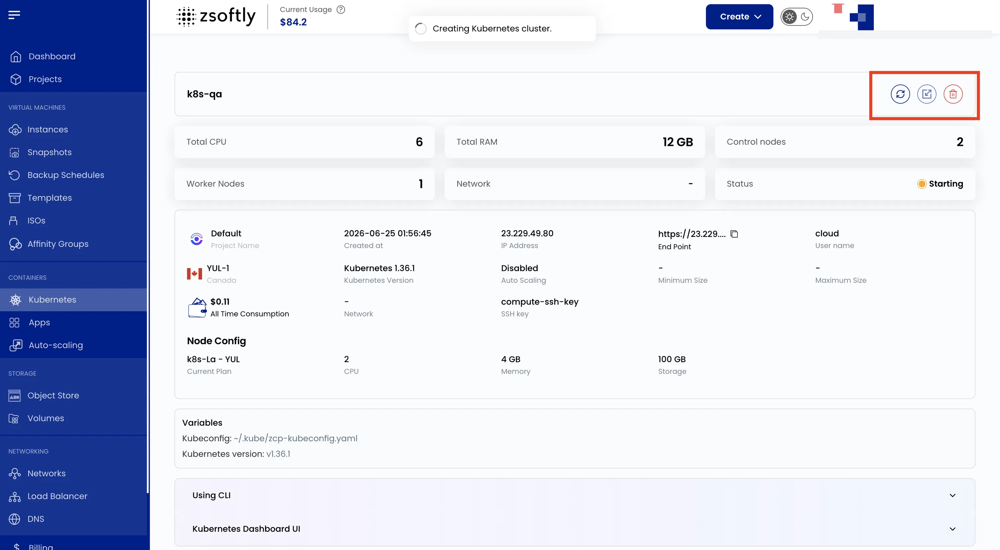
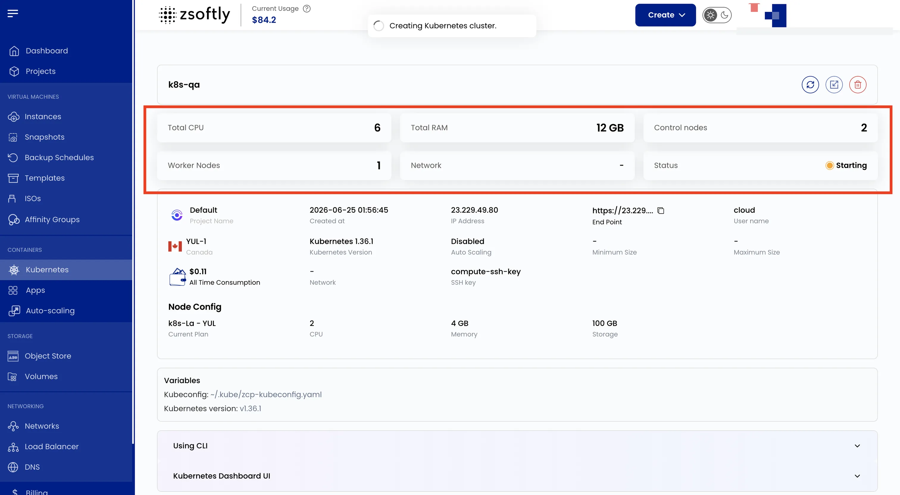
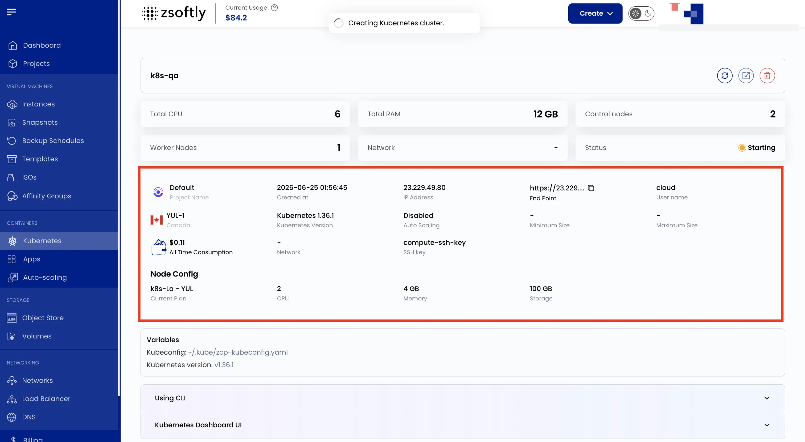

## Kubernetes Cluster Overview

The Cluster Overview page provides a summary and management options for your Kubernetes cluster.

### Action Buttons

- **Upgrade Kubernetes Version**: update to a newer release
- **Refresh**: reload latest cluster data
- **Download Config**: download the `kubeconfig` file for `kubectl`
- **Power Off**: gracefully shut down the cluster
- **Delete**: permanently delete the cluster and all resources

### Cluster Overview

- **Total CPU**, **Total RAM**
- **Control Nodes** / **Worker Nodes**
- **Network**, **Status**

### Cluster Information

- Project Name, Created At, IP Address, API Endpoint, Cloud, Username, Location
- Kubernetes Version, Auto Scaling (min/max node count if enabled)
- All-Time Consumption, Network, SSH Key

### Node Config

- Current Plan, CPU per node, Memory per node, Storage per node

See also: [Create Cluster](/public-cloud/kubernetes/create-cluster),
[kubectl Access](/public-cloud/kubernetes/kubectl-access),
[Dashboard Access](/public-cloud/kubernetes/dashboard-access)
