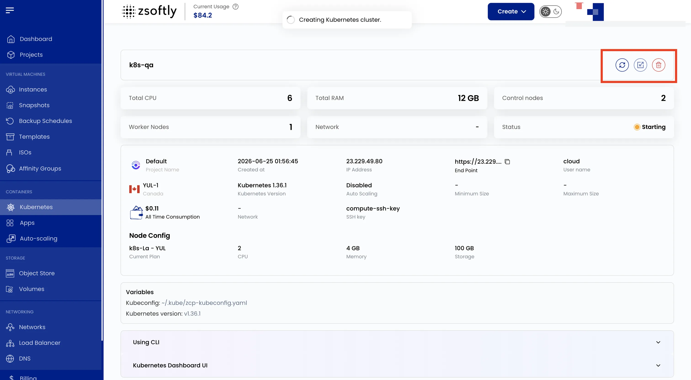
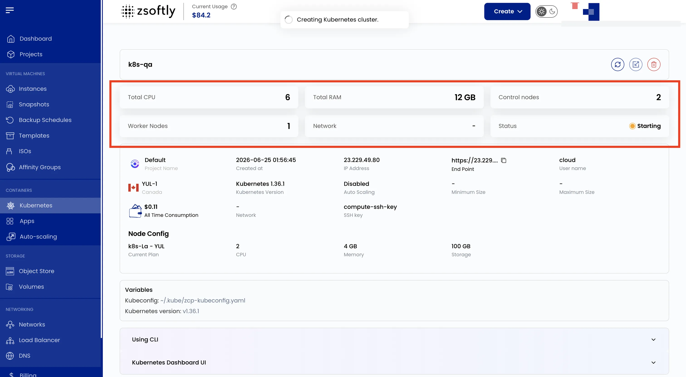
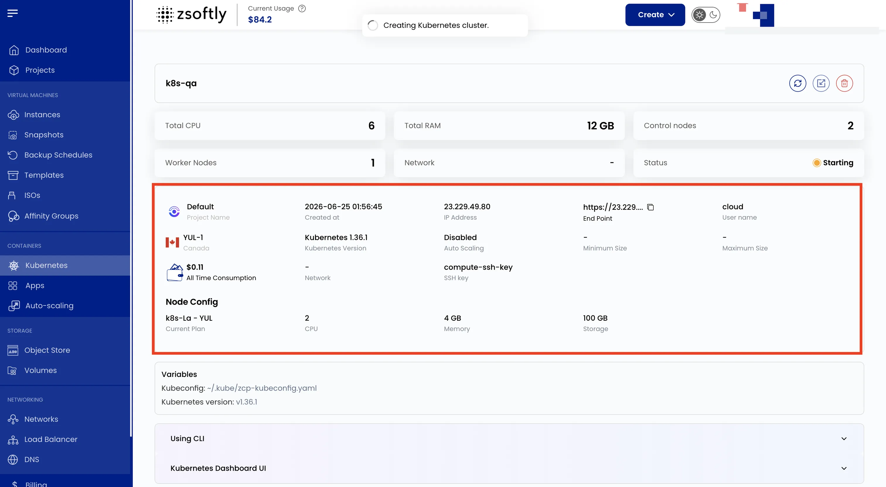

## Kubernetes Cluster Overview

The Cluster Overview page provides a summary and management options for your Kubernetes cluster.

### Action Buttons

- **Upgrade Kubernetes Version**: update to a newer release. Upgrades move one minor version at a
  time. A patch upgrade within the same minor version is also available.
- **Refresh**: reload latest cluster data
- **Download Config**: download the `kubeconfig` file for `kubectl`
- **Power Off**: gracefully shut down the cluster
- **Delete**: permanently delete the cluster and all resources



### Cluster Overview

- **Total CPU**, **Total RAM**
- **Control Nodes** / **Worker Nodes**
- **Network**, **Status**



### Cluster Information

- Project Name, Created At, IP Address, API Endpoint, Cloud, Username, Location
- Kubernetes Version, Auto Scaling (min/max node count if enabled)
- All-Time Consumption, Network, SSH Key



### Node Config

- Current Plan, CPU per node, Memory per node, Storage per node

## Upgrade Your Cluster

Use **Upgrade Kubernetes Version** in the portal. Upgrade one minor version at a time, such as 1.34
to 1.35, then 1.35 to 1.36. You can also apply a patch upgrade within the same minor line.

Before each upgrade:

1. Validate the target version in a test cluster that mirrors your live workload.
2. Confirm you have tested backups and a restore plan. Do not assume an in-place rollback is
   available.
3. Check operators, ingress controllers, storage add-ons, and workload dependencies for
   target-version compatibility. Review deprecated APIs and confirm PodDisruptionBudget headroom.
4. Inspect the cluster with read-only commands:

   ```bash
   kubectl version
   kubectl get nodes
   kubectl get deployments --all-namespaces
   kubectl get statefulsets --all-namespaces
   kubectl get pdb --all-namespaces
   ```

Click **Upgrade Kubernetes Version**, select the next supported version, and monitor the cluster
health after the upgrade completes. Repeat the preflight checks after every step in a multi-minor
upgrade. Plan for workload disruption during maintenance.

See the Kubernetes documentation for
[version-skew guidance](https://kubernetes.io/releases/version-skew-policy/) and
[PodDisruptionBudgets](https://kubernetes.io/docs/tasks/run-application/configure-pdb/).

See also: [Create Cluster](/public-cloud/kubernetes/create-cluster),
[kubectl Access](/public-cloud/kubernetes/kubectl-access),
[Dashboard Access](/public-cloud/kubernetes/dashboard-access)
