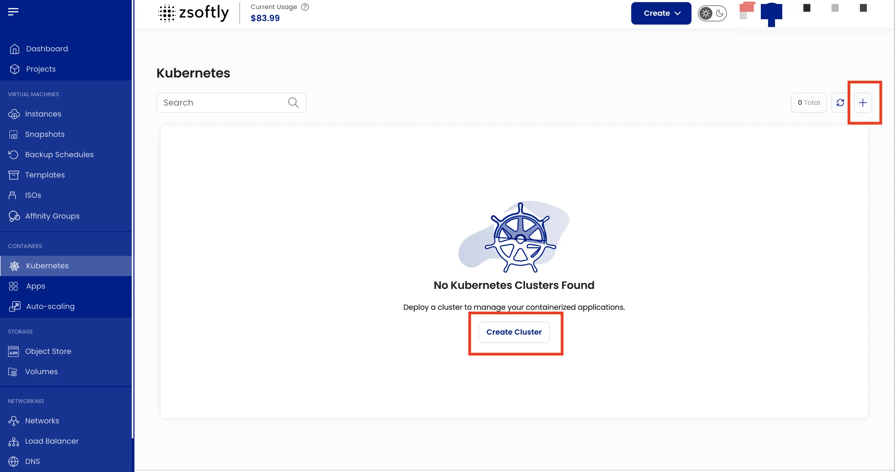
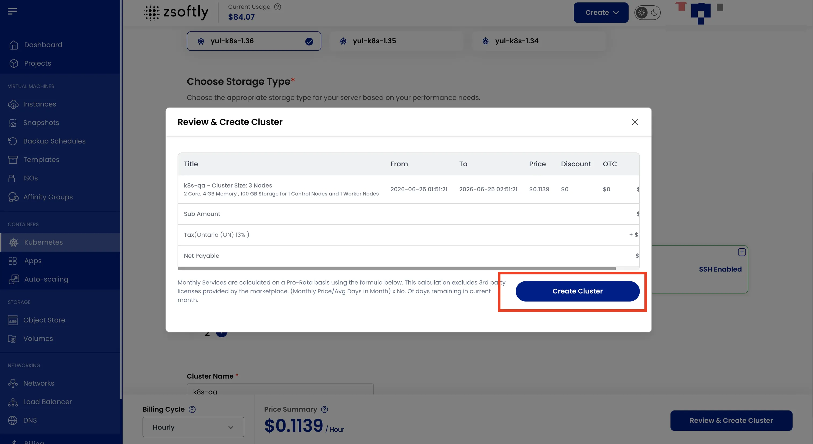

Managed Kubernetes on ZSoftly Public Cloud gives you a standard, upstream Kubernetes cluster without
operating the control plane yourself. Provision it from the portal, scale on demand, and connect
with the `kubectl` and Helm workflows your team already uses. No forked distributions and no
proprietary operators, so what you build here runs anywhere.

## Supported versions

ZCP supports Kubernetes **1.34**, **1.35**, and **1.36** (current: **1.36.1**). Upgrade a running
cluster to a newer release in place from the
[Cluster Overview](/public-cloud/kubernetes/cluster-overview). Match your `kubectl` client to the
cluster's minor version. See [kubectl Access](/public-cloud/kubernetes/kubectl-access).

| Item         | Support                                |
| ------------ | -------------------------------------- |
| Kubernetes   | 1.34, 1.35, 1.36 (current 1.36.1)      |
| Distribution | Standard upstream Kubernetes, no forks |
| Upgrades     | In-place, to any newer supported minor |

## What you get

- **Managed control plane** — ZSoftly runs and maintains the control plane. You focus on workloads.
- **High availability (optional)** — add control nodes for a redundant control plane.
- **Autoscaling** — set a minimum and maximum worker-node count and the cluster scales to demand.
- **Node plans** — choose a fixed plan (set CPU, memory, and storage) or a custom plan (your own
  sizing and node count).
- **Persistent volumes** — dynamically provisioned block storage through the cluster's CSI driver.
- **Load balancers** — expose a `Service` of type `LoadBalancer` and reach it on a public address.
- **Standard tooling** — works with `kubectl`, Helm, and the Kubernetes dashboard. Download a
  `kubeconfig` from the portal.
- **In-place version upgrades** and optional **SSH access** to the nodes.

## Create a cluster

- From the left-hand menu, click **Kubernetes**.
- Click **Create Cluster** or the **+** icon.

### Steps

1. **Location**: select the data center.
2. **Project**: assign to a project.
3. **Network**: select an existing private network, or create a new one.
4. **Cluster Capacity**:
   - Select a predefined **Node Plan** (fixed CPU/memory/storage)
   - Or use a **Custom Plan** (specify CPU, memory, storage, and node count)
5. **Advanced Settings** (optional):
   - Enable **High Availability** for redundancy
   - Add **Control Nodes** for additional stability
   - Add an **SSH Key** for node access
6. **Cluster Name**: provide a unique name.
7. **Create**:
   - Billing cycles: Hourly, Monthly, Quarterly, Semiannually, Yearly, Bi-annually, Tri-annually
   - Billing rules: Date to Date, Fixed Calendar Month, Unfixed Calendar Month, Fixed Prorata,
     Unfixed Prorata
   - Click **Create Cluster**

## After you create

- [Connect with kubectl](/public-cloud/kubernetes/kubectl-access) — download your `kubeconfig` and
  run your first commands.
- [Cluster Overview](/public-cloud/kubernetes/cluster-overview) — scale, upgrade, and manage the
  cluster.
- [Dashboard Access](/public-cloud/kubernetes/dashboard-access) — use the web dashboard.
