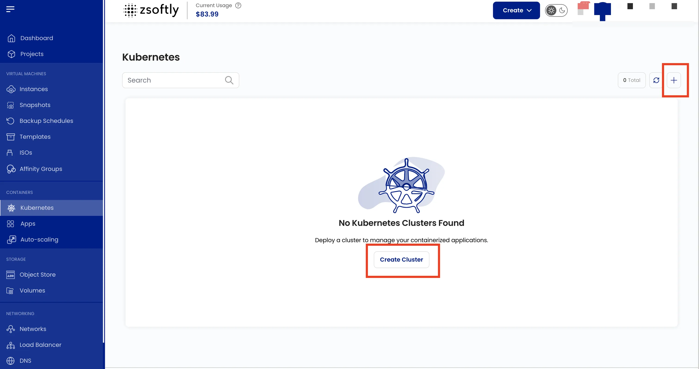
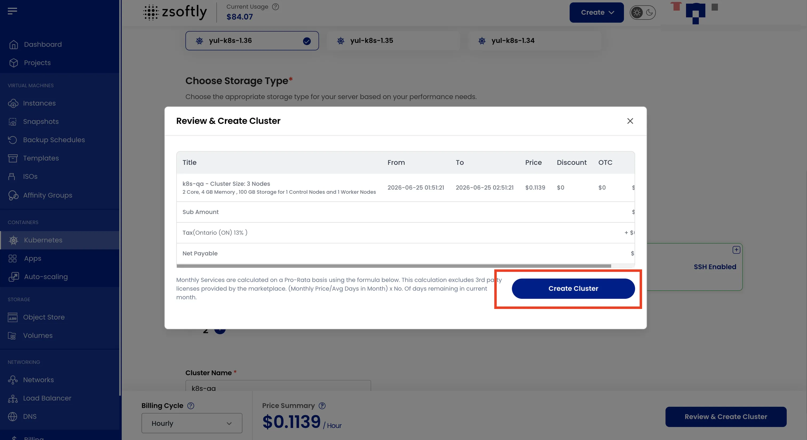

import {
  defaultVersion,
  kubernetesLifecycles,
  legacyVersionsList,
  newClusterVersionsList,
  supportedMinorsList,
  supportedMinorsPlain,
} from '../../../../data/kubernetes-versions';

Managed Kubernetes on ZSoftly Public Cloud gives you a standard, upstream Kubernetes cluster without
operating the control plane yourself. Provision it from the portal, scale on demand, and connect
with the `kubectl` and Helm workflows your team already uses. No forked distributions and no
proprietary operators, so what you build here runs anywhere.

## Supported versions

ZCP supports Kubernetes {supportedMinorsList()}. New clusters can choose {newClusterVersionsList()}.
A cluster created on an earlier patch release, such as {legacyVersionsList()}, currently stays on
that version until you upgrade it. A future ZCP lifecycle notice may require an upgrade.

Upgrade a running cluster one minor version at a time, or apply a patch within the same minor
version. Do this in place from the [Cluster Overview](/public-cloud/kubernetes/cluster-overview).
Match your `kubectl` client to the cluster's minor version. See
[kubectl Access](/public-cloud/kubernetes/kubectl-access).

<table>
  <thead>
    <tr>
      <th>Item</th>
      <th>Support</th>
    </tr>
  </thead>
  <tbody>
    <tr>
      <td>Kubernetes</td>
      <td>
        {supportedMinorsPlain()} (default for new clusters: {defaultVersion.version})
      </td>
    </tr>
    <tr>
      <td>Distribution</td>
      <td>Standard upstream Kubernetes, no forks</td>
    </tr>
    <tr>
      <td>Upgrades</td>
      <td>In-place, one minor version at a time, or a patch within the same minor</td>
    </tr>
  </tbody>
</table>

## Version Lifecycle

The Kubernetes project supports recent minor releases for a limited period. In the final maintenance
phase, it provides critical core-component, dependency, and security fixes. After end of life,
upstream provides no further fixes for that minor line. ZCP availability does not extend that
maintenance period. See the Kubernetes
[patch release schedule](https://kubernetes.io/releases/patch-releases/).

<table>
  <thead>
    <tr>
      <th>Minor</th>
      <th>Maintenance Mode Starts</th>
      <th>Upstream End of Life</th>
    </tr>
  </thead>
  <tbody>
    {kubernetesLifecycles.map((lifecycle) => (
      <tr>
        <td>{lifecycle.minor}</td>
        <td>{lifecycle.maintenanceDate}</td>
        <td>{lifecycle.eolDate}</td>
      </tr>
    ))}
  </tbody>
</table>

Kubernetes 1.33 reached end of life on June 28, 2026, and 1.32 on February 28, 2026. See the
[Kubernetes release history](https://kubernetes.io/releases/) for older minor lines.

ZCP plans to retain three recent supported minor lines. The proposed December 2026 transition would
retire 1.34 from the standard offering and set 1.35 as the minimum supported version. The rolling
minimum advances as newer ZCP minor lines are adopted and announced.

Upgrade before Kubernetes 1.34 reaches end of life on October 27, 2026. Do not wait for the proposed
transition.

If the proposal takes effect, clusters below the minimum would need an upgrade or a separately
agreed paid enhanced-support arrangement. Without such an agreement, ZCP plans automatic upgrades
after an announced cutoff. The cutoff, scope, eligibility, pricing, notice period, and service terms
have not been announced. An enhanced-support arrangement does not by itself guarantee security
backports.

:::caution

This lifecycle transition is proposed, not a current retirement policy. ZCP has not retired 1.34 or
changed the default version for new clusters.

:::

## What you get

- **Managed control plane**: ZSoftly runs and maintains the control plane. You focus on workloads.
- **High availability (optional)**: add control nodes for a redundant control plane.
- **Autoscaling**: set a minimum and maximum worker-node count and the cluster scales to demand.
- **Node plans**: choose a fixed plan (set CPU, memory, and storage) or a custom plan (your own
  sizing and node count).
- **Persistent volumes**: dynamically provisioned block storage through the cluster's CSI driver.
- **Load balancers**: expose a `Service` of type `LoadBalancer` and reach it on a public address.
- **Standard tooling**: works with `kubectl`, Helm, and the Kubernetes dashboard. Download a
  `kubeconfig` from the portal.
- **In-place version upgrades** and optional **SSH access** to the nodes.

## Create a cluster

- From the left-hand menu, click **Kubernetes**.
- Click **Create Cluster** or the **+** icon.

### Steps

1. **Project**: assign to a project.
2. **Location**: select the data center.
3. **Select Version**: choose the Kubernetes version for the cluster.
4. **Storage Type**: select the storage type for the cluster nodes.
5. **Cluster Capacity**:
   - Select a predefined **Node Plan** (fixed CPU/memory/storage)
   - Or use a **Custom Plan** (specify CPU, memory, storage, and node count)
6. **Advanced Settings** (optional):
   - Enable **High Availability** for redundancy
   - Add **Control Nodes** for additional stability
   - Add an **SSH Key** for node access
7. **Cluster Name**: provide a unique name.
8. **Create**:
   - Billing cycles: Hourly, Monthly, or Yearly.
   - Click **Create Cluster**

## After you create

- [Connect with kubectl](/public-cloud/kubernetes/kubectl-access): download your `kubeconfig` and
  run your first commands.
- [Cluster Overview](/public-cloud/kubernetes/cluster-overview): scale, upgrade, and manage the
  cluster.
- [Dashboard Access](/public-cloud/kubernetes/dashboard-access): use the web dashboard.
