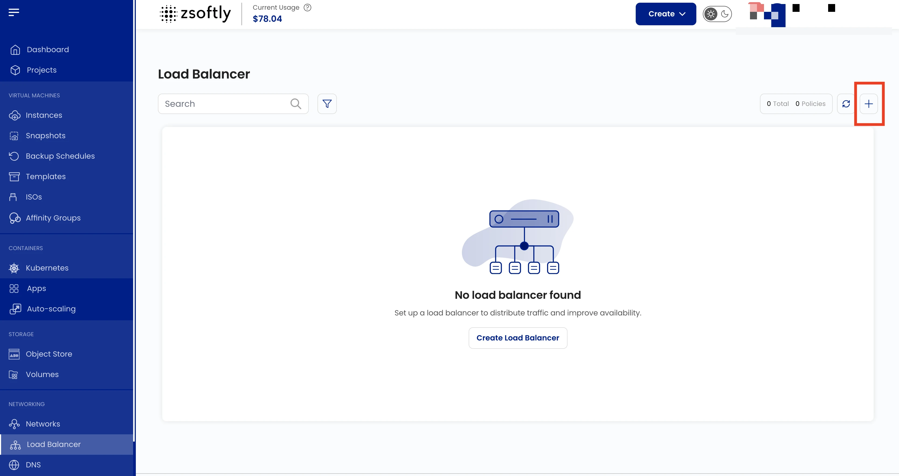
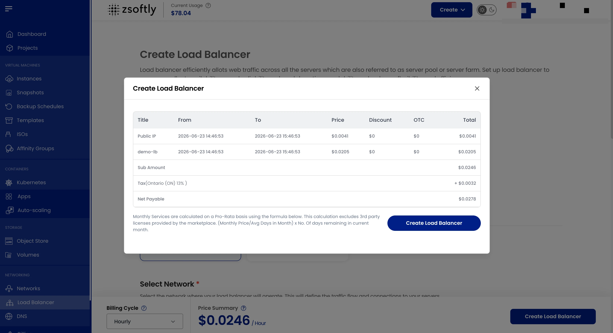

A Load Balancer distributes incoming traffic across multiple servers to ensure high availability,
reliability, and improved performance.

### Create a Load Balancer

- From the left-hand menu, click **Load Balancer**.
- Click the **+** icon.

### Steps

1. **Project**: assign to a project.
2. **Location**: select the data center.
3. **Network**: select the network where the load balancer will operate.
4. **IP**: choose an **Existing IP** or **Acquire New IP** (creates a default isolated IP in the
   selected zone).
5. **Forwarding Rules**:
   - **Rule Name**, **Protocol** (TCP, UDP, HTTP, HTTPS), port range
   - **Algorithm**: Source IP, Round Robin, or Least Connections
   - **Sticky Sessions**: LB Cookie, App Cookie, Source-Based, or None
   - Select **VM instances** to handle traffic
6. **Name**: alphanumeric, dashes, and periods only.
7. **Create**:
   - Billing cycles: Hourly, Monthly, Quarterly, Semiannually, Yearly, Bi-annually, Tri-annually
   - One package per zone
   - Click **Create Load Balancer**

### Attach Additional VMs

After creation, click on the Load Balancer → **Add VM** to attach more backend instances.

See also: [Public Networks](../networking/public-network/create),
[VPC](../networking/vpc/create-vpc)
