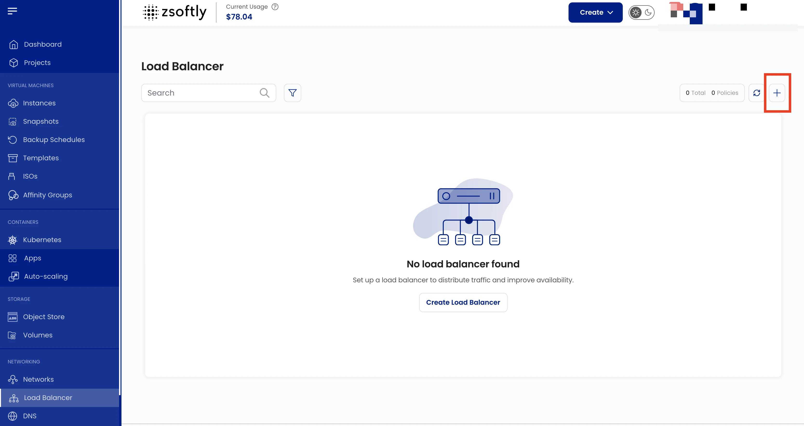
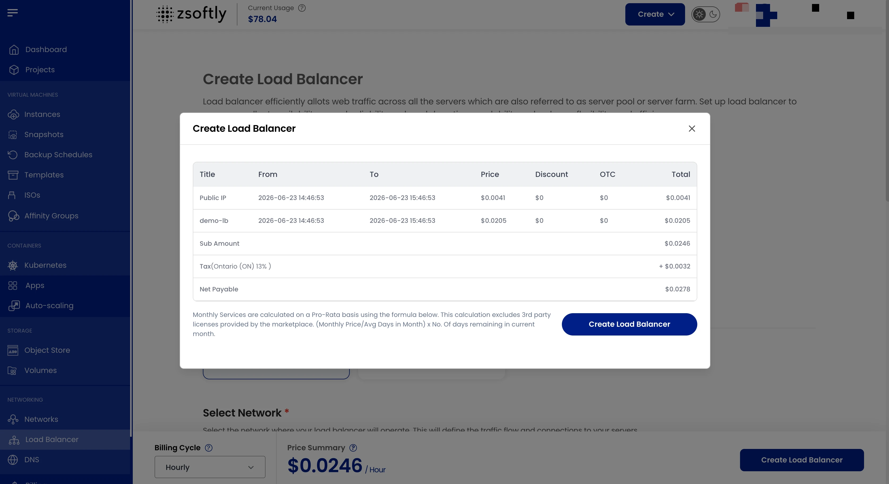

A Load Balancer distributes incoming traffic across multiple servers to ensure high availability,
reliability, and improved performance.

### Create a Load Balancer

- From the left-hand menu, click **Load Balancer**.
- Click the **+** icon.



### Steps

1. **Project**: assign to a project.
2. **Location**: select the data center.
3. **Network**: select the network where the load balancer will operate.
4. **IP**: choose an **Existing IP** or **Acquire New IP** (creates a default isolated IP in the
   selected zone).
5. **Forwarding Rules**:
   - **Rule Name**, **Protocol** (TCP, UDP, HTTP, HTTPS), port range
   - **Algorithm**: Source IP, Round Robin, or Least Connections
   - **Sticky Sessions**: LB Cookie, App Cookie, Source-Based, or None
   - Select **VM instances** to handle traffic
6. **Name**: alphanumeric, dashes, and periods only.
7. **Create**:
   - Billing cycles: Hourly, Monthly, or Yearly.
   - One package per zone
   - Click **Create Load Balancer**



### Attach Additional VMs

You can select multiple VMs on the same network while creating the load balancer. To add more
backend instances afterwards, open the Load Balancer and click **Add New Policies**.

### Manage with Terraform

Provider v0.3.0 exposes `data.zcp_load_balancer` with its rule IDs, so an existing load balancer can
supply a rule to `zcp_load_balancer_attachment`:

```hcl
data "zcp_load_balancer" "existing" {
  slug = var.load_balancer_slug
}

resource "zcp_load_balancer_attachment" "web" {
  load_balancer   = data.zcp_load_balancer.existing.id
  rule            = data.zcp_load_balancer.existing.rules[0].id
  virtual_machine = zcp_instance.web.id
  cloud_provider  = zcp_instance.web.cloud_provider
  region          = zcp_instance.web.region
}
```

The API rejects deletion of the only active `zcp_load_balancer_rule` on a load balancer. Keep at
least one rule when you manage rules independently.

See also: [Public Networks](/public-cloud/networking/public-network/create/),
[VPC](/public-cloud/networking/vpc/create-vpc/)
