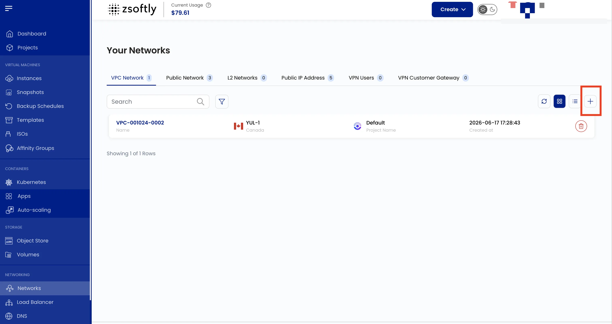
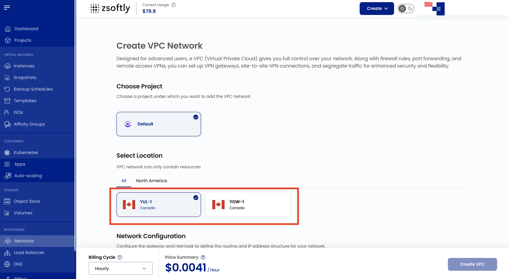
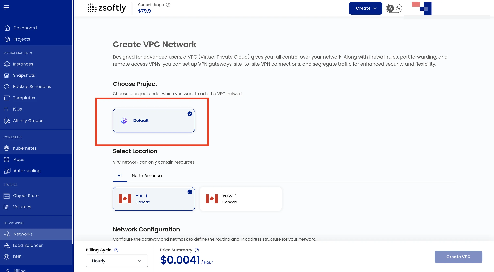
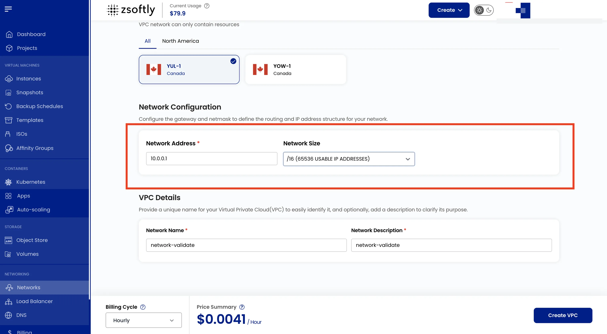
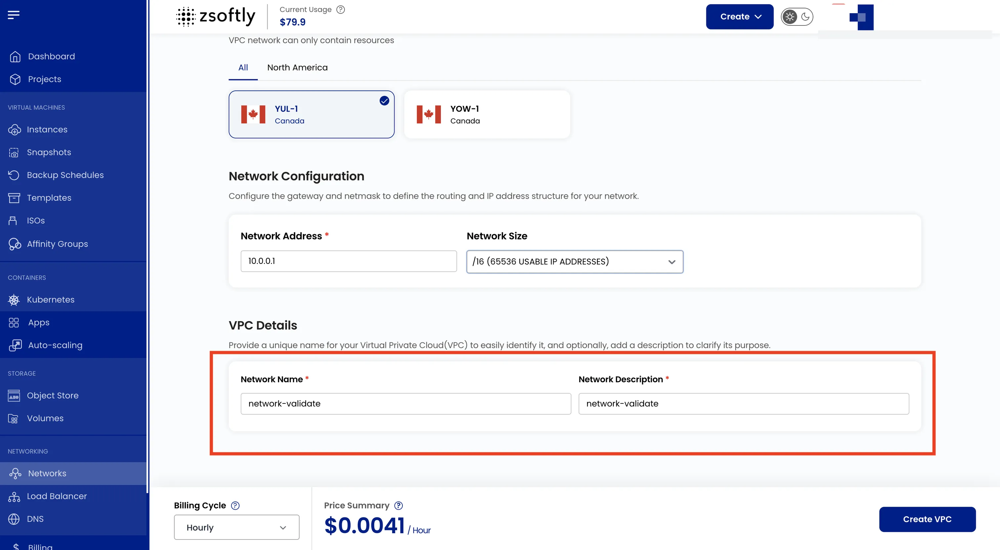
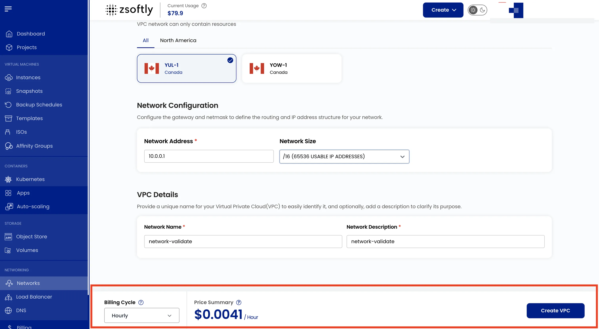

A **Public Network** provides internet-facing access to cloud resources. It allows VMs and services
to communicate with external systems over the internet.

### Create a Public Network

- From the left-hand menu, click **Networks** → **Public Network** tab.
- Click the **+** icon to open the creation page.

### Choose a Location

Select the data center location where you want to host the network.

### Assign to a Project

Assign the network to a project to organize resources.

### Network Configurations

Configure the gateway and network mask to define the routing and IP address structure.

### Name

Provide a unique name for your Public Network.

### Create

- Choose the **Billing Cycle**: Hourly or Monthly.
- Review the price summary and click **Create**.

See also: [Network Overview](/public-cloud/networking/public-network/overview),
[Public IPs](/public-cloud/networking/public-network/public-ips)
