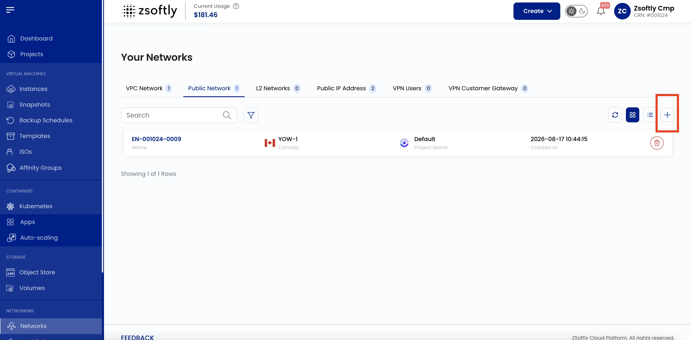
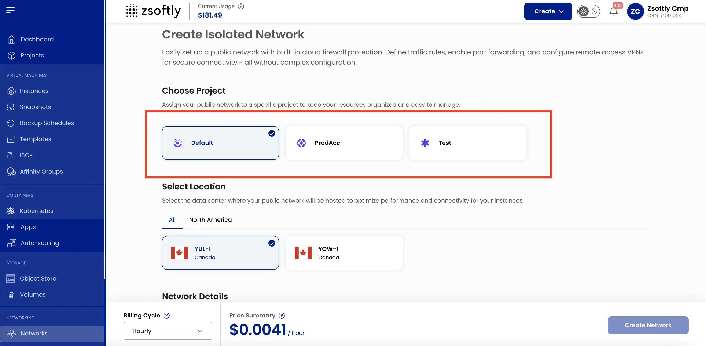
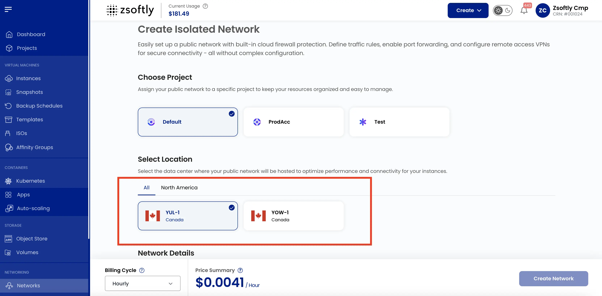
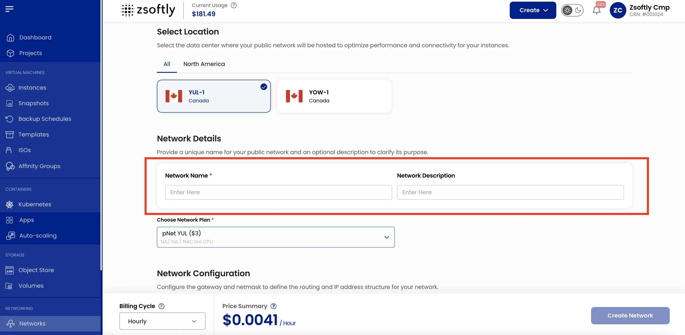
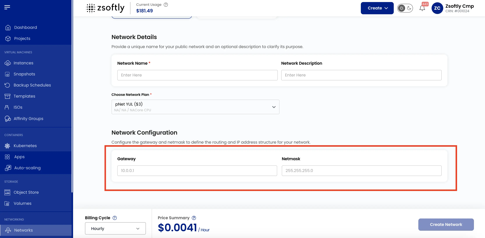
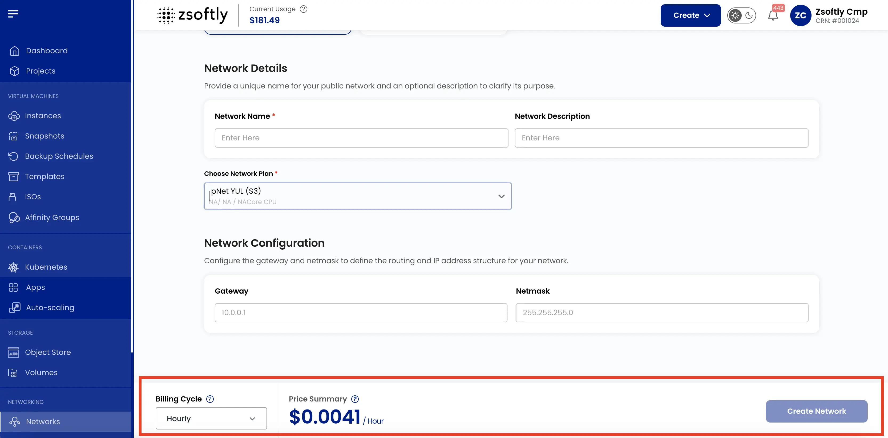

A **Public Network** provides internet-facing access to cloud resources. It allows VMs and services
to communicate with external systems over the internet.

### Create a Public Network

- From the left-hand menu, click **Networks** → **Public Network** tab.
- Click the **+** icon. The page title is **Create Isolated Network**.

### Choose Project

Under **Choose Project**, select the project for the network.

### Select Location

Under **Select Location**, choose the data center location for the network.

### Network Details

Enter a **Network Name**.

### Choose Network Plan

Under **Choose Network Plan**, select a network plan.

### Network Configuration

ZSoftly has not verified whether **Gateway** and **Netmask** are required. If the portal populates a
field with a value for the selected network, leave that value unchanged. If either field is blank or
appears to show placeholder text, do not enter or infer a value. Record the field and any message
shown, then open [Support](/troubleshooting#raise-a-support-ticket) with the project, location, any
message shown, and non-sensitive resource details.

### Create

- Choose the **Billing Cycle**: Hourly, Monthly, or Yearly.
- Review the **Price Summary** and click **Create Network**.

See also: [Network Overview](/public-cloud/networking/public-network/overview),
[Public IPs](/public-cloud/networking/public-network/public-ips)
