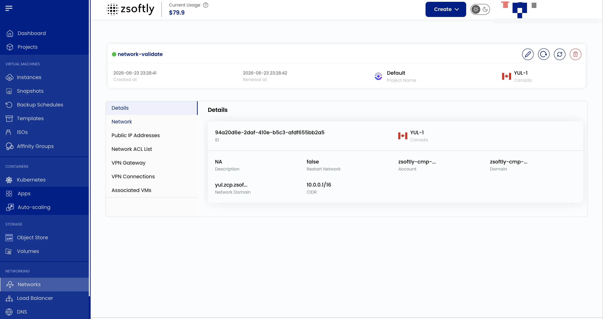

## Public Network Overview

A Public Network is a logically defined network within the cloud environment. The Overview tab
shows:

- **Network ID**: The ID assigned to the network.
- **Network Type**: Isolated (no external access) or Cached (temporary storage optimization).
- **Traffic Types**: Guest (user-facing) or Public (internet access) traffic.
- **Gateway**: Access point between networks.
- **Netmask**: Defines the subnet IP range.
- **CIDR**: Specifies the network's IP range.
- **Account**: The account that owns the network.

See also: [Create Public Network](/public-cloud/networking/public-network/create),
[Public IPs](/public-cloud/networking/public-network/public-ips)
