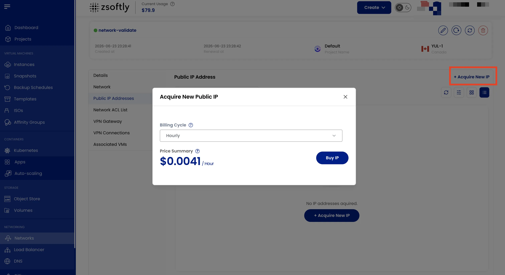

Public IP addresses allow resources in the network to communicate with the internet. All public IPs
include network-level DDoS mitigation, absorbing volumetric attacks before they reach your workload.

- In the **Public IP Addresses** tab, view all assigned public IPs.
- Click **Acquire New IP** to request a new public IP.
- Choose the desired **Billing Cycle** and click **Buy IP**.

See also: [Network Overview](/public-cloud/networking/public-network/overview),
[Create Public Network](/public-cloud/networking/public-network/create)
